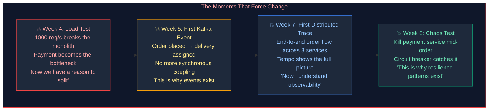

# Tadka Architecture Evolution — 8 Week Timeline

> "You don't design a distributed system. You earn one."

## Timeline Diagram

```mermaid
graph LR
    subgraph phase1["Phase 1: Monolith<br/>Weeks 1–3"]
        w1["Week 1<br/>━━━━━━━<br/>CRUD APIs<br/>Order state machine<br/>EF Core migrations"]
        w2["Week 2<br/>━━━━━━━<br/>Indexing<br/>Read replicas<br/>Query optimization"]
        w3["Week 3<br/>━━━━━━━<br/>Redis caching<br/>CAP theorem<br/>Geospatial queries"]
    end

    subgraph phase2["Phase 2: Modular Monolith<br/>Week 4"]
        w4["Week 4<br/>━━━━━━━<br/>MediatR events<br/>Domain boundaries<br/>Load testing<br/>→ Find the bottleneck"]
    end

    subgraph phase3["Phase 3: Service Extraction<br/>Weeks 5–6"]
        w5["Week 5<br/>━━━━━━━<br/>Kafka messaging<br/>Saga pattern<br/>Payment extraction<br/>Idempotency"]
        w6["Week 6<br/>━━━━━━━<br/>YARP gateway<br/>Auth (JWT)<br/>Delivery extraction<br/>Docker multi-stage"]
    end

    subgraph phase4["Phase 4: Production<br/>Weeks 7–8"]
        w7["Week 7<br/>━━━━━━━<br/>ECS Fargate deploy<br/>Terraform IaC<br/>GitHub Actions CI/CD<br/>CDN + Rate limiting"]
        w8["Week 8<br/>━━━━━━━<br/>OpenTelemetry<br/>Grafana dashboards<br/>Circuit breakers<br/>Chaos engineering<br/>Final load test"]
    end

    w1 --> w2 --> w3 --> w4 --> w5 --> w6 --> w7 --> w8

    style phase1 fill:#0c2d48,stroke:#3b82f6,stroke-width:2px,color:#93c5fd
    style phase2 fill:#1a2e05,stroke:#84cc16,stroke-width:2px,color:#bef264
    style phase3 fill:#2d1f0e,stroke:#f59e0b,stroke-width:2px,color:#fbbf24
    style phase4 fill:#2d0a1e,stroke:#ec4899,stroke-width:2px,color:#f9a8d4

    style w1 fill:#1e3a5f,stroke:#3b82f6,color:#bfdbfe
    style w2 fill:#1e3a5f,stroke:#3b82f6,color:#bfdbfe
    style w3 fill:#1e3a5f,stroke:#3b82f6,color:#bfdbfe
    style w4 fill:#263a05,stroke:#84cc16,color:#d9f99d
    style w5 fill:#3d2508,stroke:#f59e0b,color:#fde68a
    style w6 fill:#3d2508,stroke:#f59e0b,color:#fde68a
    style w7 fill:#3d0a24,stroke:#ec4899,color:#fbcfe8
    style w8 fill:#3d0a24,stroke:#ec4899,color:#fbcfe8
```

## Pivotal Moments

## Tech Stack Progressive Reveal

| Week | What You Add | Why You Need It |
|------|-------------|-----------------|
| 1 | .NET 10 + PostgreSQL | Build the product. Ship features. |
| 2 | Read Replicas + Indexes | Menu listing is slow at scale. Separate reads from writes. |
| 3 | Redis | Restaurant data doesn't change every second. Stop hitting the DB for the same data. |
| 4 | MediatR | Domains are calling each other directly. Internal events decouple them without a message broker. |
| 5 | Kafka | Payment completion shouldn't block order confirmation. Async events across service boundaries. |
| 5 | Saga Pattern | Distributed transactions don't work. Sagas coordinate multi-step flows with compensation. |
| 6 | YARP API Gateway | 3 services, one entry point. Routing, auth, rate limiting at the edge. |
| 6 | Docker | "Works on my machine" stops being acceptable. Containers = reproducible environments. |
| 6 | ECS Fargate | Your laptop isn't a data center. Serverless containers in AWS. |
| 7 | Terraform | Clicking buttons in AWS console doesn't scale. Infrastructure as code = repeatable, reviewable. |
| 7 | GitHub Actions | Manual deploys are error-prone. CI/CD = push to main, it deploys. |
| 7 | CDN | Restaurant images are 80% of your bandwidth. Put them on the edge. |
| 8 | OpenTelemetry | Request failed. Which service? Which line? Distributed tracing answers this. |
| 8 | Prometheus + Grafana | Are we meeting our SLOs? Dashboards tell you before customers complain. |
| 8 | Polly | Payment service is slow. Do you wait forever? Circuit breaker = fail fast, retry smart. |

## What to Tell Students

"Notice the pattern. We don't add Redis because a blog post said caching is important. We add Redis in Week 3 because our restaurant listing endpoint is doing 50 identical database queries per second and the P99 latency is unacceptable.

We don't add Kafka because Netflix uses it. We add Kafka in Week 5 because our order placement is synchronously waiting for delivery assignment and payment confirmation, and that coupling is making our API slow and fragile.

Every technology earns its place. If you can't explain why you added something, you shouldn't have added it."
