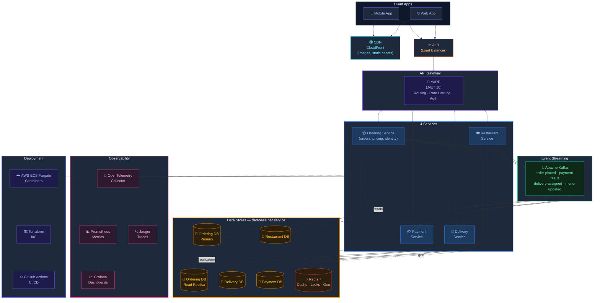

# D1-4b: Tadka Final Architecture (Week 8)

> "THIS is where we'll be in 8 weeks. But we'll earn every single box on this diagram."

## Diagram

## What to Tell Students

"Count the boxes. CDN, load balancer, API gateway, **4 services** (Ordering, Restaurant, Delivery, Payment), a database *per service*, a read replica, Redis, Kafka, 3 observability tools, containerized deployment with Infrastructure as Code and CI/CD.

You won't understand every box right now. That's the point.

By Week 8, you'll have built every single one of these. Not because someone told you to add them, but because you felt the pain that made each one necessary.

Week 2: Your menu listing is slow → you add Redis.
Week 4: Your monolith deploys are blocking each other → you extract Payment as a service.
Week 5: Your order placement is coupled to delivery assignment → you add Kafka.
Week 7: Something breaks in production and you can't figure out where → you add distributed tracing.

Every line on this diagram has a story. You'll live each one."

**There is no separate User service.** Identity stays inside Ordering. If a student counts five services, that is the moment to say: extraction needs a *trigger* — fault isolation, a distinct scaling profile, org ownership — and identity never earned one. This diagram is the canonical answer; the count is always **four services plus a gateway**.

## Week-by-Week Box Count

| Week | New Boxes Added | Total |
|------|----------------|-------|
| 1 | API + PostgreSQL | 2 |
| 2 | Read Replica | 3 |
| 3 | Redis | 4 |
| 4 | Payment extracted + own DB | 6 |
| 5 | Kafka + Delivery extracted + own DB | 9 |
| 6 | Restaurant extracted + own DB + YARP Gateway | 12 |
| 7 | CDN + ALB + Terraform + GitHub Actions + Docker + ECS Fargate | 18 |
| 8 | OpenTelemetry + Prometheus + Grafana + Jaeger | 22 |
