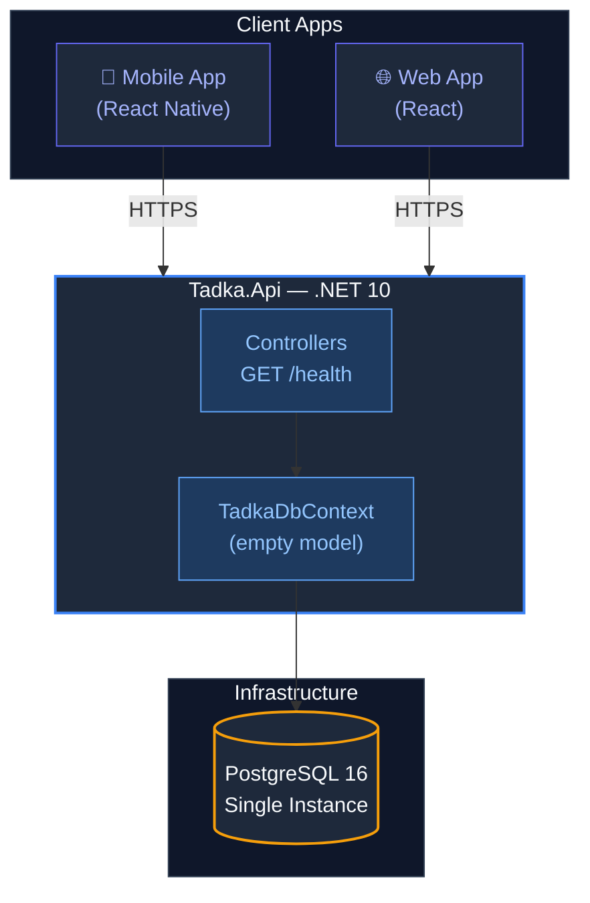

# D1-4: Tadka Monolith Architecture (Week 1)

> "This is where we START. Not 5 microservices. One application. Like every real startup."

## Diagram

## What to Tell Students

"Look at this diagram. One API, one database, a health endpoint. That's it. This handles launch without breaking a sweat. A single PostgreSQL instance with proper indexes can handle thousands of queries per second.

We have not designed the domain yet. ADR-002 only says: one process, not five services. Tomorrow we name the bounded contexts and *then* put them in folders inside this same project. Pre-creating `Orders/` and `Payments/` directories today would be guessing the model before we have it — the same mistake as starting with microservices.

Every startup you admire started here. Swiggy's first version was a single Django app. Flipkart ran on a single Java monolith for years. We start the same way, and we'll feel the pain that forces us to split. That pain is the real teacher."

## What's Deliberately Missing

- No `Domain/` folders (Day 2 — after the room names the bounded contexts)
- No Redis (added Week 2, when we need caching)
- No Kafka (added Week 5, when we need async events)
- No API Gateway (added Week 5, when we have multiple services)
- No CDN (added Week 7, when we care about image performance)
- No load balancer (added Week 6, when we deploy to AWS)
- No monitoring stack (added Week 7, when we need observability)

Each of those boxes gets added when we have a real reason. Not before.
