# Day 2 — Domain model (aggregate boundaries)

Student handout. Aggregate roots, entities, and value objects across the five bounded contexts. The instructor live-draw happens first; this is the canonical reveal.

## Aggregate Boundary Map

```mermaid
graph TB
    subgraph ordering["ordering (Bounded Context)"]
        direction TB
        subgraph orderAgg["🔷 Order (Aggregate Root)"]
            order["Order\n─────────\nId : Guid\nCustomerId : Guid\nRestaurantId : Guid\nStatus : OrderStatus\nCreatedAt : DateTime\nDeliveredAt : DateTime?"]
            orderItem["OrderItem (Entity)\n─────────\nId : Guid\nMenuItemId : Guid\nName : string ⚠️ snapshot\nQuantity : int\nSpecialInstructions : string"]
            totalAmount["Money (Value Object)\n─────────\nAmount : decimal\nCurrency : string"]
            deliveryAddr["Address (Value Object)\n─────────\nLine1, Line2, City\nPincode, Lat, Lng"]
            unitPrice["Money (Value Object)\n─────────\nAmount : decimal\nCurrency : string"]
        end
        order --> orderItem
        order --> totalAmount
        order --> deliveryAddr
        orderItem --> unitPrice
    end

    subgraph restaurant["restaurant (Bounded Context)"]
        direction TB
        subgraph restAgg["🔷 Restaurant (Aggregate Root)"]
            rest["Restaurant\n─────────\nId : Guid\nName : string\nIsActive : bool\nAvgPrepTime : TimeSpan"]
            menuItem["MenuItem (Entity)\n─────────\nId : Guid\nName : string\nDescription : string\nCategory : string\nIsAvailable : bool\nIsVeg : bool"]
            restAddr["Address (Value Object)"]
            menuPrice["Money (Value Object)"]
        end
        rest --> menuItem
        rest --> restAddr
        menuItem --> menuPrice
    end

    subgraph delivery["delivery (Bounded Context)"]
        direction TB
        subgraph agentAgg["🔷 DeliveryAgent (Aggregate Root)"]
            agent["DeliveryAgent\n─────────\nId : Guid\nName : string\nPhone : string\nStatus : AgentStatus"]
            geoLoc["GeoLocation (Value Object)\n─────────\nLatitude : double\nLongitude : double"]
        end
        agent --> geoLoc

        subgraph assignAgg["🔷 DeliveryAssignment (Aggregate Root)"]
            assign["DeliveryAssignment\n─────────\nId : Guid\nOrderId : Guid\nAgentId : Guid\nStatus : AssignmentStatus\nAssignedAt : DateTime\nPickedUpAt : DateTime?\nDeliveredAt : DateTime?"]
        end
    end

    subgraph identity["identity (Bounded Context)"]
        direction TB
        subgraph userAgg["🔷 User (Aggregate Root)"]
            user["User\n─────────\nId : Guid\nName : string\nEmail : string\nPhone : string\nRole : UserRole\nCreatedAt : DateTime"]
            savedAddr["Address (Value Object)\n─────────\n(list of saved addresses)"]
        end
        user --> savedAddr
    end

    subgraph payment["payment (Bounded Context)"]
        direction TB
        subgraph payAgg["🔷 Payment (Aggregate Root)"]
            pay["Payment\n─────────\nId : Guid\nOrderId : Guid\nAmount : decimal\nCurrency : string\nMethod : string\nStatus : PaymentStatus\nGatewayReference : string"]
        end
    end

    style ordering fill:#0c2d48,stroke:#3b82f6,stroke-width:2px,color:#93c5fd
    style restaurant fill:#1a2e05,stroke:#84cc16,stroke-width:2px,color:#bef264
    style delivery fill:#2d1f0e,stroke:#f59e0b,stroke-width:2px,color:#fbbf24
    style identity fill:#2d0a1e,stroke:#ec4899,stroke-width:2px,color:#f9a8d4
    style payment fill:#1e1e2e,stroke:#a78bfa,stroke-width:2px,color:#c4b5fd

    style orderAgg fill:#1e3a5f,stroke:#60a5fa,stroke-width:2px,color:#bfdbfe
    style restAgg fill:#263a05,stroke:#a3e635,stroke-width:2px,color:#d9f99d
    style agentAgg fill:#3d2508,stroke:#fbbf24,stroke-width:2px,color:#fde68a
    style assignAgg fill:#3d2508,stroke:#fbbf24,stroke-width:2px,color:#fde68a
    style userAgg fill:#3d0a24,stroke:#f472b6,stroke-width:2px,color:#fbcfe8
    style payAgg fill:#2e1065,stroke:#a78bfa,stroke-width:2px,color:#c4b5fd
```

## Key Concepts to Teach From This Diagram

### 🔷 Aggregate Roots (6 total)
Each aggregate root is a **consistency boundary**. Everything inside the aggregate is guaranteed to be valid together after any operation.

| Aggregate Root | Domain | Why It's a Root |
|---|---|---|
| **Order** | ordering | An order must always have valid items, a valid total, and a valid address. You never create an OrderItem without an Order. |
| **Restaurant** | restaurant | A restaurant's menu items are meaningless without the restaurant. Menu availability is the restaurant's responsibility. |
| **DeliveryAgent** | delivery | An agent's availability status and location are independent of any specific delivery. |
| **DeliveryAssignment** | delivery | An assignment's lifecycle (assigned → picked up → delivered) is tied to a specific order, not to the agent's profile. |
| **User** | identity | A user manages their own profile and saved addresses independently. |
| **Payment** | payment | A payment tracks a single financial transaction against a single order. |

### Why DeliveryAgent and DeliveryAssignment Are Separate Aggregates

> This is the **key teaching moment** for aggregate boundary design.

- **Wrong:** One `DeliveryAgent` aggregate that contains a `List<DeliveryAssignment>`.
- **Why wrong:** Updating the agent's GPS location would lock the entire assignment history. At 200 deliveries/day, the aggregate grows unbounded. Concurrent operations (dispatch assigns delivery while agent updates location) would conflict.
- **Right:** Two separate aggregates. They reference each other by ID (`AgentId` in `DeliveryAssignment`), not by object reference.
- **Rule of thumb:** If two things have different lifecycles, different change frequencies, or different reasons to change — they're separate aggregates.

### Entities vs Value Objects

| Type | Identity? | Mutable? | Examples in Tadka |
|---|---|---|---|
| **Entity** | Has a unique ID | Yes (state changes) | Order, OrderItem, MenuItem, User |
| **Value Object** | No identity, defined by its attributes | Immutable | Money, Address, GeoLocation |

**Teaching script:**
- "Is `Money(299, 'INR')` the same as another `Money(299, 'INR')`? **Yes.** No identity, just value. That's a value object."
- "Is `Order(id=abc)` the same as `Order(id=xyz)` even if they have identical items? **No.** Different identity. That's an entity."

### ⚠️ Snapshot Fields

`OrderItem.Name` and `OrderItem.UnitPrice` are **snapshots** of the menu item at the time the order was placed. The restaurant can rename "Chicken Biryani" to "Hyderabadi Dum Biryani" next week — the historical order still says "Chicken Biryani" at ₹299.

This is not data duplication. This is **historical accuracy**. Amazon, Flipkart, and Swiggy all do this.

### Cross-Domain References

Domains reference each other **by ID only**, never by object reference:

- `Order.CustomerId` → references `User.Id` (but no FK in database)
- `Order.RestaurantId` → references `Restaurant.Id` (but no FK in database)
- `DeliveryAssignment.OrderId` → references `Order.Id` (but no FK in database)
- `Payment.OrderId` → references `Order.Id` (but no FK in database)

**Why no cross-domain FKs:** When we extract services in Week 4+, each service takes its schema. Cross-domain FKs would break at extraction time.

---

## Practice Questions for Students

1. "A customer wants to rate a restaurant after delivery. Where does the `Rating` entity live — in the ordering domain or the restaurant domain? Why?"
2. "Should `DeliveryAssignment` contain the full delivery address, or should it reference the Order's address by OrderId?"
3. "A new feature request: customers can add a tip for the delivery agent. Is `Tip` a new aggregate, a new entity inside Order, or a new value object? Justify."
