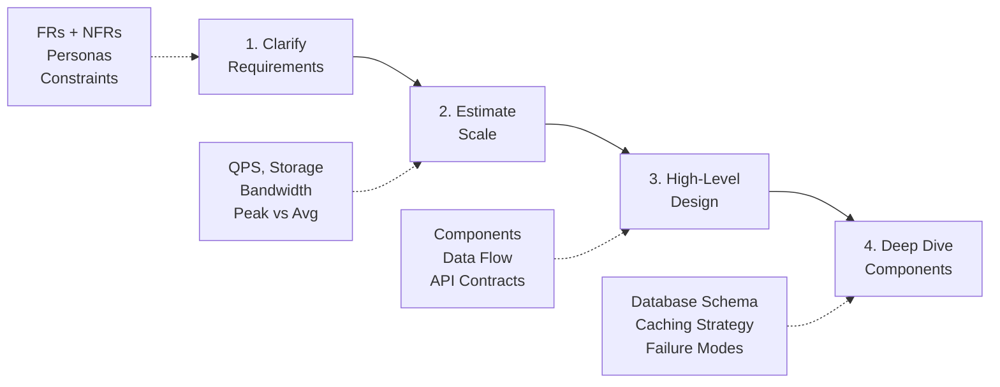

# Day 2: 4-Step System Design Framework

## The Framework

## How Tadka Maps to This Framework

| Step | What We Did | When |
|------|------------|------|
| 1. Clarify Requirements | 20 FRs, 8 NFRs from product brief | Day 1 |
| 2. Estimate Scale | 1 lakh orders/day, 3x peak, P99 targets | Day 1 |
| 3. High-Level Design | Monolith with domain folders, single PostgreSQL | Day 1-2 |
| 4. Deep Dive | Domain model, database schema, API design | Day 2-3 |

## Diagramming Rules

- **Boxes** = components or services. Name them precisely ("Order Service", not "Service 1").
- **Arrows** = data flow. Always label: HTTP REST, gRPC, Kafka event, SQL query, Redis GET.
- **Color** = concern type. Blue = compute/services, green = storage/databases, orange = external/third-party.
- **Shapes**: rectangles for services, cylinders for databases, hexagons for message brokers.

### Anti-Patterns
- Boxes with no arrows (orphaned components)
- Arrows with no labels (mystery interactions)
- 50-box diagrams that explain nothing
- "If you can't name the arrow, you don't understand the interaction."
