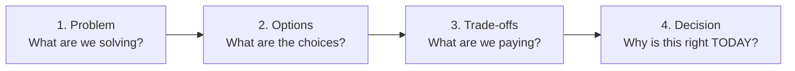
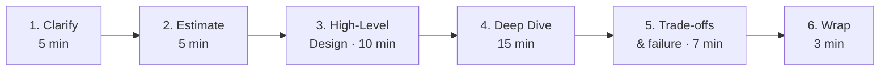

# Day 2: The Two Frameworks, and How to Draw a Diagram

Two different things get called "a framework" in system design, and mixing them up is the fastest way to sound junior. They do different jobs.

## 1. The decision framework (Day 1) — how you make one call

Four steps. Every architecture decision in this cohort goes through them, and they are also the skeleton of an ADR.

If you remember one thing from the whole cohort, remember this one. It scales from "which cache?" to "monolith or services?" and it is what an ADR is written to record.

## 2. The interview round (Day 2) — how you spend 45 minutes

Six moves. This is not a different way of thinking; it is the four steps above, opened up and given a clock.

| Move | What you actually do |
|---|---|
| 1. Clarify | Ask only the questions that **change the design**: scale, read/write mix, consistency per operation, what is out of scope. |
| 2. Estimate | Back-of-envelope, out loud, with assumptions stated. Order of magnitude, not decimals. |
| 3. High-level design | Boxes and **labelled** arrows. The contract you draw is the future service boundary. |
| 4. Deep dive | They pick one component. Go deep, and name the options before you pick one. |
| 5. Trade-offs and failure | What breaks at 10x, what you traded away. Name your own design's weaknesses before they do. |
| 6. Wrap | The decision in one breath, plus the one thing you would revisit first. |

**An interview is an ADR compressed into 45 minutes.** Moves 1 and 2 are Day 1 (requirements and estimation). Moves 3 to 6 are every Architect's Decision block you write from here on.

## How Tadka maps to the round

| Move | What we did | When |
|------|------------|------|
| 1. Clarify | 20 FRs, 8 NFRs from the product brief | Day 1 |
| 2. Estimate | 1 lakh orders/day, peak ratio, P99 targets, storage from frequency | Day 1 |
| 3. High-level design | Monolith, five bounded contexts, one Postgres | Day 1–2 |
| 4. Deep dive | Domain model, aggregates, schema-per-domain | Day 2 |
| 5. Trade-offs | ADR-003 and ADR-008, both with failure modes and revisit triggers | Day 2 |
| 6. Wrap | Every ADR ends with "revisit when" | Every day |

## 3. Diagram rules — a picture another engineer can read

Your diagram is what survives after you leave the room. In a design review, in an interview, or two years later when someone new opens the repo, they will not read your code. They will look at your diagram.

- **Name every box precisely.** "Order Service", not "Service 1" or "Backend". If the name does not say what it does, the box is doing no work.
- **Label every arrow.** Write what travels: `HTTP`, `SQL query`, `Kafka event`, `Redis GET`. An unlabelled arrow is a mystery, not information.
- **Give colour a meaning.** One colour per kind of thing. Blue = compute, green = storage, orange = external. Colour is not decoration.
- **Stop at eight to ten boxes.** Past that nobody reads it. Draw two diagrams instead of one crowded one.

**If you cannot name the arrow, you do not understand the interaction.**

### Anti-patterns

- Boxes with no arrows — if nothing connects to it, why is it in the system?
- Arrows with no labels — the most common one, and the most expensive.
- Fifty-box diagrams that look thorough and explain nothing.
- Shapes chosen at random. Pick a convention (rectangles for services, cylinders for databases) and hold it.

## 4. Where AI fits

Ask a model "what bounded contexts should I use?" and it will answer in four seconds, confidently, with something that looks right and is usually the feature list in boxes.

That is a **high-altitude** question: the answer depends on your team size, what has to fail together, and what is even in scope. The model has none of that context, so it produces something generic and plausible.

Use it the other way round. Decide first, then ask: *"here are my five contexts and my constraints — what am I missing?"* That is a middle-altitude question, and it is where these tools are genuinely strong.

**AI helps you think faster. It does not make the call.**
