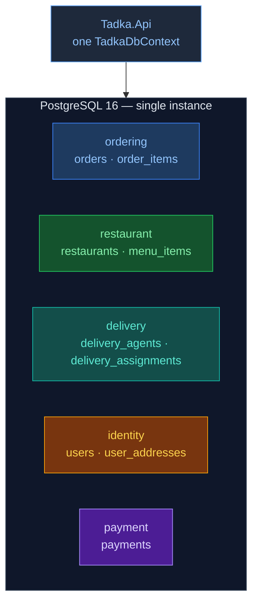

# Day 2 — Schema-per-domain (one database, five schemas)

One PostgreSQL **instance**. Five **schemas**. **Zero arrows between them** — that missing line is ADR-008, not an omission.

There is no `users` schema and no `orders` schema. Names are **bounded-context** names (`identity`, `ordering`), not table names. The C# folder for identity is still `Domain/Users/` — aggregate name vs context name.

Inside a schema, FKs are fine (`order_items.order_id` → `orders.id`). Across schemas, only Guid columns (`orders.customer_id` has no FK to `identity.users`).
