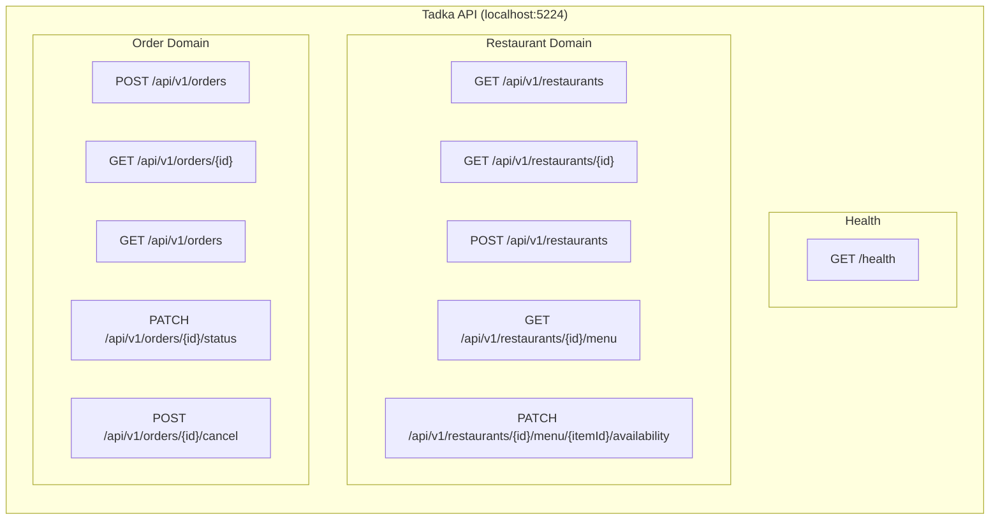
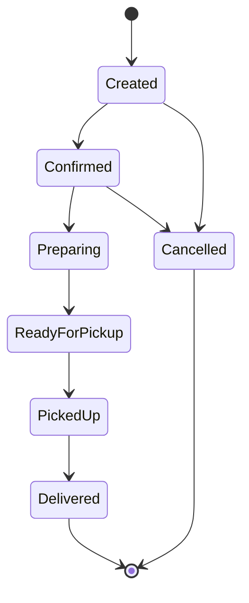

# Day 3: API Route Map

## All Implemented Endpoints

## Endpoint Summary Table

### Restaurant Endpoints (5)

| Method | Route | Purpose | Status Codes |
|--------|-------|---------|-------------|
| GET | `/api/v1/restaurants` | List with city filter, pagination | 200 |
| GET | `/api/v1/restaurants/{id}` | Get single restaurant | 200, 404 |
| POST | `/api/v1/restaurants` | Create restaurant | 201, 400 |
| GET | `/api/v1/restaurants/{id}/menu` | List menu items (vegOnly, category filter) | 200, 404 |
| PATCH | `/api/v1/restaurants/{id}/menu/{itemId}/availability` | Toggle item availability | 204, 404 |

### Order Endpoints (5)

| Method | Route | Purpose | Status Codes |
|--------|-------|---------|-------------|
| POST | `/api/v1/orders` | Create order (server-side pricing) | 201, 400, 404 |
| GET | `/api/v1/orders/{id}` | Get order details | 200, 404 |
| GET | `/api/v1/orders` | List with customer filter, pagination | 200 |
| PATCH | `/api/v1/orders/{id}/status` | Update status (state machine) | 204, 404, 422 |
| POST | `/api/v1/orders/{id}/cancel` | Cancel order | 204, 404, 422 |

### Health (1)

| Method | Route | Purpose | Status Codes |
|--------|-------|---------|-------------|
| GET | `/health` | Readiness check | 200 |

**Total: 11 endpoints**

## Order State Machine

## Future Endpoints (Not Implemented)

| Domain | Endpoints | Planned |
|--------|-----------|---------|
| Delivery | 4 endpoints | Day 4 |
| User/Auth | 4 endpoints | Day 6 |
| Payment | 3 endpoints | Day 7 |
