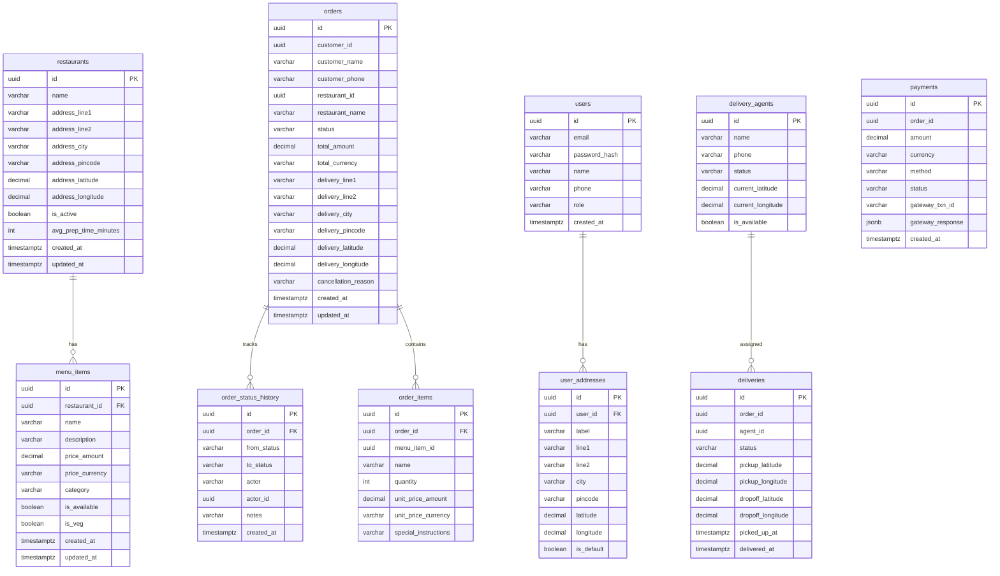

# Day 3: Database ER Diagram

## Entity Relationship Diagram

All tables in one PostgreSQL database, separated by schema. No cross-schema foreign keys.

## Schema Ownership

| Schema | Tables | Status |
|--------|--------|--------|
| `restaurant` | restaurants, menu_items | ✅ Implemented (Day 2-3) |
| `ordering` | orders, order_items | ✅ Implemented (Day 2-3) |
| `identity` | users, user_addresses | 🔲 Planned (Day 6) |
| `delivery` | delivery_agents, deliveries | 🔲 Planned (Day 4) |
| `payment` | payments | 🔲 Planned (Day 7) |

## Design Rules

1. **No cross-schema foreign keys.** `orders.restaurant_id` is NOT a FK to `restaurant.restaurants`. It's a plain UUID. This makes future service extraction possible.

2. **Denormalized order_items.** `order_items.name` and `unit_price_amount` are copied from menu_items at order time. If the restaurant changes the price later, existing orders aren't affected.

3. **VARCHAR for status fields.** Not enums. Adding a new status doesn't require a migration.

4. **Value objects stored as owned entities.** `Address`, `Money` are flattened into parent table columns via EF Core's `OwnsOne`.
