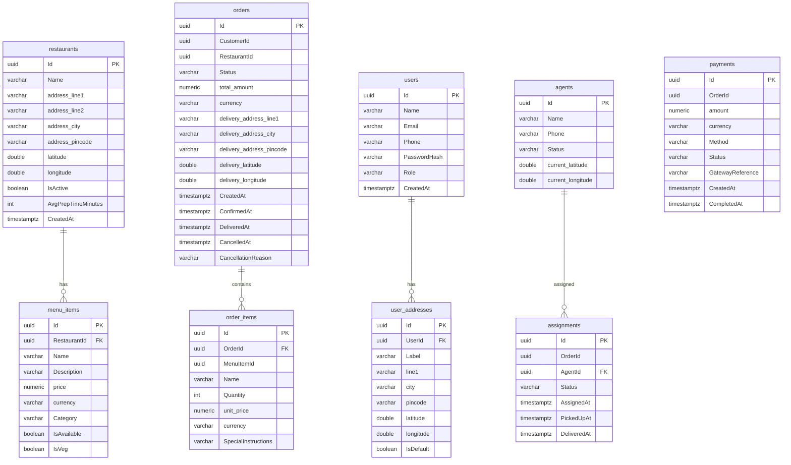

# Day 3: Database ER Diagram

## Entity Relationship Diagram

All tables in one PostgreSQL database, separated by schema. **No cross-schema foreign keys** — cross-domain links are plain UUIDs. (Mirrors the live EF model; column casing is mixed because owned value objects use snake_case.)

## Schema Ownership

| Schema | Tables | Status |
|--------|--------|--------|
| `restaurant` | restaurants, menu_items | ✅ live + seeded |
| `ordering` | orders, order_items | ✅ live |
| `identity` | users, user_addresses | ✅ live (1 customer seeded; auth wired later) |
| `delivery` | agents, assignments | ✅ schema present (delivery endpoints come Day 4+) |
| `payment` | payments | ✅ schema present (processing comes Day 7) |

## Design Rules

1. **No cross-schema foreign keys** (ADR-008). `orders.RestaurantId`, `order_items.MenuItemId`, `assignments.OrderId`, `payments.OrderId` are plain UUIDs, validated in the application layer. This keeps each schema independently extractable.
2. **Within-schema FKs only**: `menu_items → restaurants`, `order_items → orders`, `user_addresses → users`, `assignments → agents`.
3. **Denormalized snapshots** (ADR-009): `order_items.Name` + `unit_price` are copied from the menu at order time — historical accuracy.
4. **VARCHAR status, not ENUM** — flexible to add new states without an `ALTER TYPE` migration.
5. **Value objects via `OwnsOne`** — `Money`, `Address`, `GeoLocation` flatten into parent columns (the snake_case ones).
6. **No hard DELETE** — `IsActive` / `IsAvailable` / `Cancelled` instead.
