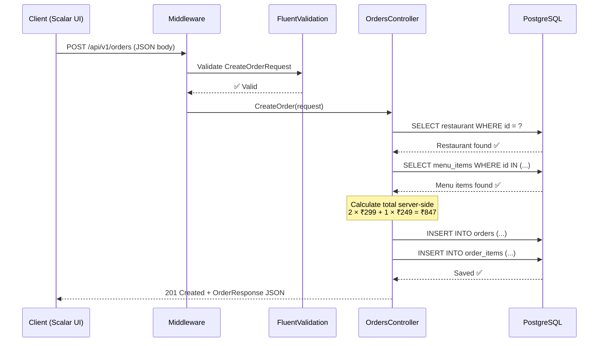
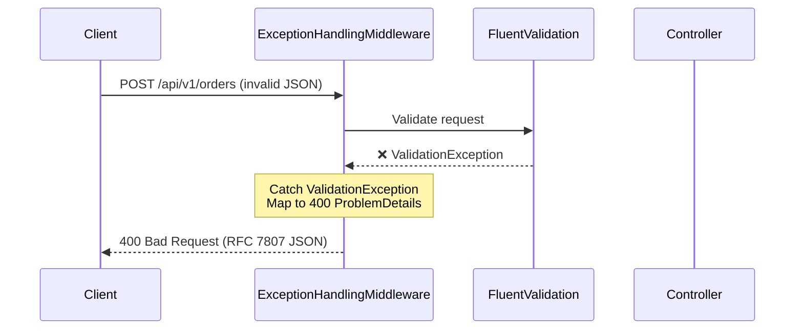
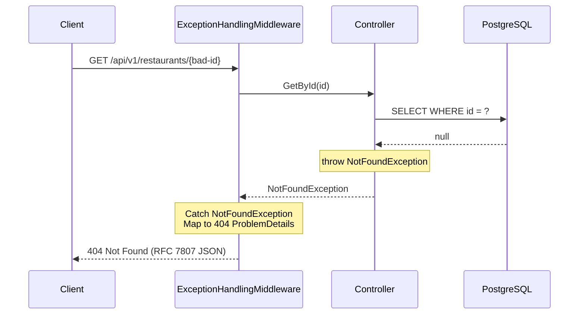
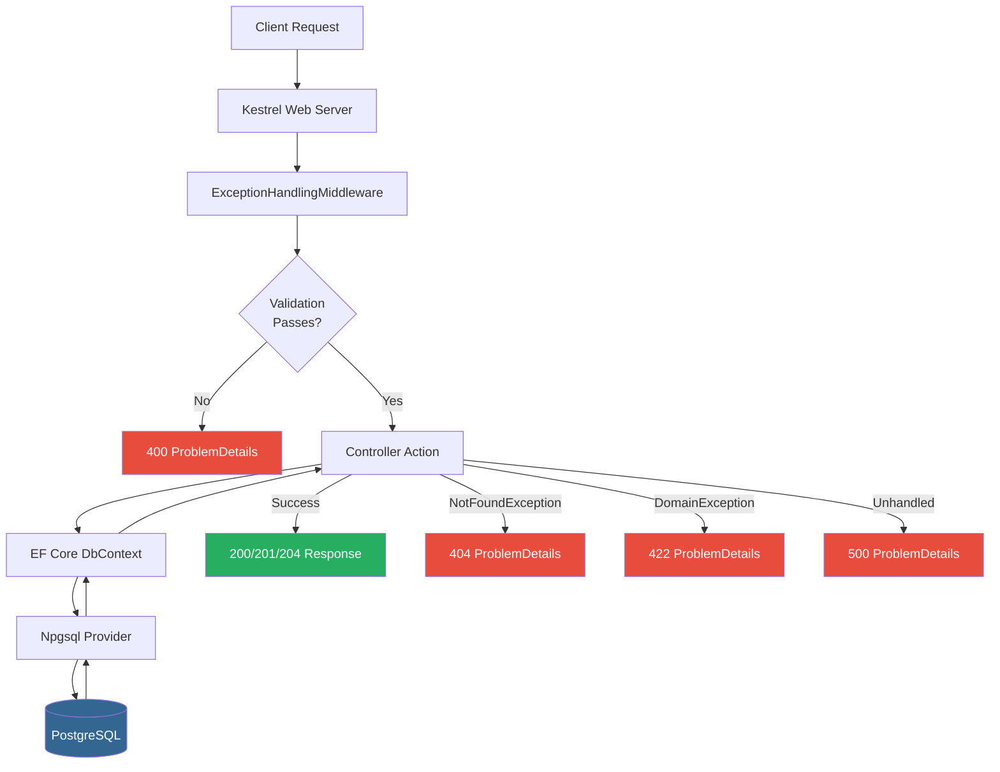

# Day 3: Request Flow Diagram

## Happy Path: Create Order

```mermaid
sequenceDiagram
    participant C as Client (Scalar UI)
    participant M as Middleware
    participant V as FluentValidation
    participant Ctrl as OrdersController
    participant DB as PostgreSQL

    C->>M: POST /api/v1/orders (JSON body)
    M->>V: Validate CreateOrderRequest
    V-->>M: ✅ Valid

    M->>Ctrl: CreateOrder(request)

    Ctrl->>DB: SELECT restaurant WHERE id = ?
    DB-->>Ctrl: Restaurant found ✅

    Ctrl->>DB: SELECT menu_items WHERE id IN (...)
    DB-->>Ctrl: Menu items found ✅

    Note over Ctrl: Calculate total server-side<br/>2 × ₹299 + 1 × ₹249 = ₹847

    Ctrl->>DB: INSERT INTO orders (...)
    Ctrl->>DB: INSERT INTO order_items (...)
    DB-->>Ctrl: Saved ✅

    Ctrl-->>C: 201 Created + OrderResponse JSON
```

## Error Path: Validation Failure

```mermaid
sequenceDiagram
    participant C as Client
    participant M as ExceptionHandlingMiddleware
    participant V as FluentValidation
    participant Ctrl as Controller

    C->>M: POST /api/v1/orders (invalid JSON)
    M->>V: Validate request
    V-->>M: ❌ ValidationException

    Note over M: Catch ValidationException<br/>Map to 400 ProblemDetails

    M-->>C: 400 Bad Request (RFC 7807 JSON)
```

## Error Path: Resource Not Found

```mermaid
sequenceDiagram
    participant C as Client
    participant M as ExceptionHandlingMiddleware
    participant Ctrl as Controller
    participant DB as PostgreSQL

    C->>M: GET /api/v1/restaurants/{bad-id}
    M->>Ctrl: GetById(id)
    Ctrl->>DB: SELECT WHERE id = ?
    DB-->>Ctrl: null

    Note over Ctrl: throw NotFoundException

    Ctrl-->>M: NotFoundException
    Note over M: Catch NotFoundException<br/>Map to 404 ProblemDetails

    M-->>C: 404 Not Found (RFC 7807 JSON)
```

## Full Request Pipeline

```mermaid
graph TD
    A[Client Request] --> B[Kestrel Web Server]
    B --> C[ExceptionHandlingMiddleware]
    C --> D{Validation<br/>Passes?}
    D -->|No| E[400 ProblemDetails]
    D -->|Yes| F[Controller Action]
    F --> G[EF Core DbContext]
    G --> H[Npgsql Provider]
    H --> I[(PostgreSQL)]
    I --> H
    H --> G
    G --> F
    F -->|Success| J[200/201/204 Response]
    F -->|NotFoundException| K[404 ProblemDetails]
    F -->|DomainException| L[422 ProblemDetails]
    F -->|Unhandled| M[500 ProblemDetails]

    style I fill:#336791,color:#fff
    style E fill:#e74c3c,color:#fff
    style K fill:#e74c3c,color:#fff
    style L fill:#e74c3c,color:#fff
    style M fill:#e74c3c,color:#fff
    style J fill:#27ae60,color:#fff
```
