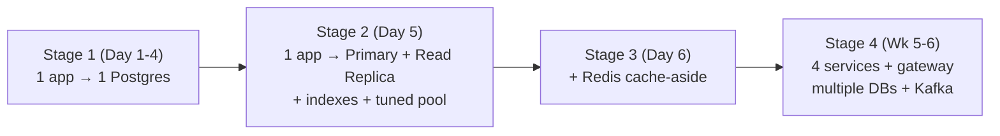
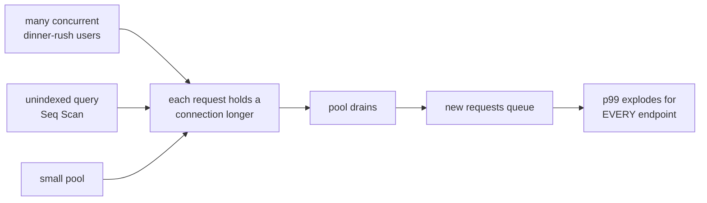
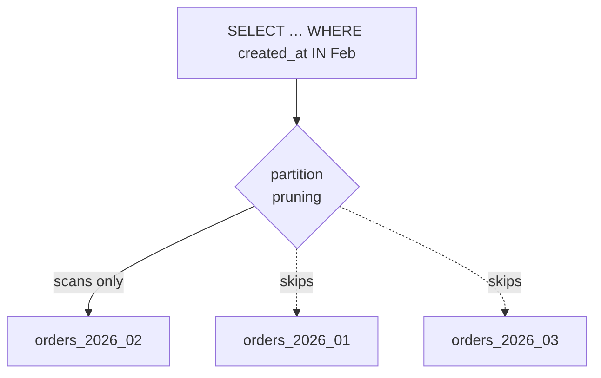

# Day 5 — Scaling the Database (diagrams)

Failure-first scaling of the read/write paths. See ADR-014 (indexing), ADR-015 (connection pool),
ADR-016 (read replica + read/write split), ADR-017 (partitioning/sharding deferred), and
`docs/scaling-decision-tree.md` (cheapest-first).

---

## 1. Architecture evolution (where Day 5 sits)



Each stage is *earned* by a measured break, not a calendar. Day 5 moves Stage 1 → Stage 2.

---

## 2. Read/write split + the read-your-writes rule (ADR-016)

```mermaid
flowchart TD
    C[Client] -->|POST /orders, PATCH status| API[Tadka.Api]
    C -->|GET /restaurants, /menu, /orders history| API
    C -->|GET /orders/&#123;id&#125; just placed| API

    API -->|writes + read-your-writes<br/>TadkaDbContext| P[(Primary 5432)]
    API -->|read-heavy GETs NoTracking<br/>TadkaReadDbContext| R[(Read replica 5433)]
    P -.->|streaming WAL| R

    classDef pri fill:#0c2d48,stroke:#3b82f6,color:#93c5fd
    classDef rep fill:#14532d,stroke:#4ade80,color:#bbf7d0
    class P pri
    class R rep
```



> **The rule:** any GET that can follow a user's own write in the same flow (e.g. the order they just placed) reads from the **primary** — the replica may be milliseconds behind. Everything stale-tolerant (lists, menu, history) reads from the **replica**.

---

## 3. The dinner-rush causal chain (Beat 1 + 2)



Fix cheapest-first: **index** (root cause) + **pool tuning** (stops the queue). Total daily volume never mattered — concurrency × hold-time × pool-size did.

---

## 4. EXPLAIN before / after (Beat 1)

```
BEFORE (no index):  Seq Scan on orders  (reads all rows)  +  Sort        ~1200 ms
AFTER  (composite): Index Scan using ix_orders_customer_id_created_at     ~2 ms
```

`(customer_id, created_at DESC)` satisfies both the filter and the ORDER BY from the index, so the `Sort` node disappears too.

---

## 5. Partition pruning (Beat 4 — deferred, ADR-017)



Only earned at ~1 crore rows / RAM pressure. Until then a B-tree index handles the volume; partitioning would only make simple `WHERE id = ?` lookups harder.
