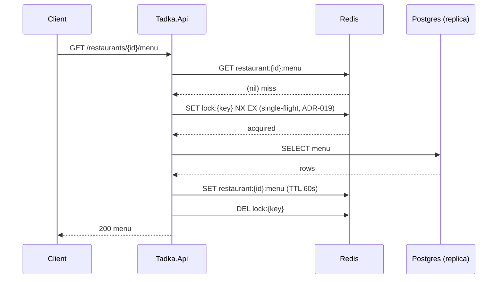
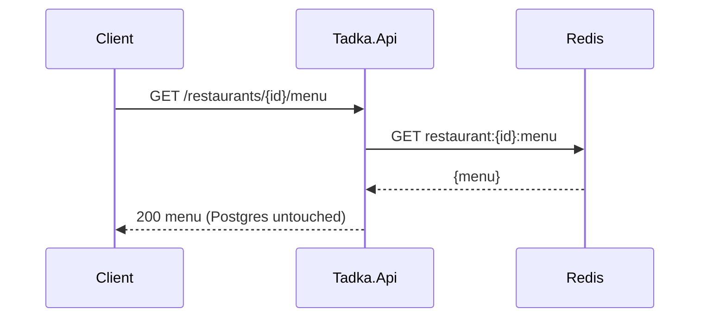
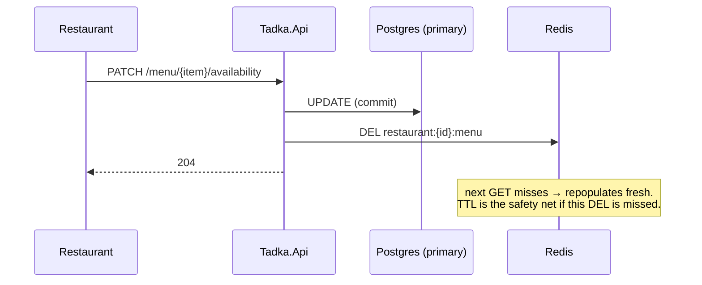
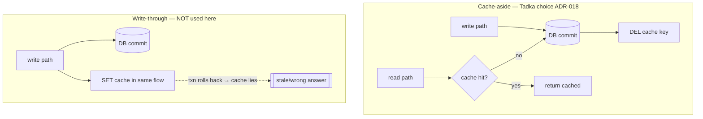
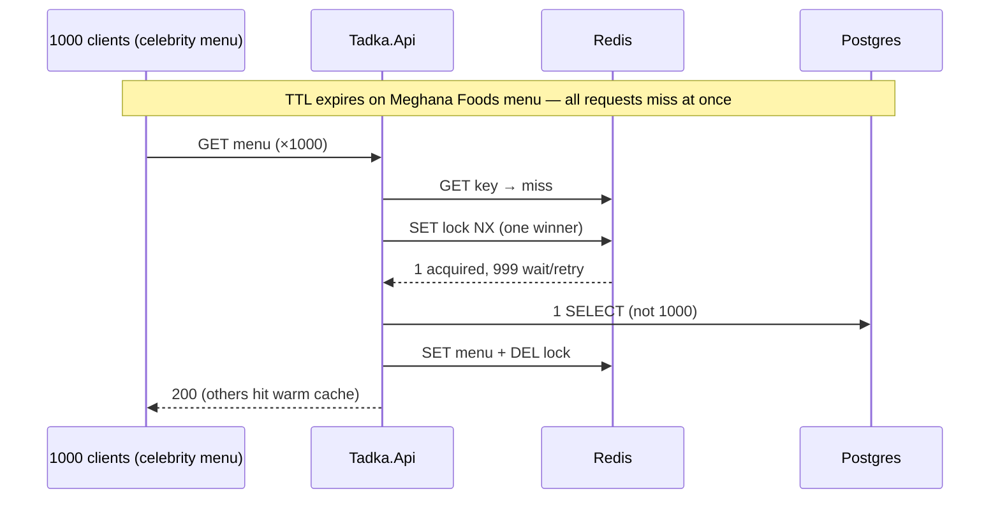
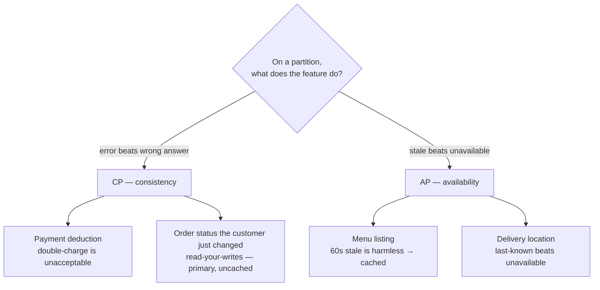

# Day 6 — Cache Patterns (diagrams)

Redis cache-aside on the menu, single-flight stampede protection, and CAP per feature.
See ADR-018 (cache-aside + delete-on-write), ADR-019 (single-flight lock).

---

## 1. Cache miss → populate (with single-flight lock)

## 2. Cache hit (the DB never sees it)

## 3. Invalidation — delete-on-write (ADR-018)

> **Cache-aside delete, not write-through:** if we *updated* Redis on write and the DB txn then rolled back, the cache would lie. Delete-then-repopulate's worst case is a harmless miss.

---

## 4. Cache-aside vs write-through (option-space)

| Pattern | Write path | Stale risk | Rollback safety | When to switch |
|---------|------------|------------|-----------------|----------------|
| **Cache-aside** | DB first, invalidate cache | TTL-bound stale window | Safe (worst case = miss) | Default for read-heavy, tolerate seconds of staleness |
| **Write-through** | DB + cache updated together | Lower on reads | **Unsafe** if cache update outlives a rolled-back txn | Strong read-after-write on hot keys, or when miss cost is extreme |

---

## 5. Stampede / hot-key (ADR-019)

Without the lock: 1000 concurrent misses → 1000 identical DB queries → replica meltdown (Day-14 chaos reuses this lever).

---

## 6. CAP per feature (not per system)

Networks partition; **P is a given**. Per feature: on a partition, choose **Consistency** (error/block) or **Availability** (possibly stale)?

| Feature | Choice | In Tadka |
|---------|--------|----------|
| Payment | **CP** | never cached |
| Order status (just changed) | **CP / fresh** | primary, read-your-writes (ADR-016) |
| Menu | **AP** | Redis cache-aside, TTL 60s |
| Delivery location | **AP** | SSE + Redis pub/sub (ADR-020) |