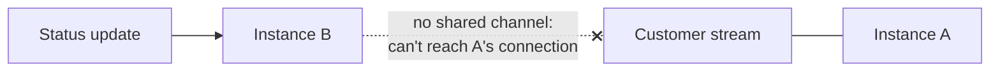
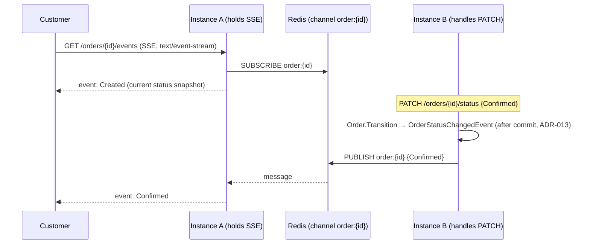

# Day 6 — Live Tracking: SSE + Redis Pub/Sub Backplane

See ADR-020. The Day-4 cliffhanger: in-process domain events need a **backplane** once you run more than one instance.

---

## 1. Why a backplane (the break)

A streaming connection lives on **one** instance. With two instances (for availability), an update processed on B can't reach a stream held by A — it's silently lost.

---

## 2. The fix — publish to Redis, the holding instance is subscribed

- **SSE** (one-way, plain HTTP, auto-reconnect) — right fit for server→client tracking; WebSocket reserved for two-way chat.
- The **publish** rides the Day-4 in-process domain-event seam (ADR-013); at extraction (Week 5) it becomes a **Kafka** publish — same shape.
- Redis pub/sub is at-most-once (fine for tracking; SSE reconnect re-sends current status). Durable delivery (driver assignment) uses Kafka (Day 9).