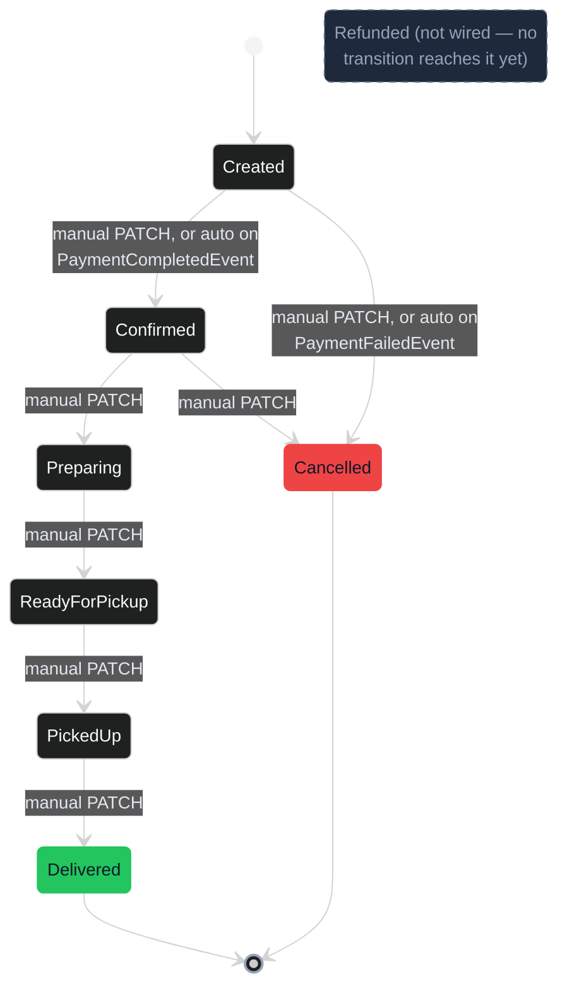

# Day 7 — Order lifecycle (state diagram)

The order state machine existed before Day 7 (Week 2, ADR-012 optimistic concurrency), but Day 7's async payment work is what gave it its first *automatic* transitions — until now, every state change was a manual `PATCH /orders/{id}/status`. Grounded directly in `src/Tadka.Api/Domain/Orders/OrderStateMachine.cs`, `OrderStatus.cs`, and the two reaction handlers in `Domain/Orders/Events/Handlers/OrderPaymentReactionHandlers.cs`, not just ADR prose.

---

## 1. States and transitions

**Legend:** green = the one happy-path terminal state, red = the other terminal state, dashed slate = declared in the code (`OrderStatus.Refunded` exists in the enum) but not yet reachable — `OrderStateMachine.cs`'s own comment calls it out: `// terminal in v1 — Refunded is a Day-7 payment concern, not wired yet`.

**What Day 7 actually changed here — precisely, from the handler code, not the ADR summary:**
- `ConfirmOrderOnPaymentCompleted` (`INotificationHandler<PaymentCompletedEvent>`) calls `order.Transition(OrderStatus.Confirmed)` — so a settled payment auto-advances `Created → Confirmed`. This is the *same* transition a human already had via `PATCH`; Day 7 just added a second, automatic trigger for it.
- `CancelOrderOnPaymentFailed` (`INotificationHandler<PaymentFailedEvent>`) calls `order.Cancel(...)` — same story: `Created → Cancelled` already existed, a failed payment is just a new caller of it.
- **No new transition was added to the table.** ADR-022/023's "the order reacts through the existing state machine" is literally true at the code level — `Transitions` in `OrderStateMachine.cs` is unchanged from before Day 7. What's new is *who else* is allowed to trigger `Confirmed` and `Cancelled`: an event handler, not just a human via the API.
- **The race is handled, not ignored.** Both handlers check `result.IsFailure` after calling the state machine and just log + return if the order already moved on (e.g., an admin manually cancelled it before payment settled). `CanTransition` is the single guard both a human `PATCH` and an automatic event go through — there's exactly one place "is this move legal" is decided.
- **`Refunded` is real but dormant.** It's a full member of `OrderStatus`, but zero entries in `Transitions` point to it, and neither payment handler references it. Drawing it as reachable would be wrong; drawing it as absent would hide a state the code has already committed to supporting. The dashed styling is the honest middle ground.
