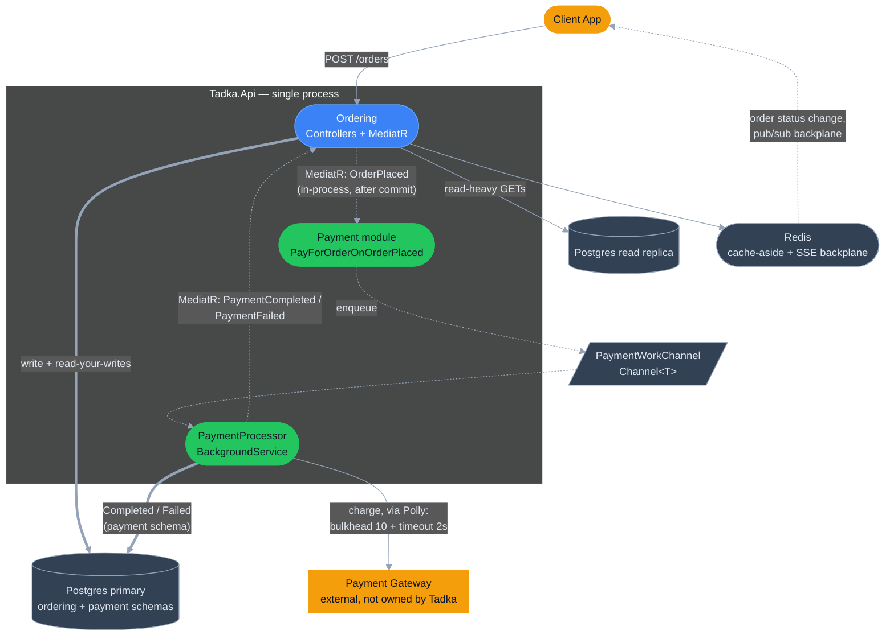
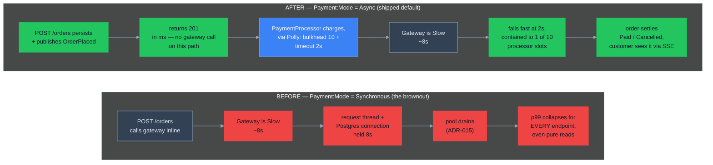

# Day 7 — Payment resilience (diagrams)

Payment enters the order flow for the first time — and with it, Tadka's first hard external dependency it doesn't own. See ADR-021 (Polly timeout + bulkhead), ADR-022 (modular monolith, MediatR, Payment module), ADR-023 (async payment, CQRS-lite), and `cohort-prep/day-07/break-kit-day-07.md` (the brownout lab this maps to).

Grounded in the actual code on this branch: `src/Tadka.Api/Modules/Payments/` (`PaymentProcessor.cs`, `PaymentWorkChannel.cs`, `PayForOrderOnOrderPlaced.cs`, `PaymentOptions.cs`, `IPaymentGateway.cs` / `FakePaymentGateway.cs`), `src/Tadka.Api/Infrastructure/Resilience/PaymentResiliencePipeline.cs`, `src/Tadka.Api/Domain/Payments/Payment.cs`. Still **one deployable** — `src/Tadka.Api` is the only project in `src/` on this branch; Payment is carved as a module, not yet a service (that's Day 8).

---

## 1. High-level runtime architecture (end of Day 7, shipped default: Async)

**Legend:** amber = outside Tadka's control (client, payment gateway), blue = the existing request path, green = what Day 7 adds, slate = infrastructure. Dashed arrows are in-process events/queueing, not HTTP calls.

**What the diagram is actually proving:** `Ordering` and `PayModule` sit in the same OS process and the same physical Postgres — but `Ordering` has **zero references** to anything under `Modules/Payments`, and the only contract between them is the `OrderPlaced`/`PaymentCompleted`/`PaymentFailed` events (ADR-022). That boundary is what Day 8 later extracts into a real service without touching Ordering's code — the diagram already shows the cut line, a day early.

Also note what's *not* in the request path: `Ordering -->|POST /orders|` never reaches `Gateway`. The synchronous edge stops at `Primary`. Payment is entirely someone else's problem by the time the client gets its `201`.

---

## 2. Before / after: the brownout (ADR-021 + ADR-023)

Same code, one config flip — `Payment:Mode = Synchronous` vs `Async` (`PaymentOptions.cs`) with the gateway set to `Behavior: Slow` (~8s, `GatewayOptions.SlowDelaySeconds`). This is the actual teaching lever in the code, not a hypothetical.

**The point that's easy to miss:** the gateway is *equally slow* in both halves (`~8s`, unchanged). Nothing about the payment provider got better. What changed is **where the wait happens and who it's allowed to hurt** — before, an 8s wait sits on the shared connection pool that every other endpoint depends on; after, the same 8s wait is a `TimeoutRejectedException` at 2s, contained to one of ten processor slots, on a background path the order-creation request never touches. Same failure, bounded blast radius (ADR-021's own phrase).

One real ordering detail worth teaching from the code, not just the prose: in `PaymentResiliencePipeline.cs` the **bulkhead (concurrency limiter) is the outermost strategy and timeout is innermost** — a call is admitted against the 10-permit cap first, *then* subjected to the 2s clock. Rejected-for-capacity and timed-out-in-flight are two different failure modes with two different causes, and the pipeline is built to tell them apart.
