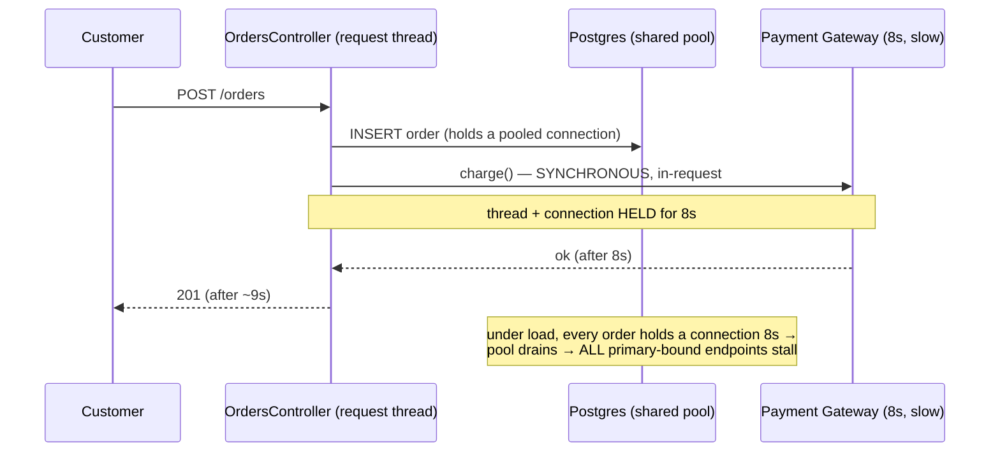
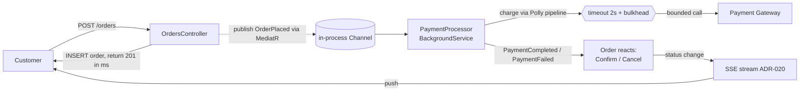
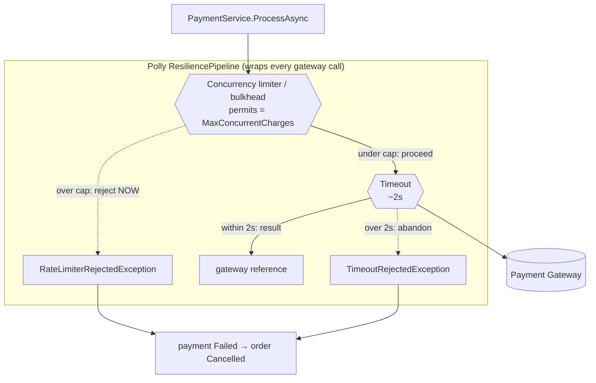
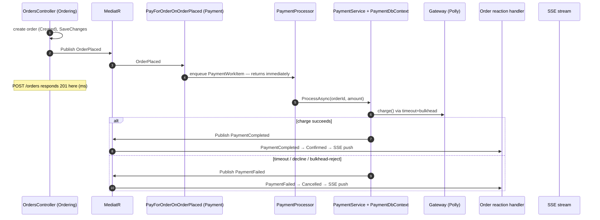
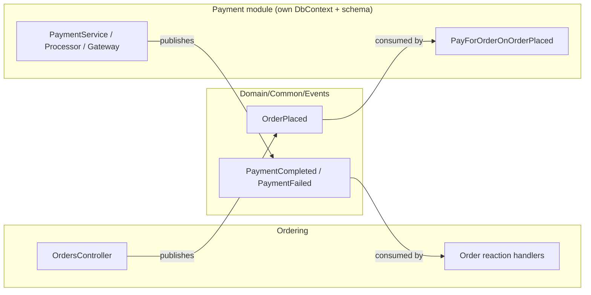

# Day 7 — Payment Resilience & Decoupling (diagrams)

The payment brownout: sync in-request charging holds the shared pool for ~9s.
Fixed with Polly (ADR-021), a Payment module seam (ADR-022), and async payment (ADR-023).

---

## 1. Before — synchronous payment inside the order request (the brownout)

```mermaid
sequenceDiagram
    participant C as Customer
    participant API as OrdersController (request thread)
    participant DB as Postgres (shared pool)
    participant GW as Payment Gateway (8s, slow)

    C->>API: POST /orders
    API->>DB: INSERT order (holds a pooled connection)
    API->>GW: charge() — SYNCHRONOUS, in-request
    Note over API,GW: thread + connection HELD for 8s
    GW-->>API: ok (after 8s)
    API-->>C: 201 (after ~9s)
    Note over DB: under load, every order holds a connection 8s →<br/>pool drains → ALL primary-bound endpoints stall
```

A slow *payment* dependency degrades the *whole* monolith — including menu browsing — because it holds resources every request needs.

---

## 2. After — Polly-bounded gateway + payment off the request path

```mermaid
flowchart LR
    C[Customer] -->|POST /orders| API[OrdersController]
    API -->|INSERT order, return 201 in ms| C
    API -.->|publish OrderPlaced via MediatR| Q[(in-process Channel)]
    Q --> W[PaymentProcessor<br/>BackgroundService]
    W -->|charge via Polly pipeline| P{{timeout 2s + bulkhead}}
    P -->|bounded call| GW[Payment Gateway]
    W -->|PaymentCompleted / PaymentFailed| ORD[Order reacts:<br/>Confirm / Cancel]
    ORD -->|status change| SSE[SSE stream ADR-020]
    SSE -->|push| C
```

`POST /orders` returns immediately; payment converges later and is **pushed** on the Day-6 SSE stream.

---

## 3. The Polly pipeline: timeout + bulkhead (ADR-021)

```mermaid
flowchart TB
    subgraph Pipeline["Polly ResiliencePipeline (wraps every gateway call)"]
        direction TB
        BH{{Concurrency limiter / bulkhead<br/>permits = MaxConcurrentCharges}}
        TO{{Timeout<br/>~2s}}
        BH -->|under cap: proceed| TO
        BH -.->|over cap: reject NOW| REJ[RateLimiterRejectedException]
        TO -->|within 2s: result| OK[gateway reference]
        TO -.->|over 2s: abandon| TMO[TimeoutRejectedException]
    end

    Caller[PaymentService.ProcessAsync] --> BH
    TO --> GW[(Payment Gateway)]
    REJ --> FAIL[payment Failed → order Cancelled]
    TMO --> FAIL
```

- **Bulkhead (outermost):** caps blast radius — at most N in-flight gateway calls.
- **Timeout (innermost):** caps hold time — an 8s hang becomes a ~2s handled failure.

Retry + circuit breaker deferred to Day 14 (ADR-043).

---

## 4. Event flow: modules communicate only through events (ADR-022/023)

```mermaid
sequenceDiagram
    autonumber
    participant API as OrdersController (Ordering)
    participant M as MediatR
    participant PH as PayForOrderOnOrderPlaced (Payment)
    participant Q as PaymentProcessor
    participant PS as PaymentService + PaymentDbContext
    participant GW as Gateway (Polly)
    participant OR as Order reaction handler
    participant SSE as SSE stream

    API->>API: create order (Created), SaveChanges
    API->>M: Publish OrderPlaced
    M->>PH: OrderPlaced
    PH->>Q: enqueue PaymentWorkItem — returns immediately
    Note over API: POST /orders responds 201 here (ms)

    Q->>PS: ProcessAsync(orderId, amount)
    PS->>GW: charge() via timeout+bulkhead
    alt charge succeeds
        PS->>M: Publish PaymentCompleted
        M->>OR: PaymentCompleted → Confirmed → SSE push
    else timeout / decline / bulkhead-reject
        PS->>M: Publish PaymentFailed
        M->>OR: PaymentFailed → Cancelled → SSE push
    end
```

## 5. Module boundaries (grep-proven)

```mermaid
flowchart LR
    subgraph Ordering
        O1[OrdersController]
        O2[Order reaction handlers]
    end
    subgraph Shared["Domain/Common/Events"]
        E1[OrderPlaced]
        E2[PaymentCompleted / PaymentFailed]
    end
    subgraph Payment["Payment module (own DbContext + schema)"]
        P1[PayForOrderOnOrderPlaced]
        P2[PaymentService / Processor / Gateway]
    end

    O1 -->|publishes| E1
    E1 -->|consumed by| P1
    P2 -->|publishes| E2
    E2 -->|consumed by| O2
```

Both modules point at **Shared**, never at each other. That seam is what makes Day-8 extraction a *move*, not a *rewrite*.