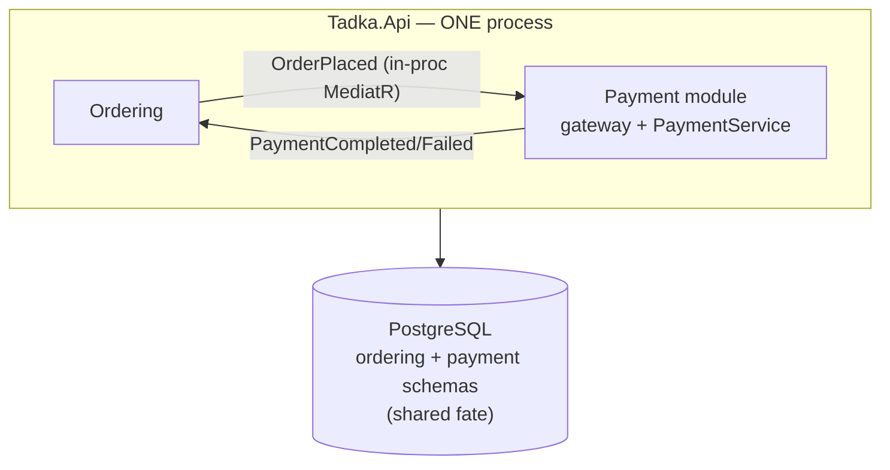
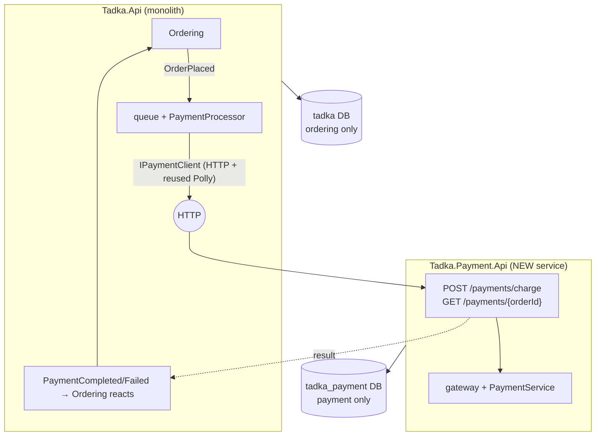

# Day 8 — Before / After: one process → two services + two databases

Read this next to the runbook [`day-08.md`](../runbooks/day-08.md).

**Before (Day 7 — modular monolith):** Payment is a clean *module*, but it shares the monolith's **process** and **database**. A payment fatal or a payment-DB outage takes the whole host down.

**After (Day 8 — first extraction):** Payment is its own **service** with its own **database**, reached over **HTTP**. Kill Payment (or its DB) and the monolith keeps serving menus.

The two boxes share **no code** and **no database** — only the event/HTTP **contract**. That contract becomes a Kafka topic on Day 9.
