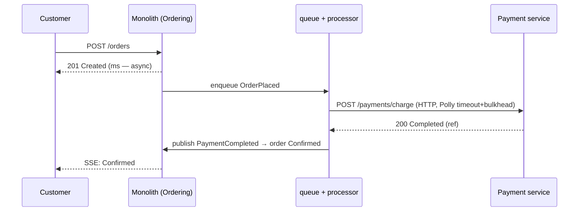
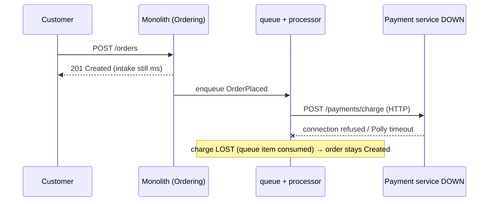

# Day 8 — The HTTP bridge and the charge that vanishes

**Happy path** — async intake is unchanged; the charge settles over HTTP; status rides Day-6 SSE.

**Payment service DOWN** — this is runbook §2–§3. You get **201**. The charge is **lost**.

Fault isolation works (monolith is fine). The charge is lost because HTTP needs the callee **now**. Day 9: Outbox + Kafka — a down service means the message **waits**, not vanishes.
