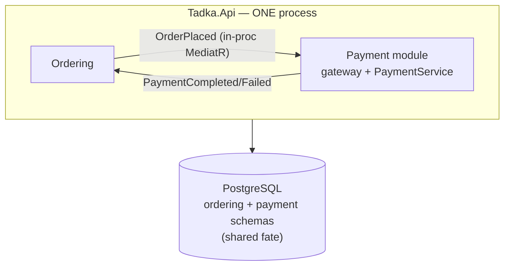
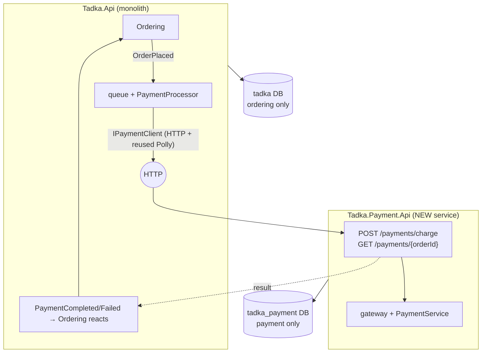
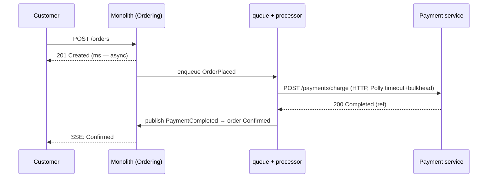
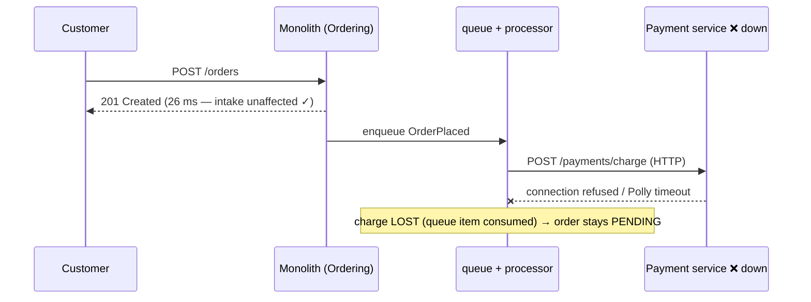

# Day 8 — HTTP Bridge & Temporal Coupling (diagrams)

Synchronous HTTP between services (ADR-025). Fault isolation works; the charge can be **lost** if Payment is down — earns Day 9.

---

## 1. Before / After: one process → two services + two databases

**Before (Day 7 — modular monolith):** Payment is a clean *module*, but shares the monolith's **process** and **database**.

```mermaid
flowchart TB
    subgraph M["Tadka.Api — ONE process"]
        O["Ordering"] -- "OrderPlaced (in-proc MediatR)" --> P["Payment module<br/>gateway + PaymentService"]
        P -- "PaymentCompleted/Failed" --> O
    end
    M --> DB[("PostgreSQL<br/>ordering + payment schemas<br/>(shared fate)")]
```

**After (Day 8 — first extraction):** Payment is its own **service** with its own **database**, reached over **HTTP**.

```mermaid
flowchart TB
    subgraph MONO["Tadka.Api (monolith)"]
        O["Ordering"] -- "OrderPlaced" --> Q["queue + PaymentProcessor"]
        Q -- "IPaymentClient (HTTP + reused Polly)" --> NET(("HTTP"))
        EV["PaymentCompleted/Failed → Ordering reacts"] --> O
    end
    subgraph PAY["Tadka.Payment.Api (NEW service)"]
        EP["POST /payments/charge<br/>GET /payments/{orderId}"] --> GW["gateway + PaymentService"]
    end
    NET --> EP
    EP -. "result" .-> EV
    MONO --> CDB[("tadka DB<br/>ordering only")]
    PAY --> PDB[("tadka_payment DB<br/>payment only")]
```

The two boxes share **no code** and **no database** — only the event/HTTP **contract**. That contract becomes a Kafka topic on Day 9.

---

## 2. Happy path — async intake preserved

```mermaid
sequenceDiagram
    participant C as Customer
    participant M as Monolith (Ordering)
    participant Q as queue + processor
    participant P as Payment service
    C->>M: POST /orders
    M-->>C: 201 Created (ms — async)
    M->>Q: enqueue OrderPlaced
    Q->>P: POST /payments/charge (HTTP, Polly timeout+bulkhead)
    P-->>Q: 200 Completed (ref)
    Q->>M: publish PaymentCompleted → order Confirmed
    M-->>C: SSE: Confirmed
```

---

## 3. Payment service DOWN — the wound synchronous HTTP leaves

```mermaid
sequenceDiagram
    participant C as Customer
    participant M as Monolith (Ordering)
    participant Q as queue + processor
    participant P as Payment service ❌ down
    C->>M: POST /orders
    M-->>C: 201 Created (26 ms — intake unaffected ✓)
    M->>Q: enqueue OrderPlaced
    Q->>P: POST /payments/charge (HTTP)
    P--xQ: connection refused / Polly timeout
    Note over Q: charge LOST (queue item consumed) → order stays PENDING
```

> **Fault isolation works** (monolith fine, intake fast) — but the charge is **lost** because sync HTTP requires the callee to be up *at that moment*. **Day 9** fixes it: Outbox + Kafka redelivers; Payment consumer is idempotent — a down service means the message *waits*, not vanishes.