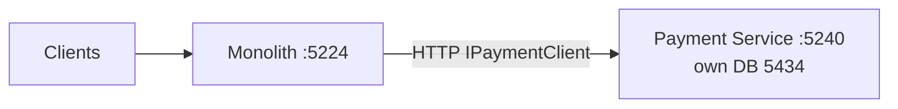
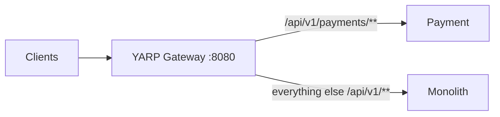
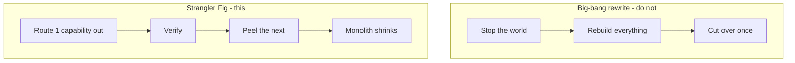

# Day 8 — Strangler Fig (extract without a big-bang rewrite)

You peel **one** capability at a time. Everything else stays on the monolith. Day 8 peels **Payment**.

**Today you have no API gateway.** You run two `dotnet run`s (`:5224` and `:5240`). The picture below is the **pattern**; YARP `:8080` is **Day 11**. Until then, the “router” is: clients hit the monolith; the monolith calls Payment over HTTP.

Later (Day 11+), a gateway sits in front and peels more vines the same way:

Because Day 7 gave Payment its own DbContext/schema/contract, extraction is a **move**, not a rewrite.
