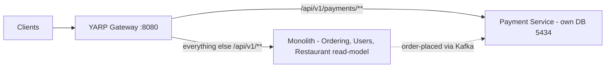
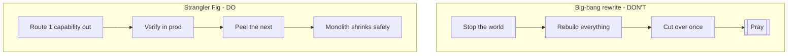

# Day 8 — Strangler Fig (first service extraction)

Payment peels out of the monolith without a big-bang rewrite. See ADR-024 (extract Payment), ADR-026 (database-per-service).

---

## 1. The routing view (Payment is the first vine)

```mermaid
flowchart LR
  client[Clients] --> gw[YARP Gateway :8080]
  gw -->|/api/v1/payments/**| pay[Payment Service - own DB 5434]
  gw -->|everything else /api/v1/**| mono[Monolith - Ordering, Users, Restaurant read-model]
  mono -.->|order-placed via Kafka| pay
```

**Move, not rewrite:** the Day-7 clean module seam becomes a network boundary. Day 11 peels Delivery, Day 12 peels Restaurant — same pattern, one vine at a time.

---

## 2. Why it beats a big-bang rewrite

```mermaid
flowchart TB
  subgraph bigbang [Big-bang rewrite - DON'T]
    a[Stop the world] --> b[Rebuild everything] --> c[Cut over once] --> d[[Pray]]
  end
  subgraph strangler [Strangler Fig - DO]
    e[Route 1 capability out] --> f[Verify in prod] --> g[Peel the next] --> h[Monolith shrinks safely]
  end
```

> **The seam is the product.** Because Day-7 gave Payment its own DbContext/schema/contract, extraction is a *move*: point the gateway route at the new service, keep the contract. The monolith keeps serving every un-peeled capability the whole time.