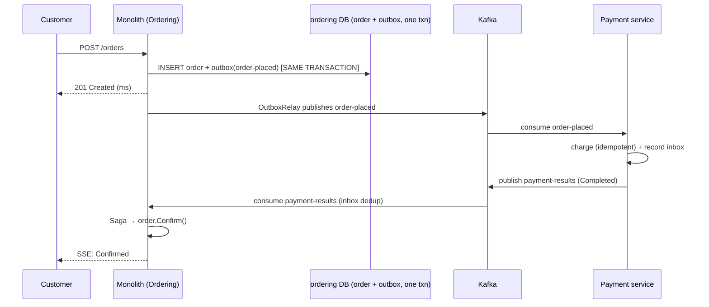
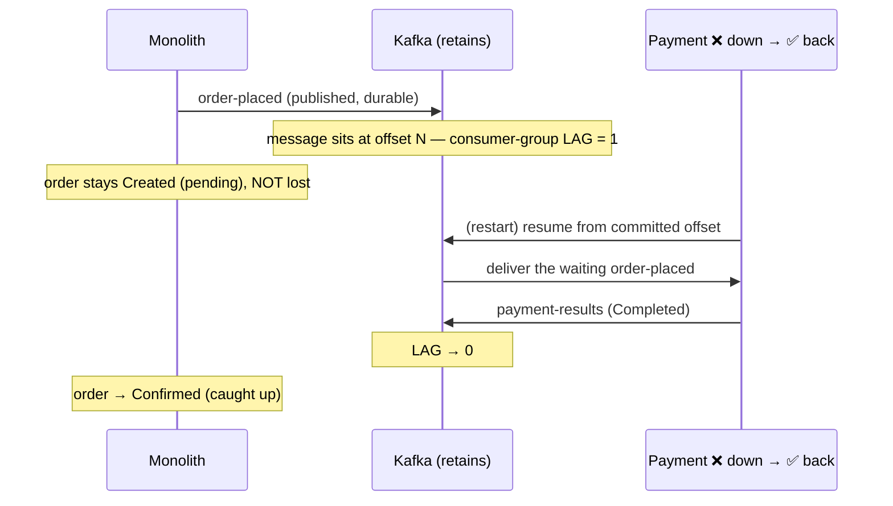

# Day 9 — Outbox → Kafka → Inbox (diagrams)

Durable async backbone healing Day-8 temporal coupling. See ADR-027 (Kafka), ADR-028 (Outbox/Inbox).

---

## 1. Happy path — event committed with the order

---

## 2. Catch-up — Payment down, message waits

---

## 3. What each piece closes

| Piece | Closes |
|-------|--------|
| **Outbox** | dual-write gap — event committed *with* the order |
| **Inbox + unique index** | at-least-once safety — no double charge |
| **Kafka retention** | temporal coupling — work **waits**, never disappears |

Multi-pod relay: `FOR UPDATE SKIP LOCKED` on OutboxRelay (ADR-028) — one row claimed by one pod.