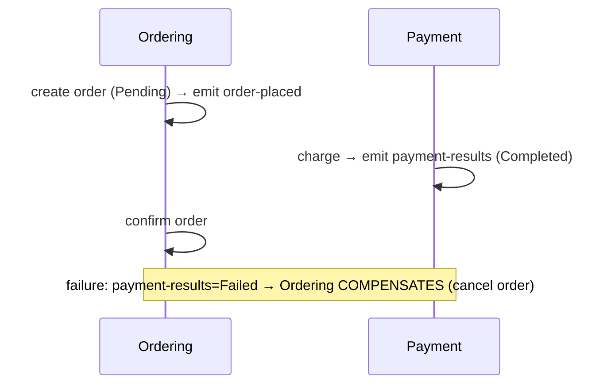
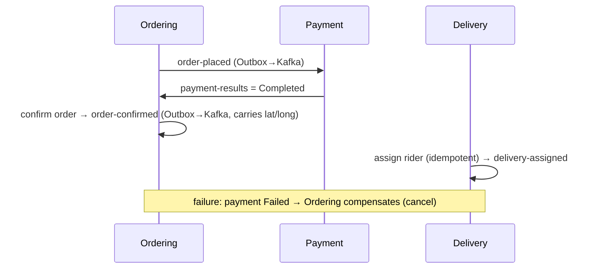
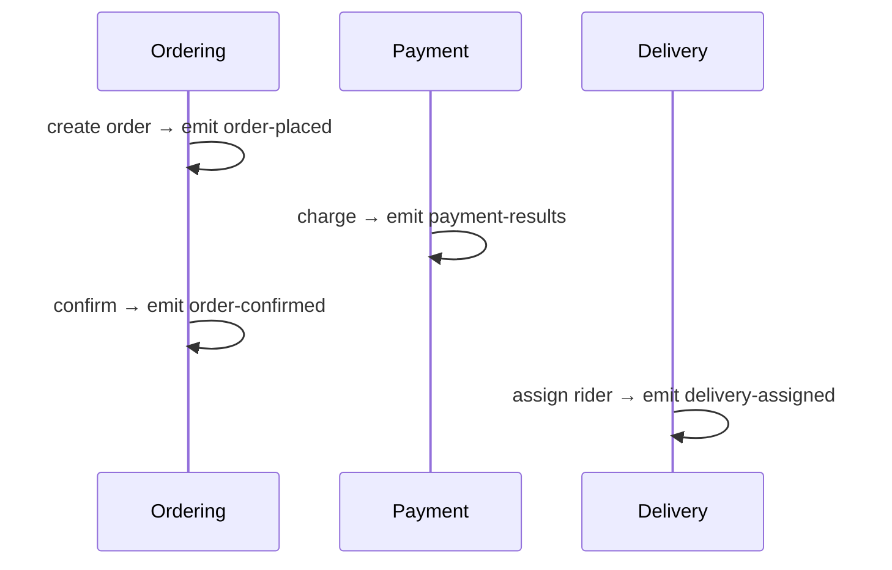
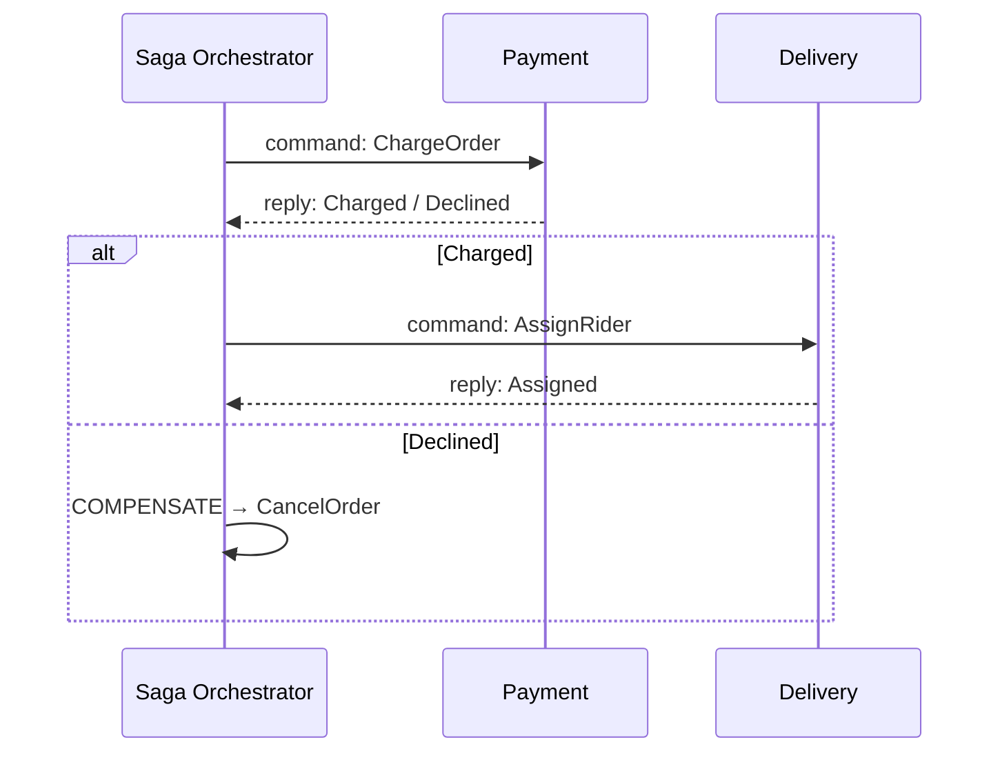

# Day 9–11 — Saga Choreography (diagrams)

Cross-service consistency without 2PC. See ADR-029 (Saga choreography). Day 11 adds Delivery as the 3rd participant.

---

## 1. Two-participant Saga (Day 9)

---

## 2. Three-participant Saga (Day 11)

---

## 3. Choreography vs orchestration (option-space)

**Choreography (what Tadka runs)** — no central brain; each service reacts to events.

**Orchestration (when flow outgrows implicit handlers)** — a coordinator owns commands + compensations.

| Use **choreography** when… | Use **orchestration** when… |
|---|---|
| 2–3 participants, mostly linear | 4+ participants / complex branching |
| services stay maximally autonomous | you need one place to see + operate the flow |
| flow rarely changes | timeouts, human steps, long-running |

> Rule of thumb: **start choreographed; reach for an orchestrator when you can no longer answer "what happens next?" by reading one file.**

Implementation landscape: manual Kafka handlers (Tadka), MassTransit/NServiceBus (.NET), Temporal, Camunda, Step Functions — pattern is language-neutral.