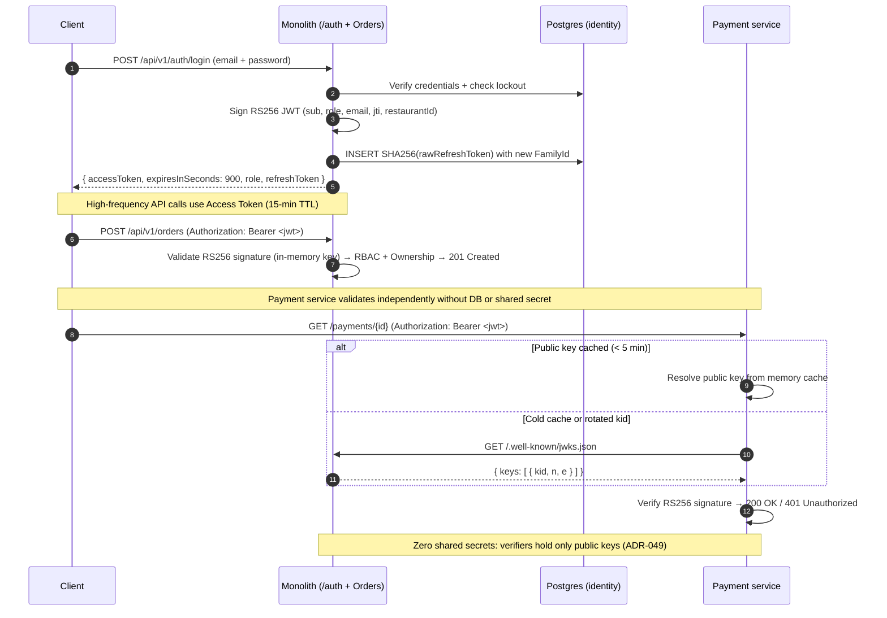
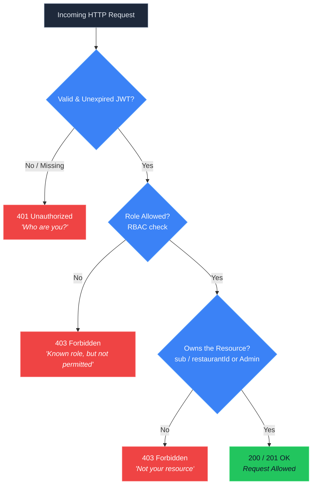
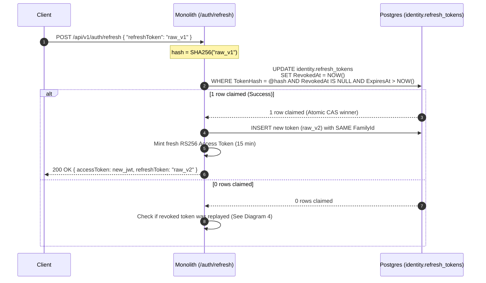
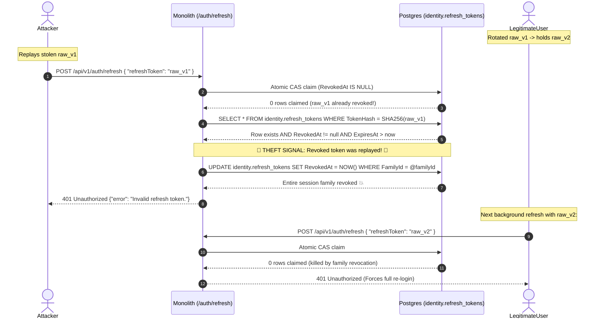

# Day 10 — Authentication & Authorization Diagrams

Complete visual flow of JWT authentication, asymmetric RS256/JWKS per-service validation, RBAC + resource ownership, and atomic refresh-token rotation with reuse detection.

> **Deep Dive Reading:** [`docs/learn/token-and-refresh-flow.md`](../learn/token-and-refresh-flow.md)
>
> **Related Architecture Decision Records:**
> - [ADR-030: Stateless JWT Authentication](../adrs/030-stateless-jwt-auth.md)
> - [ADR-031: RBAC and Resource Ownership](../adrs/031-rbac-and-resource-ownership.md)
> - [ADR-032: PII Encryption and Right-to-be-Forgotten](../adrs/032-pii-masking-and-encryption.md)
> - [ADR-048: Refresh-Token Rotation & Reuse Detection](../adrs/048-refresh-token-rotation-reuse-detection.md)
> - [ADR-049: RS256 Asymmetric Signing & JWKS Key Rotation](../adrs/049-rs256-jwks-key-rotation.md)

---

## 1. Login → RS256 JWT & Refresh Token → Per-Service JWKS Validation

---

## 2. Authorization Decision Tree (401 vs 403)

> **HTTP Semantics:**
> - **401 Unauthorized:** Authentication failure (*Who are you?* — missing, invalid, or expired token).
> - **403 Forbidden:** Authorization failure (*You are known, but not allowed* — insufficient role or accessing another tenant's data).

---

## 3. Silent Refresh & Single-Use CAS Rotation

---

## 4. Replay Attack Detection & Family Revocation

