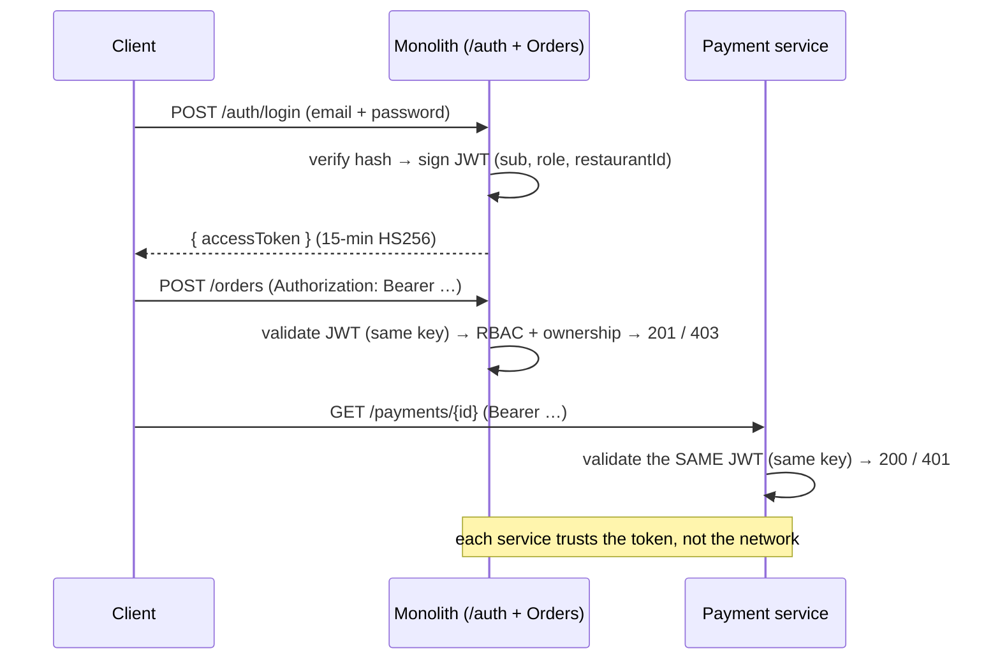

# Day 10 — Authentication & Authorization (diagrams)

JWT auth and per-service validation. See ADR-030 (JWT), ADR-031 (RBAC + ownership), ADR-032 (PII).

---

## 1. Login → JWT → per-service validation

```mermaid
sequenceDiagram
    participant C as Client
    participant M as Monolith (/auth + Orders)
    participant P as Payment service
    C->>M: POST /auth/login (email + password)
    M->>M: verify hash → sign JWT (sub, role, restaurantId)
    M-->>C: { accessToken }  (15-min HS256)
    C->>M: POST /orders  (Authorization: Bearer …)
    M->>M: validate JWT (same key) → RBAC + ownership → 201 / 403
    C->>P: GET /payments/{id}  (Bearer …)
    P->>P: validate the SAME JWT (same key) → 200 / 401
    Note over M,P: each service trusts the token, not the network
```

---

## 2. Authorization decision tree (401 vs 403)

```mermaid
flowchart TD
    A[request] --> B{valid JWT?}
    B -- no --> R401[401 Unauthorized]
    B -- yes --> C{role allowed? (RBAC)}
    C -- no --> R403a[403 Forbidden]
    C -- yes --> D{owns the resource?<br/>sub / restaurantId or Admin}
    D -- no --> R403b[403 Forbidden]
    D -- yes --> OK[allow]
```

> **401 ≠ 403.** 401 = *who are you?* (no/invalid token). 403 = *you're known, but not allowed* (wrong role or wrong owner).

Escalation ladder when ownership isn't enough: **RBAC → ownership → ABAC (context) → ReBAC/OPA** — adopt the next rung only when a real rule demands it.