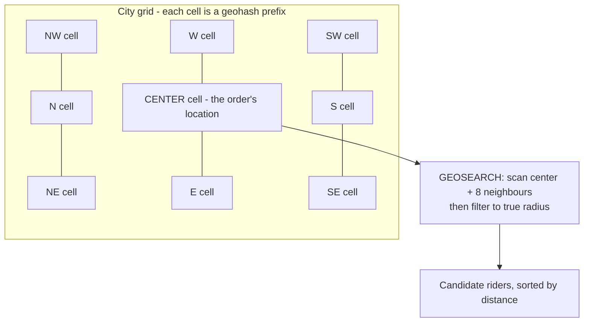
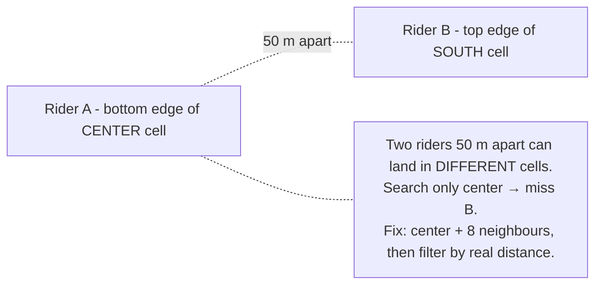

# Day 11 — Geohashing & Nearest-Rider Search

Redis-GEO for live rider location. See ADR-034 (polyglot persistence: Redis-geo + Postgres history).

---

## 1. The cell grid + neighbour search

A geohash encodes lat/long into a short string where a shared prefix means physical proximity.

---

## 2. Edge effect — why neighbours matter

---

## 3. Write vs read profile

| Side | Pattern | Scale note |
|------|---------|------------|
| **Writes** | latest-wins `GEOADD` every 5–10s | ~30–60K location writes/s at Swiggy scale — kept off OLTP DB |
| **Reads** | center cell + neighbours + radius filter | cheap prefix lookup, not full scan |

At extreme scale: **H3/S2** hierarchical cells. Hot cell (surge) → cap + widen radius + shard the city.