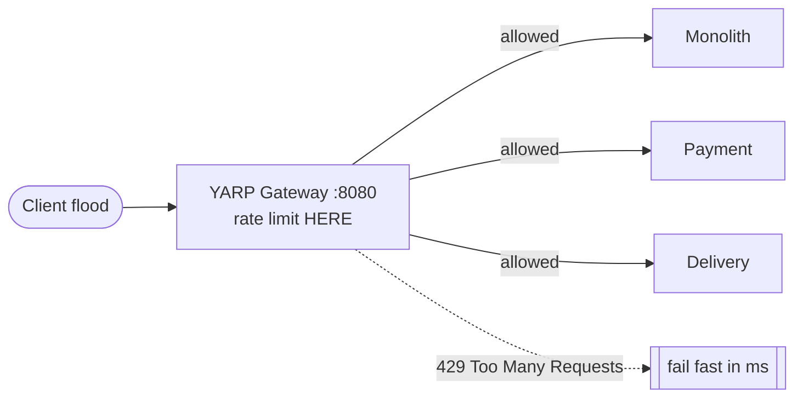
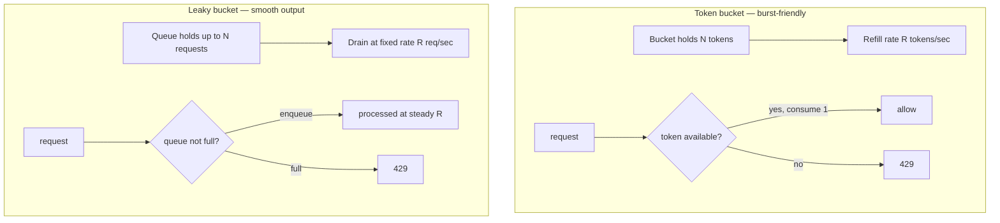
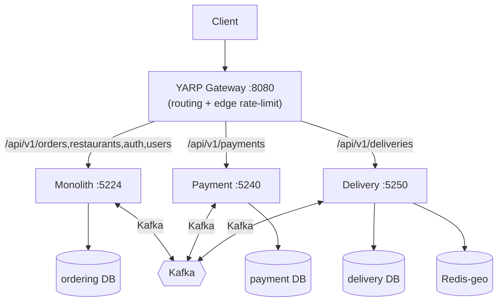

# Day 11 — Edge Rate Limiting (diagrams)

YARP gateway applies rate limits at the edge (ADR-035). Token bucket vs leaky bucket — the option-space.

---

## 1. Where limiting sits

Load-shedding at the edge: *a 429 in 50 ms beats a 200 in 30 s* (ADR-044). Gateway is **not** a trust boundary — each service still validates JWT (ADR-031).

---

## 2. Token bucket vs leaky bucket

| Algorithm | Burst behaviour | Steady traffic | Typical use |
|-----------|-----------------|----------------|-------------|
| **Token bucket** | Allows short bursts up to bucket size | Average capped at refill rate | API gateways, user-facing APIs (Tadka YARP) |
| **Leaky bucket** | Smooths bursts into steady drip | Strict output rate | Traffic shaping, legacy telco analogies |

> **Interview line:** token bucket = "you get 100 tokens, refill 10/sec — burst 100 then throttle." Leaky bucket = "requests queue and exit at a fixed rate — no burst above the leak rate."

---

## 3. Day-11 topology (3 services + gateway)

