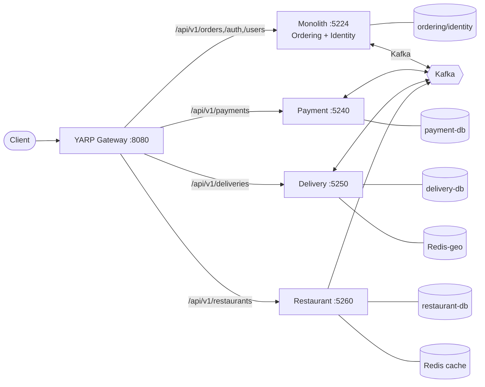
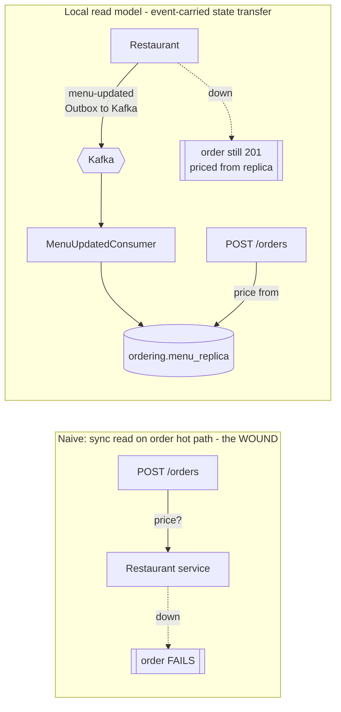
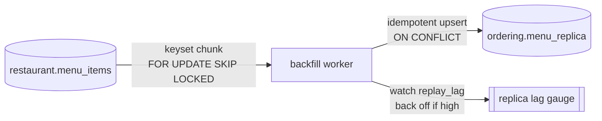

# Day 12 — 4 Services + Gateway (diagrams)

Canonical final architecture. See ADR-036 (extract Restaurant), ADR-037 (event-carried read model), ADR-038 (zero-downtime backfill).

---

## 1. Final topology

**4 services + gateway** — never "5 microservices."

---

## 2. Read-on-critical-path problem and fix (ADR-037)

Pricing reads Ordering's **own** replica → order path stays up when Restaurant is down. Trade: seconds-long stale-price window.

`RestaurantReadMode=LocalReplica|SyncHttp` lever shows wound vs fix live.

---

## 3. Zero-downtime backfill (ADR-038)

Chunked + throttled + SKIP-LOCKED + lag-watched → table never locks, reads never block. At scale → CDC (Debezium).