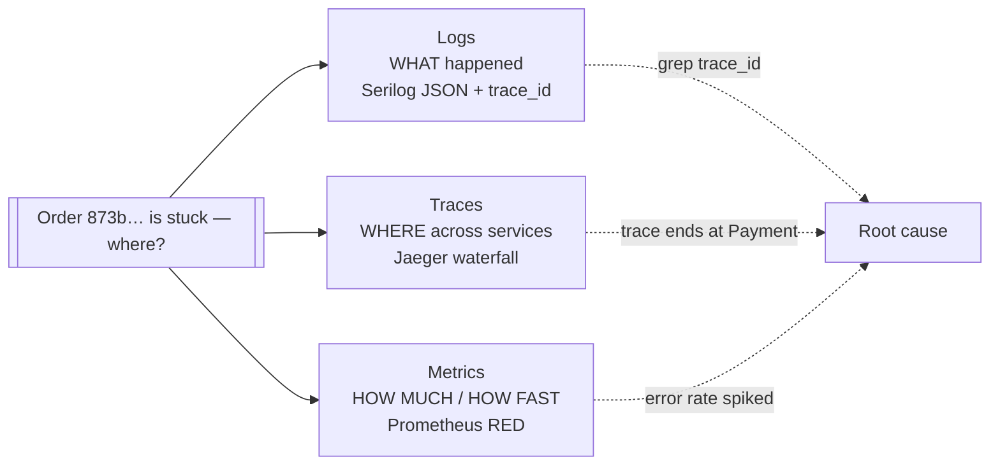
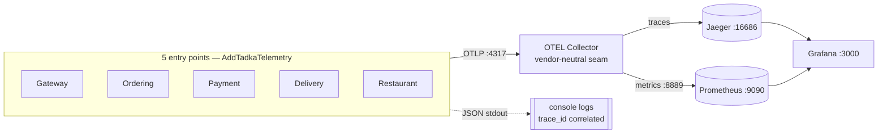
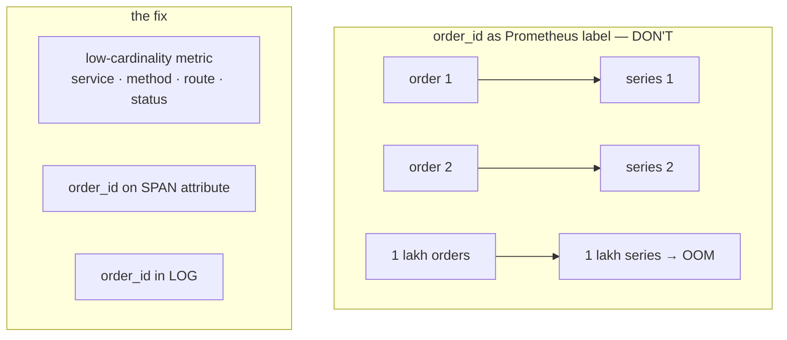
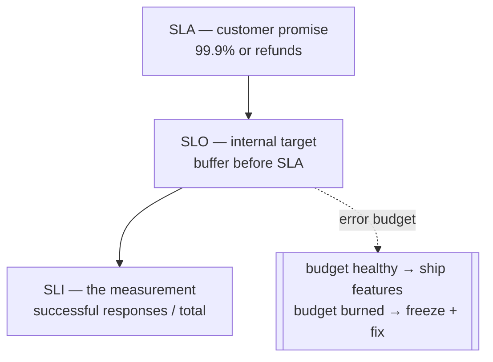

# Day 13 — Observability (diagrams)

Three pillars via OpenTelemetry. See ADR-040 (OTEL stack), ADR-041 (trace propagation), ADR-042 (cardinality limits).

---

## 1. Three pillars — what each answers

---

## 2. OTEL fan-out (instrument once, route anywhere)

Swap Jaeger → Datadog = change the collector config, not the app. Gated on `OTEL_EXPORTER_OTLP_ENDPOINT` — tests/dev unchanged.

---

## 3. The saga in ONE trace (ADR-041)

```mermaid
flowchart LR
  c([client]) -->|POST /orders| gw[Gateway span]
  gw -->|HTTP traceparent| ord[Ordering: POST api/v1/orders]
  ord --> pub1[outbox publish order-placed<br/>traceparent on the ROW]
  pub1 -->|Kafka header| payc[Payment: consume order-placed]
  payc --> pp[ProcessPayment span]
  pp --> resc[Ordering: consume payment-results]
  resc --> pub2[outbox publish order-confirmed]
  pub2 -->|Kafka header| delc[Delivery: consume order-confirmed]
```

**9 spans, 4 services, one trace.** Without Outbox `TraceParent` + Kafka header injection, this shatters into 4 disconnected traces.

**Wound:** `Payment=Failing` → trace ends at `ProcessPayment` (7 spans); no Delivery span.

---

## 4. Cardinality — ids are NOT metric labels (ADR-042)

---

## 5. SLI / SLO / SLA hierarchy

Tadka: Ordering/Restaurant/Delivery 99.9%; **Payment 99.5%** — it rides Razorpay (~99.9%), so 99.99% would be a lie.