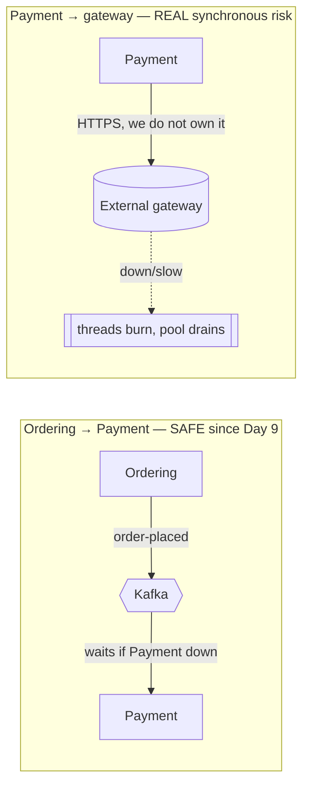
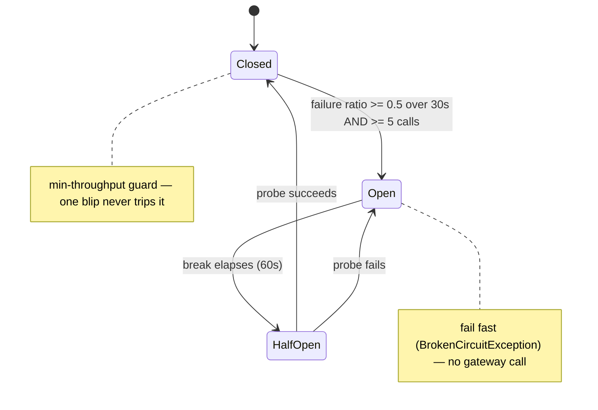
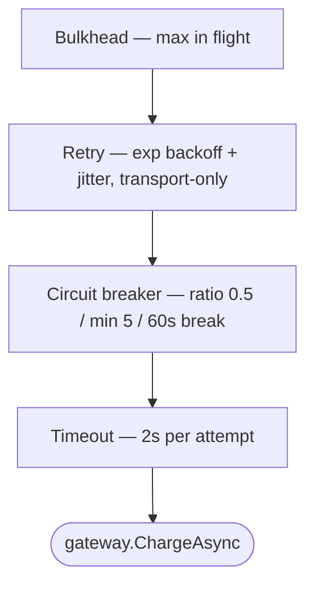
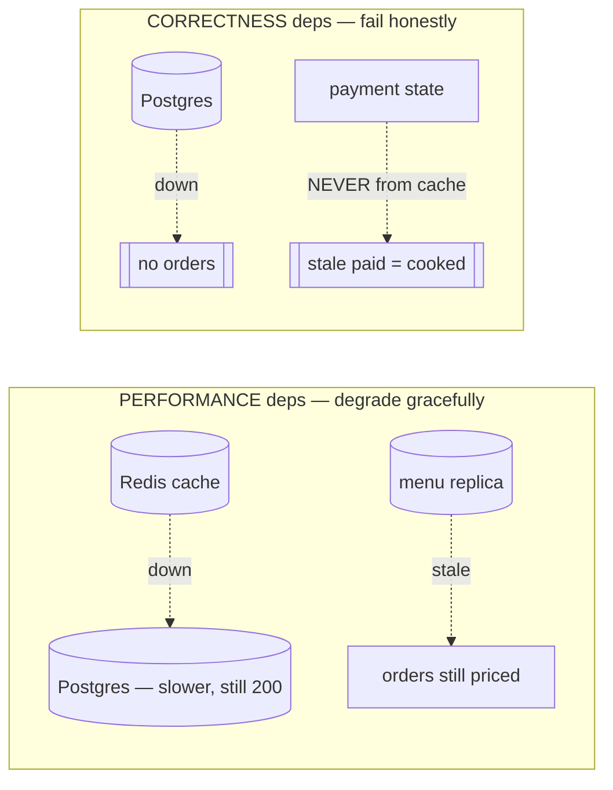

# Day 14 — Resilience & Dependency Classification (diagrams)

Circuit breaker on Payment→gateway (not Ordering→Payment — that's Kafka since Day 9). See ADR-043, ADR-044.

---

## 1. The reframe — where the cascade actually is

A down Payment = messages **wait**. The breaker belongs on the hop we can't make async: the external gateway.

---

## 2. Circuit-breaker state machine (ADR-043)

State transitions → `tadka.payment.circuit_transitions{state}` on Grafana.

---

## 3. Pipeline onion (outer → inner)

**Declines bypass all of it** — `PaymentDeclinedException` is a final business answer (no retry, no trip). `Outage` lever vs `Failing`=decline.

---

## 4. Dependency classification (ADR-044)

Plus: **backpressure** = Kafka consumer lag; **load-shedding** = gateway 429 at the edge.