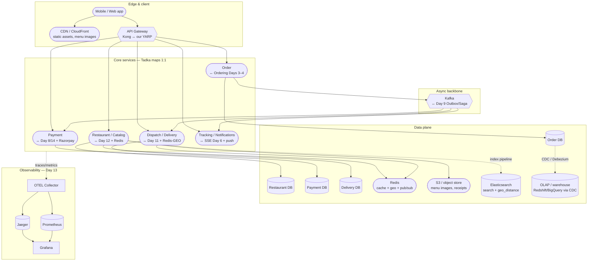
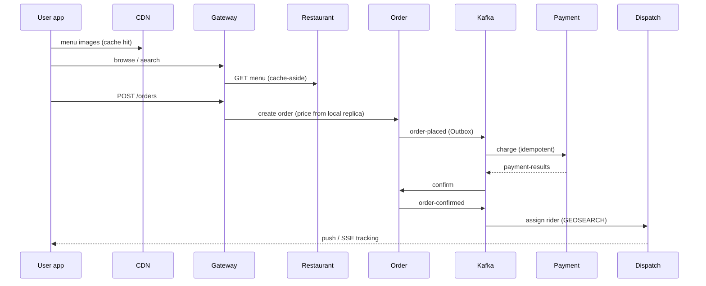
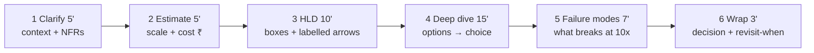

# Day 15 — Swiggy HLD Blueprint (interview teardown)

Full-ecosystem view for the Design-Swiggy masterclass. Same patterns as Tadka at 1 lakh orders/day; Swiggy at 20 lakh+ with more boxes, not different physics.

---

## 1. End-to-end ecosystem (the boxes interviewers expect)

---

## 2. Tadka ↔ Swiggy mapping (transfer sentence per box)

| Swiggy box | Tadka built | Day / ADR |
|------------|-------------|-----------|
| API Gateway | YARP :8080 | 11 / ADR-035 |
| Restaurant + menu cache | Restaurant service + Redis | 6, 12 / ADR-018, 036–037 |
| Order service | Ordering monolith slice | 3–4 |
| Kafka backbone | Outbox + Saga | 9 / ADR-027–029 |
| Payment + Razorpay | Payment + Polly breaker | 8, 14 / ADR-024, 043 |
| Dispatch + location | Delivery + Redis-GEO | 11 / ADR-033–034 |
| Live tracking | SSE + Redis pub/sub | 6 / ADR-020 |
| Search (ES) | `GET /restaurants` + replica | drill / option-space |
| CDN + S3 | not built in Tadka | drill — static offload |
| OLAP + CDC | not built | drill — analytics path |

---

## 3. Order hot path (labelled arrows)

---

## 4. Contrast anchors (curveballs)

**Zomato search** — `butter chicken near me` → Elasticsearch full-text + `geo_distance` → ML ranker → sponsored slots → A/B → top 20 in &lt;300ms. Tadka's `GET /restaurants` is the seed; ES is the when-to-switch.

**Razorpay** — idempotency key checked first → orchestrator → rails → append-only events → webhooks (at-least-once + HMAC + Inbox dedup). Same correctness primitives as Day 9.

---

## 5. The 45-minute answer skeleton

The interview answer **is** the ADR sequence: question → reason → HLD → deep dive → decide.