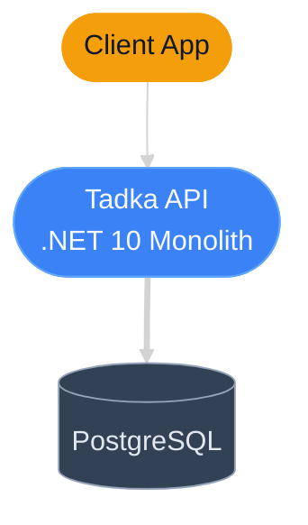
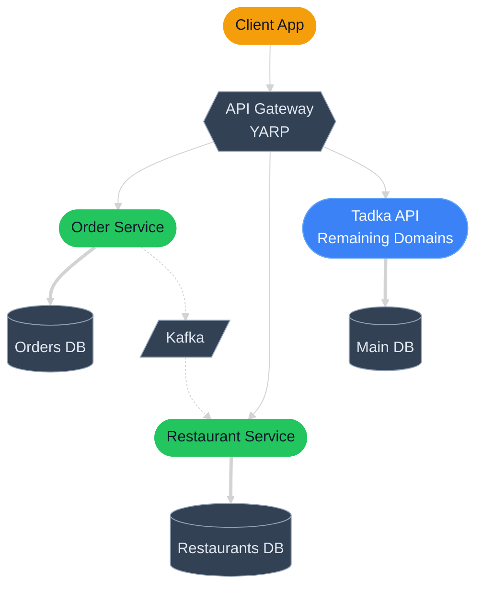
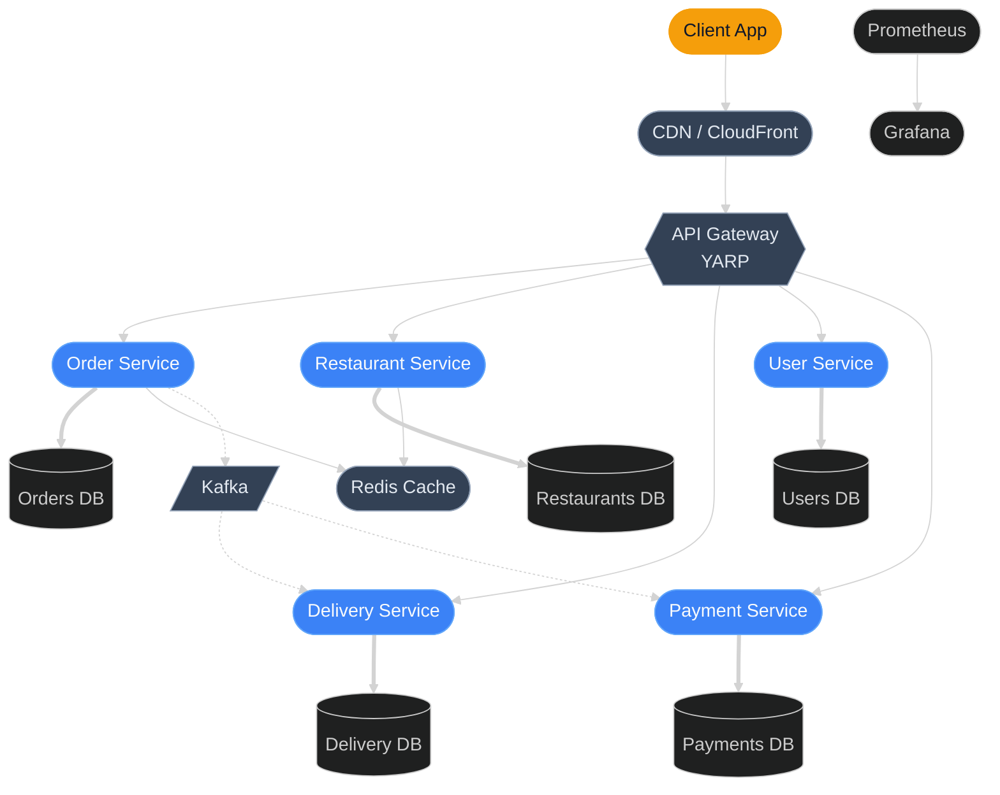

# Mermaid Diagram Style Guide

All teaching diagrams in the cohort follow these conventions for consistency.

## Color Palette (Dark Theme)

Matches the Desi Architect brand colors.

```
%%{init: {'theme': 'dark', 'themeVariables': {
  'primaryColor': '#3B82F6',
  'primaryTextColor': '#F8FAFC',
  'primaryBorderColor': '#60A5FA',
  'secondaryColor': '#1E293B',
  'tertiaryColor': '#334155',
  'lineColor': '#94A3B8',
  'textColor': '#E2E8F0',
  'fontSize': '14px'
}}}%%
```

| Role | Color | Hex | Usage |
|------|-------|-----|-------|
| Primary service | Blue | `#3B82F6` | Main service nodes |
| Infrastructure | Slate | `#334155` | Databases, caches, queues |
| External | Amber | `#F59E0B` | External APIs, clients |
| Highlight/New | Green | `#22C55E` | Newly added components this session |
| Danger/Problem | Red | `#EF4444` | Failure points, bottlenecks |
| Background | Dark Slate | `#0F172A` | Diagram background |

## Node Shapes

| Component Type | Shape | Mermaid Syntax |
|---------------|-------|----------------|
| Service / API | Rounded rectangle | `ServiceName([Service Name])` |
| Database | Cylinder | `DB[(Database)]` |
| Message Queue | Parallelogram | `Queue[/Queue Name/]` |
| Cache | Stadium | `Cache([Cache])` |
| Client / User | Person | Actor syntax or rounded rect |
| Load Balancer | Hexagon | `LB{{Load Balancer}}` |
| External API | Subroutine | `Ext[[External API]]` |

## Arrow Styles

| Meaning | Syntax | When to use |
|---------|--------|-------------|
| Sync request | `-->` | HTTP calls, direct function calls |
| Async message | `-.->` | Events, message queue publish/consume |
| Data flow | `==>` | Database reads/writes |

## Sample Diagrams

### Day 1: Monolith Architecture



### Day 8: First Service Extraction



### Week 8: Final Architecture



## Rules

1. **Every session gets a "before" and "after" diagram.** Show what changed this session in green.
2. **Max 8-10 nodes per diagram.** If it gets bigger, split into subsystem views.
3. **Label arrows** when the meaning isn't obvious (e.g., "HTTP GET", "order.placed event").
4. **Include a legend** for complex diagrams with multiple colors.
