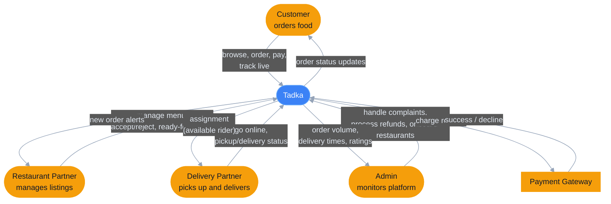

# System context (tech-agnostic)

Not tied to a single day — Tadka's environment (who talks to it, and why) is stable across the whole course even as its internals change week to week. Revisit this only if a new external actor shows up. Grounded in `docs/tadka-product-brief.md`'s four personas (Customer, Restaurant Partner, Delivery Partner, Admin) plus the Payment Gateway introduced Day 7 (ADR-021).

This is a **C4 "System Context" (Level 1)** view: one box for the whole system, no technology named, no internal structure shown — just who Tadka talks to and what each relationship is for. Compare with `docs/diagrams/day-07-payment-resilience.md` §1, which is the "open the box" (C4 Level 2/3) view of the same system.

---

## 1. Tadka in its environment

**Legend:** amber = every actor outside Tadka's control, blue = Tadka itself, drawn deliberately as one undivided box.

**Why this view earns a separate document instead of living inside a day's diagram:** every other diagram in this folder shows Tadka's *insides* changing — a monolith becoming four services, a cache appearing, a payment module getting carved out. None of that changes what's drawn here. A new engineer, a PM, or an interviewer asking "what does this system actually do" doesn't need to know it's `.NET 10` or that Postgres has a read replica — they need exactly this picture. That stability is the point of a Context diagram: it's the one architecture artifact that *shouldn't* need a new version every few days.

Two things worth naming that the box hides on purpose:
- **The Payment Gateway is the only external system**, everything else is a human actor. That asymmetry is why ADR-021 calls it out as "the first hard dependency Tadka does not own" — it's the one relationship in this diagram Tadka can't retrain, onboard, or manage the way it can a Delivery Partner.
- **Every arrow into Tadka becomes several endpoints once you open the box** (Controllers, MediatR handlers, background workers) — that fan-out is exactly what §1 of `day-07-payment-resilience.md` and the day-01/day-05 diagrams exist to show. This document intentionally stops before that.
