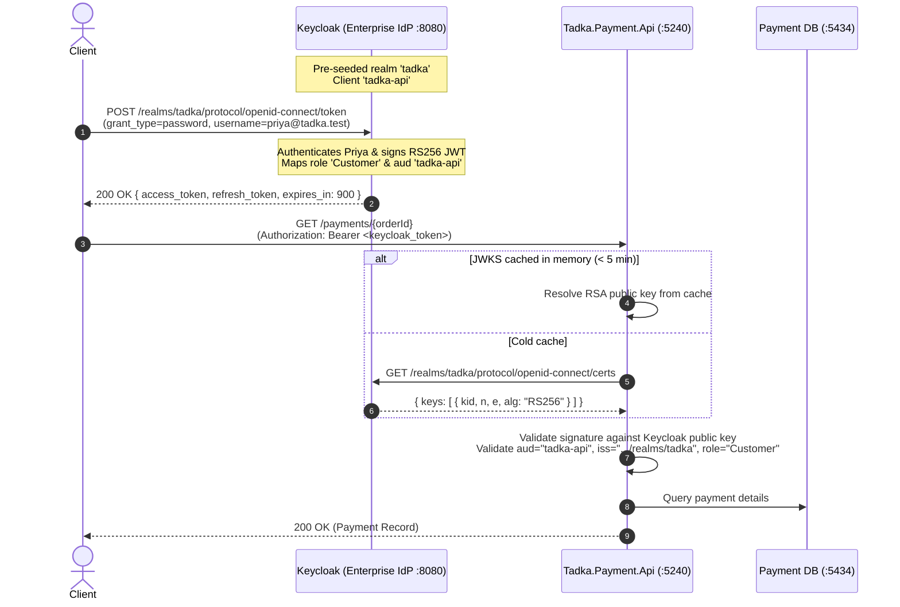

# Showcase: Enterprise Identity Provider (Keycloak) Integration

> **Bonus Showcase for Day 10.** This guide demonstrates how to replace Tadka's hand-rolled token issuer with a real, production-grade Enterprise Identity Provider (**Keycloak 24+**) in Docker — with **zero changes to application source code**.
>
> **Related Reading:**
> - [Token Generation & Refresh Flow](../learn/token-and-refresh-flow.md) (§ 11: Production Reality)
> - [Authentication & Authorization Diagrams](../diagrams/day-10-auth.md)

---

## 1. Architectural Purpose

In Day 10, we built a hand-rolled asymmetric RS256 token issuer (`TokenService`) and public key discovery endpoint (`/.well-known/jwks.json`) inside the monolith.

The natural question is: **how difficult is it to swap this for an enterprise IAM platform like Keycloak, Okta, or Auth0?**

Because [`Tadka.Payment.Api`](file:///D:/work/cohort/tadka-cohort/src/Tadka.Payment.Api/Auth/JwksClient.cs) was built with defense-in-depth and dynamic JWKS public key resolution (ADR-049), **the downstream service has zero vendor lock-in**. It does not know or care whether the token was minted by a C# class or an enterprise Keycloak cluster.



---

## 2. Step 1: Start the Pre-Seeded Keycloak Container

Keycloak runs as an optional Docker Compose profile (`auth-prod`), meaning it will **not** consume RAM or CPU during normal daily runbooks unless explicitly started.

```bash
docker compose --profile auth-prod up -d keycloak
```

Wait ~15–20 seconds for Keycloak to initialize its in-memory database and import the realm. Verify Keycloak is ready:

```bash
curl -s http://localhost:8080/realms/tadka/.well-known/openid-configuration | grep "jwks_uri"
```

Expected output:
```json
"jwks_uri":"http://localhost:8080/realms/tadka/protocol/openid-connect/certs"
```

> **Admin Console Access:** You can browse the full Keycloak management UI at [http://localhost:8080](http://localhost:8080).
> - **Username:** `admin`
> - **Password:** `admin`

---

## 3. Step 2: Request an OAuth 2.0 Token from Keycloak

Keycloak provides full OpenID Connect / OAuth 2.0 endpoints. Use the Direct Access Grant (ROPC) to authenticate as Priya:

### Bash / macOS / Linux / Git Bash:
```bash
TOKEN=$(curl -s -X POST http://localhost:8080/realms/tadka/protocol/openid-connect/token \
  -d "client_id=tadka-api" \
  -d "username=priya@tadka.test" \
  -d "password=Password123!" \
  -d "grant_type=password" | sed -E 's/.*"access_token":"([^"]+)".*/\1/')

echo "Keycloak Token: ${TOKEN:0:30}..."
```

### Windows PowerShell:
```powershell
$res = Invoke-RestMethod -Uri "http://localhost:8080/realms/tadka/protocol/openid-connect/token" `
  -Method Post `
  -Body @{
    client_id = "tadka-api"
    username = "priya@tadka.test"
    password = "Password123!"
    grant_type = "password"
  }
$TOKEN = $res.access_token
Write-Host "Keycloak Token: $($TOKEN.Substring(0, 30))..."
```

### Inspect the Keycloak Token Payload:
If you paste this token into [jwt.io](https://jwt.io), you will see standard RFC-compliant claims:
```json
{
  "exp": 1727349900,
  "iat": 1727349000,
  "jti": "5a415a77-3e5e-4bb5-a3d8-5f0426f4f251",
  "iss": "http://localhost:8080/realms/tadka",
  "aud": "tadka-api",
  "sub": "c1b2c3d4-0001-4000-8000-000000000001",
  "typ": "Bearer",
  "azp": "tadka-api",
  "role": "Customer",
  "email": "priya@tadka.test",
  "preferred_username": "priya@tadka.test"
}
```
Notice:
- `sub` is Priya's exact GUID from our domain model (`c1b2c3d4-0001-4000-8000-000000000001`).
- `role` is mapped as a top-level claim matching our RBAC gate.
- `aud` matches `tadka-api`.

---

## 4. Step 3: Run Tadka.Payment.Api Against Keycloak

Start `Tadka.Payment.Api` with the `Keycloak` environment profile (which loads [`appsettings.Keycloak.json`](file:///D:/work/cohort/tadka-cohort/src/Tadka.Payment.Api/appsettings.Keycloak.json)):

```bash
dotnet run --project src/Tadka.Payment.Api --environment Keycloak
```

The service launches on `http://localhost:5240` with its JWT validation re-targeted to Keycloak's certs endpoint.

---

## 5. Step 4: Verify Payment Service Verification

In a second terminal, send a request with the Keycloak token:

```bash
# 1. Unauthenticated request -> 401 Unauthorized:
curl -i http://localhost:5240/payments/11111111-1111-4111-8111-111111111111

# 2. Authenticated request with Keycloak token -> 200 OK:
curl -i http://localhost:5240/payments/11111111-1111-4111-8111-111111111111 \
  -H "Authorization: Bearer $TOKEN"
```

### Expected Output:
```http
HTTP/1.1 200 OK
Content-Type: application/json; charset=utf-8

{
  "id": "11111111-1111-4111-8111-111111111111",
  "orderId": "11111111-1111-4111-8111-111111111111",
  "amount": 299.00,
  "currency": "INR",
  "status": "Completed"
}
```

Inspect the `Tadka.Payment.Api` logs. You will see:
```text
info: System.Net.Http.HttpClient.jwks.ClientHandler[100]
      Sending HTTP request GET http://localhost:8080/realms/tadka/protocol/openid-connect/certs
info: System.Net.Http.HttpClient.jwks.ClientHandler[101]
      Received HTTP response headers after 15ms - 200
```
`Tadka.Payment.Api` automatically resolved Keycloak's public RSA signing key, verified the signature, confirmed Priya's role, and authorized the payment lookup!

---

## 6. Teardown

When finished with the showcase, stop Keycloak:

```bash
docker compose --profile auth-prod down
```
Normal `docker compose up -d` commands continue to run the lightweight default stack without Keycloak overhead.

---

## 7. Key Architectural Takeaways for Students

1. **Decoupled Verification (Zero Microservice Lock-in):** We swapped the entire identity issuing provider from our hand-rolled monolith to a full-blown Red Hat Keycloak cluster without modifying a single line of C# in `Tadka.Payment.Api`.
2. **Open Standards Win:** Because both our hand-rolled system and Keycloak adhere strictly to **RFC 7517 (JWKS)** and **RFC 7519 (JWT)**, downstream consumers don't care who minted the token.
3. **The Role of Application Code:** Notice that even with Keycloak, **resource ownership** (`OwnsOrAdmin`) still lives in your application code. Keycloak only asserts identity (`sub`) and role (`role`); your services protect their own resources.
