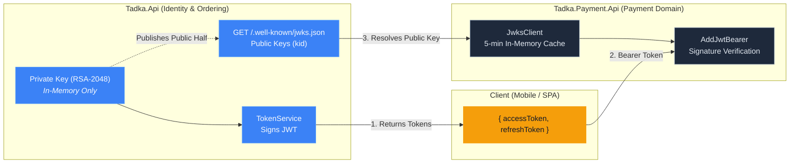
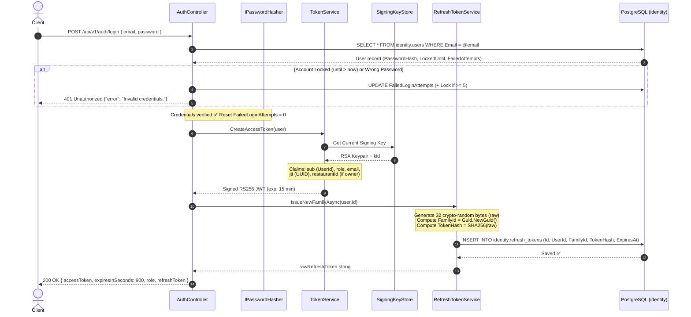
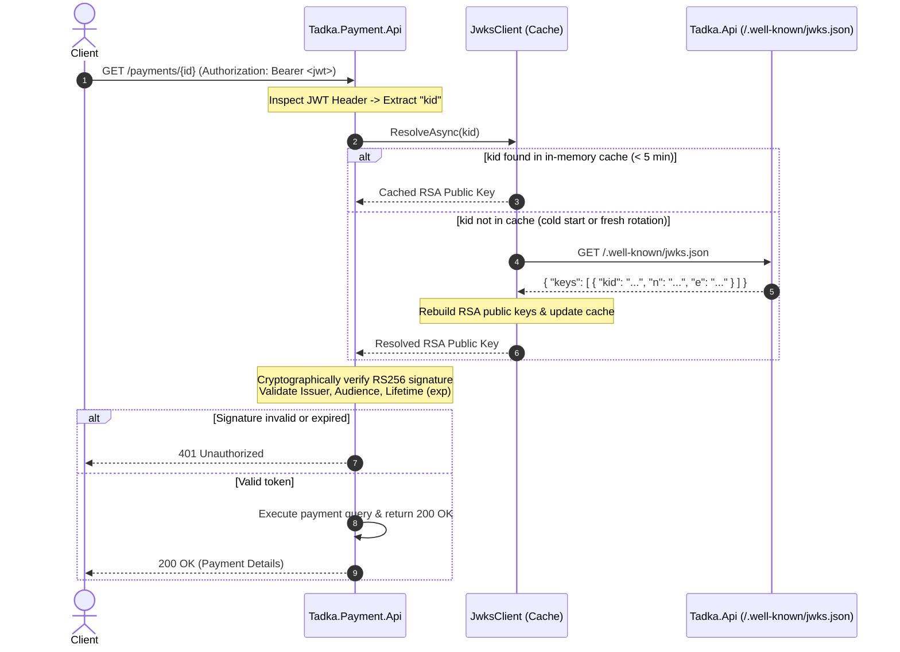
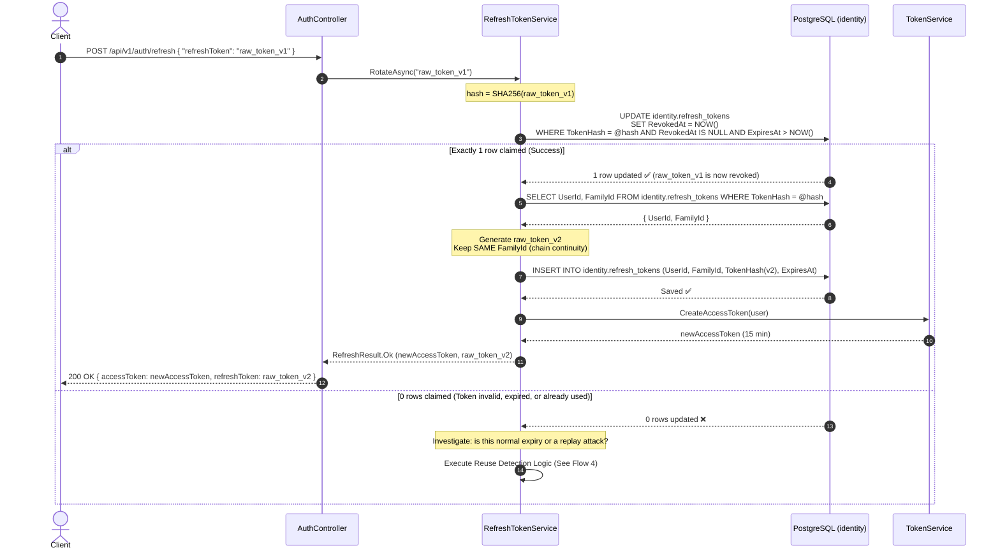
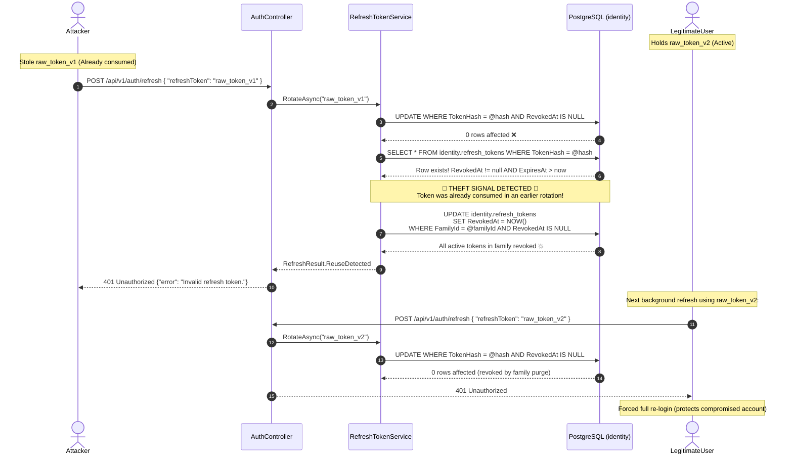
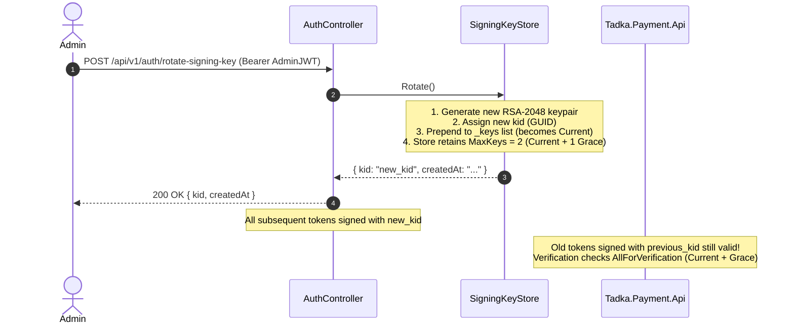
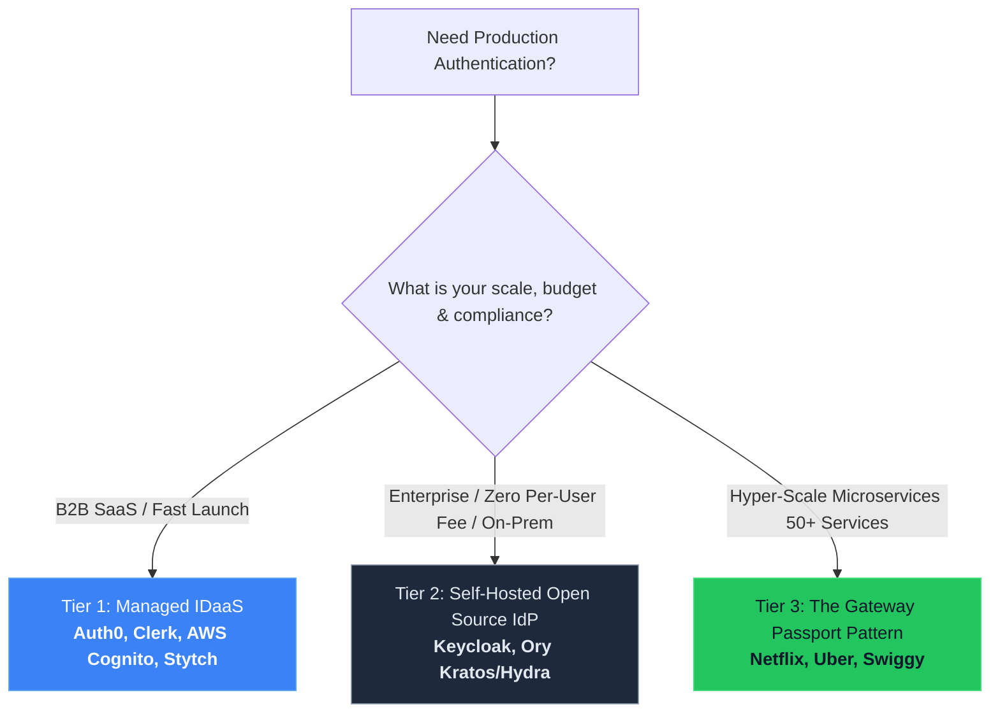

# Token Generation, RS256/JWKS, and Refresh-Token Rotation Flow

> **Deep Dive for Day 10.** This document explains the complete token lifecycle in Tadka: how access tokens are minted and verified across services without shared secrets, and how refresh tokens rotate with atomic database concurrency and replay-theft detection.
>
> **Related ADRs:**
> - [ADR-030: Stateless JWT Authentication](file:///D:/work/cohort/tadka-cohort/docs/adrs/030-stateless-jwt-auth.md)
> - [ADR-031: RBAC and Resource Ownership](file:///D:/work/cohort/tadka-cohort/docs/adrs/031-rbac-and-resource-ownership.md)
> - [ADR-048: Refresh-Token Rotation & Reuse Detection](file:///D:/work/cohort/tadka-cohort/docs/adrs/048-refresh-token-rotation-reuse-detection.md)
> - [ADR-049: RS256 Asymmetric Signing & JWKS Key Rotation](file:///D:/work/cohort/tadka-cohort/docs/adrs/049-rs256-jwks-key-rotation.md)

---

## 1. Architectural Foundations: Dual-Token Design

Every production authentication system faces a fundamental engineering tension:
1. **Stateless Scalability vs. Blast Radius:** If access tokens are stateless JWTs verified without database lookups, they cannot be instantly revoked. If an access token leaks, an attacker can use it until it expires. To bound this blast radius, access tokens **must be short-lived** (15 minutes in Tadka).
2. **User Experience vs. Frequent Re-authentication:** Forcing users to enter their credentials every 15 minutes is unacceptable. Lengthening the access token's lifetime (e.g. to 30 days) widens the vulnerability window back open.

Tadka solves this using a **Dual-Token Architecture**:

| Dimension | Access Token (JWT) | Refresh Token (Opaque) |
|---|---|---|
| **Format** | Signed RS256 JSON Web Token | 256-bit crypto-random string (Base64) |
| **Lifetime (TTL)** | Short (15 minutes) | Long (7 days) |
| **Storage (Client)** | In-memory / short-lived session storage | Secure HTTP-only cookie or protected vault |
| **Storage (Server)** | **None** (Stateless) | **SHA-256 Hash** in PostgreSQL (`identity.refresh_tokens`) |
| **Verification Cost** | Microseconds (CPU-bound RSA public-key math) | Milliseconds (single-row indexed DB lookup) |
| **Revocability** | Cannot revoke mid-flight without denylist | **Instantly revocable** in database via CAS update |
| **Purpose** | Authorize high-frequency API calls | Silently mint a fresh token pair when access token expires |

---

## 2. Cryptographic Strategy & Database Schema

### Why Asymmetric RS256 + JWKS (ADR-049)
In symmetric signing (HS256), the same secret key is used to both sign (mint) and verify tokens. If any downstream service (like `Tadka.Payment.Api`) needs to verify tokens, it must be given the secret key. If that downstream service is compromised or logs its config, **the attacker can forge tokens for ANY user, including Admins**.

With asymmetric signing (**RS256**):
- **Private Key:** Stored solely in the memory of `Tadka.Api` (`SigningKeyStore`). Only the monolith can mint tokens.
- **Public Key:** Published openly at `GET /.well-known/jwks.json` in RFC 7517 JWK format. Verifying services (e.g. `Tadka.Payment.Api`) download the public key and cache it. They can verify signatures, but **can never forge a token**.



### Why Fast Deterministic Hash (SHA-256) instead of `IPasswordHasher` (ADR-048)
- Human passwords have low entropy ("Password123!") and require salted, deliberately slow key-derivation functions (like PBKDF2, bcrypt, or Argon2) to resist offline dictionary attacks.
- A refresh token is generated using `RandomNumberGenerator.GetBytes(32)` (256 bits of cryptographic entropy). It cannot be brute-forced or guessed offline.
- When a client presents a refresh token, the server needs to find it quickly: `WHERE TokenHash = @hash`. Slow salted hashers generate a different salt on every execution, making indexed $O(1)$ equality searches impossible.
- **Tadka uses `SHA256.HashData(rawBytes)`**: Deterministic, fast, and secure. Even if the database backup leaks, an attacker only gets hashes—they cannot derive the raw refresh tokens needed to hijack sessions.

### Database Schema: `identity.refresh_tokens`

```sql
CREATE TABLE identity.refresh_tokens (
    "Id" UUID PRIMARY KEY DEFAULT gen_random_uuid(),
    "UserId" UUID NOT NULL REFERENCES identity.users("Id") ON DELETE CASCADE,
    "TokenHash" VARCHAR(64) NOT NULL,
    "FamilyId" UUID NOT NULL,
    "CreatedAt" TIMESTAMP WITHOUT TIME ZONE NOT NULL DEFAULT NOW(),
    "ExpiresAt" TIMESTAMP WITHOUT TIME ZONE NOT NULL,
    "RevokedAt" TIMESTAMP WITHOUT TIME ZONE NULL
);

-- Point lookup for presented refresh tokens:
CREATE UNIQUE INDEX "IX_refresh_tokens_TokenHash" ON identity.refresh_tokens ("TokenHash");

-- Family revocation on reuse detection or logout:
CREATE INDEX "IX_refresh_tokens_FamilyId" ON identity.refresh_tokens ("FamilyId");

-- User session queries and cascading deletes:
CREATE INDEX "IX_refresh_tokens_UserId" ON identity.refresh_tokens ("UserId");
```

---

## 3. Flow 1: Login & Token Minting

When a user logs in (`POST /api/v1/auth/login`), the system verifies credentials, checks for account lockout, and issues a fresh token pair.



### Anatomy of the RS256 Access Token
Decoded JWT payload issued by [`TokenService.cs`](file:///D:/work/cohort/tadka-cohort/src/Tadka.Api/Auth/TokenService.cs):
```json
{
  "sub": "c1b2c3d4-0001-4000-8000-000000000001",
  "role": "Customer",
  "email": "priya@example.com",
  "jti": "8b5ec1e2-04fa-4b68-b7cf-394998e3bce7",
  "iss": "tadka",
  "aud": "tadka",
  "nbf": 1727344800,
  "exp": 1727345700,
  "iat": 1727344800
}
```
- **`sub`**: Subject identifier (UUID of the user).
- **`role`**: RBAC gate (`Customer`, `RestaurantOwner`, `DeliveryPartner`, `Admin`).
- **`restaurantId`**: Present only for `RestaurantOwner` to validate resource ownership.
- **`jti`**: Unique token identifier (RFC 7519 §4.1.7). Prevents two tokens minted for the same user in the same second from being bit-for-bit identical, and provides an audit handle for log tracing.

---

## 4. Flow 2: Downstream Verification via JWKS

When the client makes a request to an extracted service (e.g. `Tadka.Payment.Api`), the payment service validates the token independently without touching a database.



---

## 5. Flow 3: Silent Refresh & Single-Use CAS Rotation

When the 15-minute access token expires, the client calls `POST /api/v1/auth/refresh` with its current refresh token.

### The Concurrency Problem: Check-Then-Act Race Condition
If two requests present the same refresh token concurrently (e.g., user opens two browser tabs simultaneously, or a mobile client fires two parallel calls after coming back online):
1. **Naive approach (Broken):** Request A and Request B both run `SELECT ... WHERE TokenHash = @hash`. Both see `RevokedAt IS NULL`. Both proceed to mint new tokens. The rotation chain branches into two active tokens, silently defeating single-use enforcement!
2. **Tadka's Atomic CAS Solution (ADR-048):** Execute a single SQL `UPDATE` that claims the token atomically:
   ```csharp
   var claimed = await db.RefreshTokens
       .Where(t => t.TokenHash == hash && t.RevokedAt == null && t.ExpiresAt > now)
       .ExecuteUpdateAsync(s => s.SetProperty(t => t.RevokedAt, now), ct);
   ```
   At the PostgreSQL level, row-level locking guarantees that **only one request will claim the row (`claimed == 1`)**. The concurrent request receives `claimed == 0`.



---

## 6. Flow 4: Replay Attack Detection & Family Revocation

### The Threat Model
Suppose an attacker intercepts `raw_token_v1`. 
- **Legitimate user** uses `raw_token_v1` to refresh. The server consumes `raw_token_v1` (`RevokedAt` is set to timestamp) and returns `raw_token_v2` to the legitimate user.
- **Attacker** later attempts to use the stolen `raw_token_v1`.

### Detection & Nuclear Response
When the attacker presents `raw_token_v1`, the atomic claim finds 0 rows (`RevokedAt` is already not null). The server does not merely reject the request—it inspects the token:
```csharp
var lookedUp = await db.RefreshTokens.AsNoTracking().FirstOrDefaultAsync(t => t.TokenHash == hash, ct);
if (lookedUp is not null && lookedUp.RevokedAt is not null && lookedUp.ExpiresAt > now)
{
    // REUSE DETECTED: Someone is presenting a token that was already rotated away!
    await RevokeFamilyAsync(lookedUp.FamilyId, ct);
    return new RefreshResult(RefreshOutcome.ReuseDetected, null, null, null);
}
```



> [!WARNING]
> **Information Leakage Prevention:** Notice that both the attacker and the legitimate user receive an identical generic response: `401 Unauthorized {"error": "Invalid refresh token."}`. The API **never reveals** whether reuse detection fired or if the token simply did not exist. This prevents an attacker from probing the endpoint to confirm whether their theft was detected.

---

## 7. Flow 5: Logout & Session Revocation

When a client logs out (`POST /api/v1/auth/logout`), it passes its current refresh token:
1. The endpoint requires an active JWT: `[Authorize]`.
2. The user ID in the JWT claims (`User.UserId()`) is compared against the database owner of the presented refresh token.
3. If they match, the system calls `RevokeFamilyAsync(stored.FamilyId)`:
   ```csharp
   await db.RefreshTokens
       .Where(t => t.FamilyId == familyId && t.RevokedAt == null)
       .ExecuteUpdateAsync(s => s.SetProperty(t => t.RevokedAt, DateTime.UtcNow), ct);
   ```
4. Returns `204 No Content`.

> [!NOTE]
> **Honest Architectural Boundary:** The access token already held by the client **remains valid until its 15-minute expiration**. A stateless JWT cannot be revoked mid-flight without introducing a centralized token blacklist (which reintroduces database statefulness and defeats the purpose of JWTs). Logout guarantees that **no further access tokens can ever be minted silently**.

---

## 8. Flow 6: Asymmetric Key Rotation (`SigningKeyStore`)

To rotate RSA signing keys without service downtime, `Tadka.Api` provides an Admin endpoint: `POST /api/v1/auth/rotate-signing-key`.



- **Grace Window (`MaxKeys = 2`):** The store keeps the current key and one previous key. Any token signed right before rotation survives verification until its 15-minute lifetime expires.
- **Eviction:** When a second rotation occurs, the oldest key is disposed from memory. Any token signed with that oldest key will fail validation (`401 Unauthorized`), triggering the client to use its refresh token to acquire a newly signed access token.

---

## 9. Verification & Live Shell Walkthrough

You can test every step of this flow locally using curl or PowerShell:

### Step 1: Login and extract both tokens
```bash
LOGIN_RES=$(curl -s -X POST http://localhost:5224/api/v1/auth/login \
  -H "Content-Type: application/json" \
  -d '{"email":"priya@example.com","password":"Password123!"}')

ACCESS_TOKEN=$(echo $LOGIN_RES | sed -E 's/.*"accessToken":"([^"]+)".*/\1/')
REFRESH_TOKEN=$(echo $LOGIN_RES | sed -E 's/.*"refreshToken":"([^"]+)".*/\1/')
```

### Step 2: Call Payment Service using Access Token
```bash
curl -i http://localhost:5240/payments/11111111-1111-4111-8111-111111111111 \
  -H "Authorization: Bearer $ACCESS_TOKEN"
# -> HTTP/1.1 200 OK (Payment service resolved public key via JWKS)
```

### Step 3: Perform Single-Use Rotation
```bash
REFRESH_RES=$(curl -s -X POST http://localhost:5224/api/v1/auth/refresh \
  -H "Content-Type: application/json" \
  -d "{\"refreshToken\":\"$REFRESH_TOKEN\"}")

NEW_ACCESS=$(echo $REFRESH_RES | sed -E 's/.*"accessToken":"([^"]+)".*/\1/')
NEW_REFRESH=$(echo $REFRESH_RES | sed -E 's/.*"refreshToken":"([^"]+)".*/\1/')
# -> HTTP/1.1 200 OK with fresh accessToken and fresh refreshToken
```

### Step 4: Replay the Used Refresh Token (Theft Simulation)
```bash
curl -i -X POST http://localhost:5224/api/v1/auth/refresh \
  -H "Content-Type: application/json" \
  -d "{\"refreshToken\":\"$REFRESH_TOKEN\"}"
# -> HTTP/1.1 401 Unauthorized (Reuse detected! Entire family revoked)
```

### Step 5: Verify the Entire Family is Killed
```bash
curl -i -X POST http://localhost:5224/api/v1/auth/refresh \
  -H "Content-Type: application/json" \
  -d "{\"refreshToken\":\"$NEW_REFRESH\"}"
# -> HTTP/1.1 401 Unauthorized (Even the latest token is now dead!)
```

---

## 10. Summary Matrix for the Senior Architect

| Threat / Scenario | Defense Mechanism | Where Handled in Tadka |
|---|---|---|
| **Access Token Leak** | Short 15-minute TTL bounds exposure | `JwtOptions.AccessTokenMinutes` in `TokenService.cs` |
| **Downstream Verifier Compromise** | Asymmetric RS256; verifiers only hold public keys | `Jwks.cs` + `JwksClient.cs` |
| **Database Compromise (Hash Leak)** | Raw tokens never stored; deterministic SHA-256 | `RefreshTokenService.Hash()` in `RefreshTokenService.cs` |
| **Concurrent Refresh Race Condition** | Atomic CAS database update (`ExecuteUpdateAsync`) | `RefreshTokenService.RotateAsync()` |
| **Stolen Refresh Token Replay** | Single-use rotation + whole family revocation | `RefreshTokenService.RevokeFamilyAsync()` |
| **Credential Stuffing / Password Flood** | Account lockout (5 attempts) + Auth rate limit | `AccountLockoutOptions` + `RateLimitPolicies.AuthWrite` |
| **Session Fixation / Replay Identical Tokens** | RFC 7519 unique `jti` GUID on every access token | `TokenService.CreateAccessToken()` |

---

## 11. Production Reality: How the Industry Works vs. Why We Hand-Rolled

A common question senior engineers ask when studying this codebase:
> *"Why did we hand-roll `TokenService`, `RefreshTokenService`, and `SigningKeyStore`? In the real world, shouldn't we just use Auth0, AWS Cognito, or Keycloak?"*

The short answer is **yes — in production, 95% of engineering teams do NOT hand-roll an Identity Provider from scratch**. They rely on dedicated IAM platforms.

However, Tadka is a teaching codebase designed to build Software Architects. Here is the architectural reasoning behind what we hand-rolled, how production systems actually operate at scale, and why the mechanics you learned today transfer 100% to real-world cloud architectures.

### 11.1 The EdTech Rationale: Why Hand-Roll a Mini-IdP?

1. **Avoiding the "YAML & Dashboard" Trap:**
   If we introduced **Keycloak** or **Auth0** in Day 10, the lecture would turn into a 90-minute tutorial on configuring Docker containers, redirect URIs, CORS origins, and client secrets in a web UI. Students would click buttons, copy-paste a client secret, and have **zero architectural mental model** of:
   - What an RS256 private/public keypair actually is.
   - Why `/.well-known/jwks.json` exists and what `kid`, `n`, and `e` mean.
   - How concurrent refresh requests race in a database (and why atomic CAS updates are necessary).
   - How reuse detection turns a stolen refresh token into a self-destructing session chain.
2. **Every Primitive We Built Follows Open RFC Standards:**
   - **RFC 7519:** JWT structure and `jti` anti-replay / unique token entropy.
   - **RFC 7517:** JWK / JWKS public key distribution format.
   - **RFC 6749 (§10.4):** OAuth 2.0 Refresh Token rotation and reuse detection.
   Because we adhered strictly to these RFCs, what we built inside `Tadka.Api` **is** a standards-compliant, lightweight OpenID Connect Identity Provider.
3. **The Verifying Side is 100% Production Code:**
   The code inside [`Tadka.Payment.Api`](file:///D:/work/cohort/tadka-cohort/src/Tadka.Payment.Api/Auth/JwksClient.cs) (`JwksClient` fetching public keys over HTTP and caching them in memory for 5 minutes) is **the exact same mechanism** your services will use in production when validating tokens against Auth0, Okta, Microsoft Entra, or Keycloak.

---

### 11.2 The Three Industry Tiers for Authentication

In commercial software development, identity architectures fall into three primary tiers:



#### Tier 1: Managed Identity-as-a-Service (IDaaS)
*Standard for Startups, Scale-ups, and B2B SaaS.*
- **Platforms:** **Auth0** (Okta), **AWS Cognito**, **Azure AD B2C / Entra External ID**, **Clerk**, **Stytch**, **Firebase Auth**.
- **How it works:**
  - The client (SPA or Mobile app) redirects to the IdP's hosted login page (using OAuth 2.0 Authorization Code flow with PKCE).
  - The IdP handles password hashing, MFA (SMS/Authenticator apps), Passkeys (WebAuthn), Social Logins (Google, Apple), and Brute-force bot defense.
  - The IdP mints the RS256 JWT access token and refresh token.
  - Your backend services simply point their JWKS URI to `https://your-tenant.auth0.com/.well-known/jwks.json`.
- **Architectural Trade-Off:**
  - **Pros:** Zero cryptographic or key-management maintenance; instant compliance (SOC2, HIPAA, ISO27001).
  - **Cons:** **Cost explosion at scale.** Auth0 charges steeply once you exceed 10,000–50,000 Monthly Active Users (MAUs). A consumer app like Swiggy or Zomato with 20+ million MAUs would face hundreds of thousands of dollars a month on SaaS auth bills.

#### Tier 2: Self-Hosted Open-Source Identity Providers
*Standard for Enterprises, Banking/Fintech, and High-Volume consumer apps that want zero per-user licensing fees.*
- **Platforms:**
  - **Keycloak** (Red Hat / CNCF): The enterprise standard. Full OIDC, SAML 2.0, user federation with LDAP/Active Directory, role management.
  - **Ory Stack** (`Ory Kratos` for user management + `Ory Hydra` for OAuth2/OIDC): Headless, written in Go, extremely lightweight, designed specifically for Kubernetes microservices.
  - **Duende IdentityServer**: The native standard in the .NET ecosystem (now requires commercial license for enterprise revenues).
- **Architectural Trade-Off:**
  - **Pros:** No per-user licensing fee; complete data sovereignty (user data stays strictly in your own PostgreSQL / VPC).
  - **Cons:** You are responsible for high availability, database replication, backups, security patching, and scaling the IdP cluster.

#### Tier 3: The API Gateway "Passport" Pattern
*Used by hyper-scale tech companies (Netflix, Uber, Swiggy).*
At massive scale, verifying external JWTs in 50 different microservices—even via cached public keys—can introduce CPU overhead and claim desynchronization.
- **How it works:**
  - The API Gateway (e.g. Envoy, Kong, or YARP in Day 11) intercepts the external token and validates it once against the IdP.
  - The Gateway creates a lightweight, short-lived internal identity envelope (often called a **Passport**) containing the verified user ID, tenant, and permissions, signed by an internal key.
  - Downstream services don't deal with external tokens, refresh tokens, or user passwords. They only inspect the internal Passport or trusted mTLS headers.

---

### 11.3 Architectural Decision Matrix

| Dimension | Hand-Rolled (Tadka Day 10) | Managed IDaaS (Auth0 / Cognito) | Self-Hosted (Keycloak / Ory) | Gateway Passport (Netflix / Swiggy) |
|---|---|---|---|---|
| **Ideal Use Case** | Teaching, monolithic MVPs, or internal micro-tools | B2B SaaS, Early-to-Growth Startups | Large enterprise, on-prem, data residency needs | Hyper-scale microservices (50+ services) |
| **Effort to Implement** | Medium (1–2 weeks) | Low (1–2 days) | Medium (1–2 weeks devops) | High (Platform engineering team) |
| **Cost Profile** | \$0 (runs in existing compute) | Expensive at high MAU (per-user pricing) | Free OSS (pay only for VM/DB compute) | Pure infrastructure compute |
| **MFA, Passkeys, Social** | Must hand-roll every feature | Turn-key toggles | Built-in plugins / extensions | Delegated to Edge / IdP |
| **Key Management** | Custom (`SigningKeyStore` / KMS) | Managed automatically | Automated via IdP database/KMS | Gateway-level key rotation |

---

### 11.4 What Never Changes (The Transferable Skills)

Even when you switch tomorrow to **Auth0**, **AWS Cognito**, or **Keycloak**:

1. **Resource Ownership is NEVER handled by the IdP:**
   Auth0 can tell you *"This user has the `Customer` role and `UserId = 42`"*. But Auth0 has **no idea** whether `UserId = 42` owns `Order = 999` in your PostgreSQL database. The inline ownership logic we wrote in [`OrdersController.cs`](file:///D:/work/cohort/tadka-cohort/src/Tadka.Api/Controllers/OrdersController.cs) (`OwnsOrAdmin`) **must still be written by you in your application code**.
2. **Per-Service JWKS Verification is identical:**
   The [`JwksClient`](file:///D:/work/cohort/tadka-cohort/src/Tadka.Payment.Api/Auth/JwksClient.cs) and `AddJwtBearer` code in `Tadka.Payment.Api` is **exactly what you configure in production**. The only thing that changes is the URL:
   ```json
   "Jwt": {
     "JwksBaseUrl": "https://dev-xyz.auth0.com" // Instead of http://localhost:5224
   }
   ```
3. **Debugging Auth Failures:**
   When an integration breaks in production and returns a silent `401` or `403`, engineers who only know how to click buttons in a SaaS dashboard are lost. Because you know how `kid` resolution, clock skew, claim mapping (`MapInboundClaims = false`), and CAS rotation work, you can diagnose the root cause immediately.

