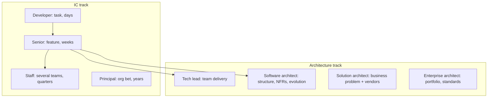
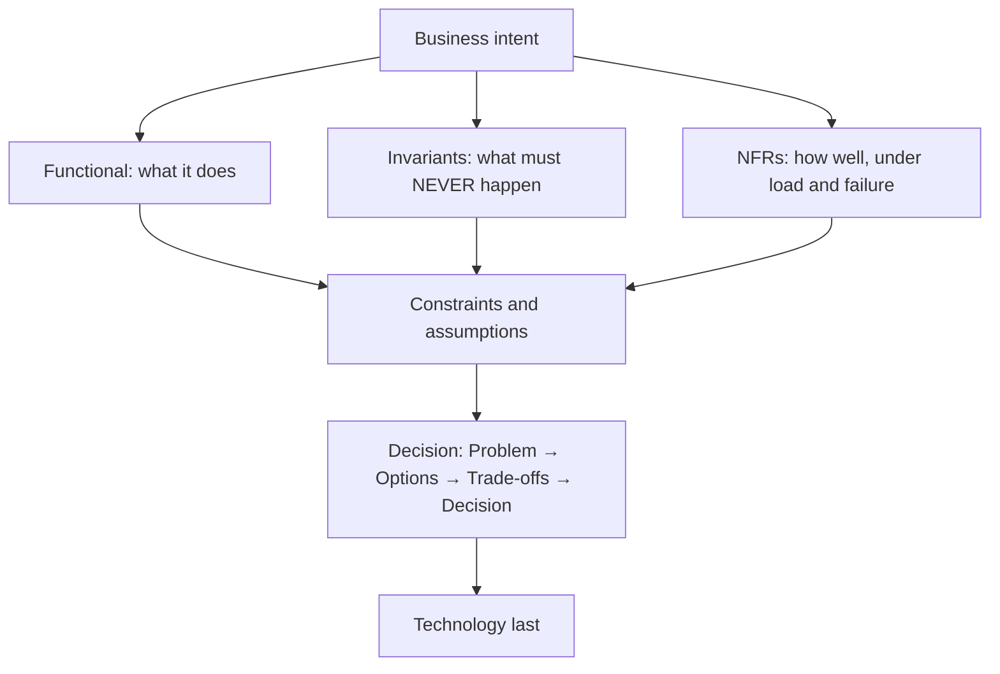
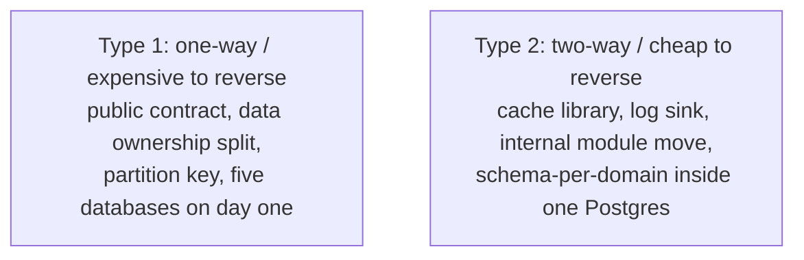

# Week 1 notes: Day 1 and Day 2

Revision notes for the Tadka cohort. Branch `day-01` is the Day 1 code. After Day 2, `git checkout day-02`.

---

## Numbers we used

| | |
|---|---|
| Product | Tadka, food delivery, Bangalore launch |
| Scale | **1 lakh orders/day** in year one |
| Average | 100,000 / 86,400 ≈ **1.2** orders/sec |
| Sustained peak | about 60% of traffic in 3 hours ≈ **5.5**/sec; design to **2x ≈ 11**/sec |
| Burst | offer drop or match end: **20-25**/sec |
| Week 8 destination | **four services + gateway** (Ordering, Payment, Delivery, Restaurant). Identity stays inside Ordering. |
| Four-step | **Problem → Options → Trade-offs → Decision** |
| Interview | **six moves** = the four-step opened up |

---

# Day 1: Think like an architect

## 1. What actually changes

Seniority is not more syntax. It is the size of the problem you can frame, the time horizon you reason over, and the consequences you can own.

An architect reduces **expensive uncertainty**.



| Role | Scope | Typical failure |
|---|---|---|
| Developer | one change, one PR | local optimum; misses system effect |
| Senior | a feature in production | solves the current boundary, never questions it |
| Tech lead | the team's delivery | becomes the only decision-maker, or stays too tactical |
| Staff | several teams / a cross-cutting problem | writes standards nobody can adopt |
| Principal | a long-horizon bet | over-designs for hypothetical scale |
| Software architect | structure, quality attributes, evolution | treats architecture as a one-time blueprint |
| Solution architect | a solution across systems and stakeholders | a diagram with no implementation owner |
| Enterprise architect | org-wide capability | governance disconnected from delivery |

Titles vary. **Scope and accountability** do not.

| | Developer | Architect |
|---|---|---|
| First question | How do I implement this? | Why are we building this, what must never happen, what fails? |
| View | class, method, local tests | boundary, ownership, cost, evolution |
| Failure | try/catch, unit tests | partial failure, slow dependency, how do we know at 2am? |
| Tech choice | "Kafka is the standard" | Which quality attribute requires Kafka, and what tax does it charge? |
| Time | this sprint | 1-3 years of change |
| Success | story passes | SLO, cost, evolvable, survives a partial outage |

**Measure first.** If an order takes 8 seconds, do not start with Redis, Kafka, or microservices. Find where the 8 seconds go. In the class example the bottleneck was a slow payment gateway, not the database. Diagnose before you prescribe.

**Four traps:**

1. Optimise the local hot path and miss the remote one.
2. Copy a FAANG diagram onto an 11/sec system.
3. Treat every quality attribute as one number for the whole platform.
4. Skip options and jump to the tool you already like.

Architects:

- find the real problem behind a requested solution
- make constraints and assumptions visible
- define boundaries and ownership
- compare options in business terms (rupees, on-call, reversibility)
- put failure and operations in the design, not in a later ticket
- revisit when evidence changes

The deliverable is a **decision a team can implement**, not a diagram.

---

## 2. Patterns transfer. Java vs C# does not.

This is not a .NET course. The same four-step, NFRs, estimation, and ADR work in Spring, Nest, or Go.

| Decision | .NET (Tadka) | Java | Node | Go |
|---|---|---|---|---|
| HTTP API | Controllers | Spring MVC | Nest / Express | net/http, chi |
| ORM | EF Core | Hibernate / jOOQ | Prisma / Kysely | sqlc, pgx |
| Pool | Npgsql pool | HikariCP | pg-pool | pgx pool |
| Tests | xUnit | JUnit | vitest | testing |

Architecture is the **decision**, not the type name. `Order` does not disappear if you rewrite Tadka in Go.

---

## 3. Business first, then architecture

```
outcome → actors and workflows → FR → NFR scenarios → constraints and invariants → options
```



Wrong: CEO says "we need Swiggy" → REST, Redis, Kafka, microservices.  
Right: Restaurant, Order, Delivery, Payment, Customer. Code is last.

| Input | Meaning | Tadka example |
|---|---|---|
| Requirement | desired behavior | customer can place an order |
| Constraint | imposed on the solution | .NET 10, one small team, launch this year |
| Invariant | must never be violated | an order is not charged twice; a cancelled order is not delivered |
| Assumption | belief until measured | 60% of orders in a 3-hour dinner window |

If the assumption is wrong, the architecture can be wrong while the code is "correct." Write the assumption down. Give it a way to be falsified.

**Invariant vs rule:** an invariant is a non-negotiable (never two captures for one payment). A rule is policy that can change (10% off over ₹500).

Tadka invariants this week: an order is not completed without a payment outcome we trust; a cancelled order is not delivered; an accepted order is not silently lost.

---

## 4. FR vs NFR

**FR** = what the system does. Browse, cart, pay, track.  
**NFR** (quality attribute) = how well, under load, failure, and time.

"Fast" and "highly available" are not requirements. A **scenario** names workload, threshold, and where you measure.

| Unusable | Usable |
|---|---|
| "The system must be fast." | Menu read P99 ≤ 300 ms at the API, at dinner peak. Place-order P99 ≤ 500 ms. |
| "Highly available." | Payment is stricter than menu browse. One number for the whole platform is a mistake. |
| "Secure." | Do not log secrets. Auth and PCI come when the system earns them. |

Write NFRs **per operation**, not per system. Payment fails honestly. Menu reads may tolerate slightly stale data.

**Percentile:** sort requests by time. P99 is slower than 99% of them. Average hides the dinner-rush tail. At 1 lakh orders/day, P99.9 is about 100 orders, often noise. P99 is the number we write.

---

## 5. The four-step

```
Problem  →  Options  →  Trade-offs  →  Decision
```

This is the spine of the week. An interview is the same ADR, compressed to 45 minutes.

**Type 1 vs Type 2 doors** (cost of reversal):



- Type 2: decide fast. Do not write a 20-page design.
- Type 1: options, failure modes, ADR, revisit trigger.

ADR-002 (monolith vs services) is Type 1 **timing**, not Type 1 forever. Schema-per-domain (Day 2) keeps the next Type 1 cheap.

**Essential vs accidental complexity:** essential = the business is hard (tax, money, consent). Accidental = we made it hard (15 microservices, Kafka for 50 messages per minute). Five databases on Day 1 is accidental.

Do not buy Stage 4 (shards, multi-region, Kafka) at Stage 1. Do design Stage 1 so Stage 2 is not a rewrite. That is schema-per-domain and no cross-schema FKs on Day 2.

Before you add a new box, ask: What bottleneck does this solve that the current box cannot? What new 3am failure does it add? Can this team debug it? If it dies, do we degrade or go dark?

---

## 6. Back-of-envelope: traffic and storage

Estimation is order-of-magnitude so you can **compare options**, not produce a bill.

```text
average /sec  = daily events / 86,400     (mental math: / 10^5)
peak          = average × peak factor     (or: peak window volume / peak seconds)
daily storage = writes/day × bytes/row    (then indexes, replicas, retention)
```

Always say whether a number is **average, sustained peak, or burst**.

**Tadka traffic:**

```text
1,00,000 orders/day
average     = 1,00,000 / 86,400                 ≈  1.2 /sec
dinner      = 60% in 3 hours = 60,000 / 10,800  ≈  5.5 /sec   (sustained peak)
design to   = 2 × 5.5                           ≈  11 /sec
burst       = offer / match                     ≈  20-25 /sec
```

Reads are higher than writes (browse about 10x per order). That still does not need five services.

**Storage comes from frequency, not the feature list.** Orders at about 2 KB are small. GPS pings, if stored forever, dwarf them. "We have a tracking feature" is not a storage estimate.

Common mistakes: treating registered users as concurrent; forgetting peak and retries; treating every request as equal cost; fake precision.

---

## 7. ADRs

An ADR is a short file in git: the decision, why, what you rejected, how it fails, when you revisit.

**Seven fields:**

1. Topic
2. Options (real ones, no straw man)
3. Choice
4. Why
5. Trade-off
6. **Failure mode** (specific and observable, not "the database might go down")
7. **Revisit when**

Weak failure: "Postgres can go down."  
Strong: "Dinner rush, pool exhausts, orders return 500, dashboard stays green because `/health` does not touch the DB. We find out from customers."

**ADR-002 Monolith First** (what "good" looks like):

```text
Topic:      How many deployables at launch?
Options:    1. One API, one Postgres
            2. Modular monolith (folders/schemas, one process)
            3. Microservices + database-per-service from day one
Choice:     2: one process, module boundaries in code
Why:        11 writes/sec; team small; same cost as option 1;
            extraction later is a refactor, not a migration
Trade-off:  one failure domain; boundaries need discipline
Failure:    team stops honouring folders; ball of mud;
            health check does not prove the database
Revisit:    measured load split; PCI; a second team that cannot share a deploy
```

Never hide the "why not?". A later reader will re-introduce five databases if they cannot see which constraint ruled them out.

**Same-commit rule:** when an ADR lands, update `CLAUDE.md` / `.github/copilot-instructions.md` in that PR. A stale context file is worse than none. Generic output looks generic, so you check it. Stale-specific output looks like "ours", so you stop checking.

---

## 8. Copilot, Claude, and health

**Altitude**

| | Hand to the model? |
|---|---|
| Low: this method, this mapping | Yes |
| Middle: draft options, critique an ADR | It drafts, you decide |
| High: monolith or services, where the boundary is | You own it. The model does not know team size, 11/sec, or an 8s payment gateway. |

**Liveness vs readiness** (branch `day-01`):

1. `docker compose stop postgres` then `curl.exe http://localhost:5224/health` still returns **200**. That is liveness. The process is up. It does not talk to Postgres. The check lies.
2. `/health/ready` talks to Postgres. With Postgres down it returns **503**. `/health` stays 200.
3. Compose service name is **`postgres`**. Port **5224**. On Windows use **`curl.exe`**.

**Why the instructions file matters:** Copilot reads `.github/copilot-instructions.md`. On `day-01` that file describes Domain folders, schemas `orders`/`users`, and `/api/v1/`. The code has `Controllers/` + `Data/` only, an empty `TadkaDbContext`, and only `/health`. The file describes a system that is not this repo. The model will generate that other system, confidently. It will look right. That is why a stale file is worse than no file.

---

## 9. ADR-002: monolith first

```
Client  →  Tadka.Api  →  one PostgreSQL
```

| | One process, one DB | Five services, five DBs, Day 1 | Modular monolith |
|---|---|---|---|
| Deploy | one command | orchestration | one command |
| Debug | one stack | needs tracing | one stack |
| Team | 2-4 | realistically 8+ | 2-4 |
| Independent scale | no | yes | not yet |
| Isolation | discipline | network | folders now, tests later |
| Cost today | one bill | 4-5x | one bill |

At **11 writes/sec** the third column wins. Microservices are not wrong. They are **wrong now**. Right decision, wrong time = over-engineering.

---

# Day 2: Domain, schemas, interview

## 10. Business first

Day 1 collected requirements and wrote ADR-002. Day 2 organizes the **business**, then the software.

```
Business → Requirements → Domain → Architecture → Code
```

Not: Requirements → Java → Spring → Code.

Two friends open a restaurant. "Which database?" is the wrong first question.

A mall: parking does not cook; cinema does not set ticket prices. Tadka departments (forget software): restaurants, customers, orders, payments, delivery.

**Software should mirror the business.** Not the framework, not the table list.

---

## 11. Bounded contexts

A **bounded context** is a boundary inside which words, rules, and models have one meaning.

"Order" is not one thing:

| Context | "Order" means |
|---|---|
| ordering | confirmed cart, money, line items |
| restaurant | ticket to cook |
| delivery | pickup job |
| payment | a capture / refund handle |

One shared `Order` class only **grows**. Add is cheap; remove is expensive:

```text
Delivery needs rider phone     → RiderPhone added
Restaurant needs prep minutes  → EstimatedPrepMinutes added
Finance needs GST split        → TaxBreakdown added
Delivery tries to REMOVE phone → stop. Does Restaurant still read it?
                                 grep. ask. give up. field stays forever.
```

Two years later: forty fields, no use case needs all of them, nobody can say which field is whose. Separate context is not the same as separate data. Each context keeps a **small complete model it can change alone**.

**Four signals** (if two of three differ, split):

1. Different language (strongest)
2. Different rate of change
3. Different **failure isolation**
4. Different ownership (Conway: this becomes decisive when teams split)

**Failure-isolation test:** take a piece down. What still works? Whatever falls together is one context.

- Payment gateway down → browse, menu, cart yes; place order no.
- Tracking down → order still goes; map does not.
- Menu down → existing orders track; no new order (no price).
- Login down → new users blocked; an already-logged-in session is a real debate.

**Wrong groupings:** by screen, by technical layer, by CRUD noun (the dangerous one, because it looks right). Cart is an unconfirmed order, not a context.

Tadka's five: **ordering, restaurant, delivery, identity, payment**.

Code boundaries **now**. Service boundaries **later**. All five live in one process on `day-02`.

---

## 12. Snapshot, entity, value object, aggregate

**Snapshot:** a historical record owns its data. The order item copies **name and ₹299** when the order is placed. A live join to `menu_items` makes last night's biryani show ₹349 after a morning price change. That breaks accounting and refunds. It is not a UI bug. Amazon does this on purpose.

A join across two databases is not "slow." It **does not exist**. Every join algorithm needs both sides in **one process's memory**. Two databases means two queries plus your `foreach`. Week 6 will need a local read model. Not this week.

| | Entity | Value object | Aggregate root |
|---|---|---|---|
| Identity | yes (Id) | no: equality by value | the door into the box |
| Example | `Order`, `Restaurant`, `User` | `Money(299,"INR")`, `Address` | `Order` (not `OrderItem`) |
| Load | via root | columns via `OwnsOne` | one transaction, one aggregate |

If `Money` were an entity you would get a `money` table and a join for something with no identity. EF flattens `OwnsOne` to `Price_Amount` and `Price_Currency` on `menu_items`.

A `decimal` amount plus a `string` currency that anyone can mismatch is why `Money` is a value object.

**Anemic vs rich:** if `Cancel()` lives in `OrderService` and `Status` is public, someone will set `Delivered` and skip the rule. The aggregate **guards** the invariant. The domain model's job is not to hold data. It is to protect the business.

Delivery has **two** roots (`DeliveryAgent`, `DeliveryAssignment`): different lifecycles, same language, same context. Aggregate = consistency. Context = autonomy. Mixing them produces too many services.

Folder `Domain/Users` vs schema `identity`: both correct. One names the thing, one names the job.

---

## 13. AI does not make the call

Ask a model for bounded contexts with a **bare** prompt (no project context file). It returns a CRUD-noun list: Menu, Cart, Rating, User.

Run the four signals. Menu and Restaurant are one context. Cart is a state of an order. Rating is not in launch scope.

The model did not ask team size, what must fail together, or what is in scope. High-altitude generic answers are dangerous because they **look** like answers.

**Use it backwards:** you find the five; then "what did I forget given these constraints?" That is middle altitude.

AI helps you think faster. It does not make the call. Tools multiply judgement. Zero times a million is still zero.

---

## 14. What a transaction actually is

"Create the order and the payment: both, or neither."

You `COMMIT` 100 row updates. Are the new **table pages** on disk when COMMIT returns? **No.** Only the **WAL** (Write-Ahead Log) was `fsync`'d.

```text
BEGIN     → your snapshot; row locks; locks held until commit
writes    → append to WAL first
COMMIT    → fsync the WAL. That instant it "happened."
table pages → later, in the background (checkpoint)
```

Crash: replay WAL. Durability is the log, not the heap.

**Atomicity** is not two updates at the same time. It is **one COMMIT record**: one bit in one file.

Random page writes scatter I/O. An append-only log is sequential. COMMIT waits on **one** sequential fsync, not on every dirty page.

Therefore:

1. A transaction cannot span two databases. Two WALs, two fsyncs, power can fail between. That is physics. 2PC, saga, and Outbox exist because of this (Week 5).
2. Lock is held until commit. Long transaction → long lock → waiters hold **connections** → pool empty → the whole app is slow.
3. Never call the network inside a transaction. An 8s gateway holds the lock for 8s.

---

## 15. A connection is a process

Postgres **forks an OS process per connection** (about 1-3 MB, even idle). `max_connections` default **100**. That is why pooling is a Postgres conversation.

The app holds a **bag of reusable connections**: the pool. Size comes from **in-flight DB operations**, not request rate. A 5 ms query holds a connection 5 ms.

```text
50 conns × 5 ms hold  →  10,000 /sec   (fine vs 11/sec)
50 conns × 9 s hold   →  ~5.5 /sec     (peak 11: pool empty)
```

A bigger pool is not faster. It lets more people wait, then you kill the database. Four app instances × 50 = 200 against a limit of 100. External poolers come later. On Day 2 you have one instance; the in-app pool is the whole answer. The mechanism is the process.

`/health` can stay green while `/health/ready` is 503. The dashboard only tells the truth if you look at the right endpoint.

MySQL and SQL Server use threads (cheaper). "We opened 500 connections on Mongo" is a different engine, not a counter-proof.

Little's Law (`concurrency ≈ rate × hold time`) is why a slow query empties the pool.

---

## 16. How many databases? ADR-003

Five contexts. Three layouts:

| | 1 DB, 1 schema | **1 DB, 5 schemas** | 5 DBs on Day 1 |
|---|---|---|---|
| Cost / month | ~₹15-20k | **same** | ~₹75k-1L |
| Boundaries | none | visible, DB-enforced | physical |
| JOIN | yes | yes (do not) | **no** |
| Transactions | one WAL | one WAL | distributed |
| Backup | 1 | 1 | 5 |
| Extract later | archaeology | **lift the schema** | already done |
| On-call | 1 | 1 | 5 |

Option 1 and 2 cost the same. `CREATE SCHEMA` is a free lunch. Five databases are correct **eventually**, not today.

**ADR-003:** one PostgreSQL, schemas `ordering`, `restaurant`, `delivery`, `identity`, `payment`.

Trade-off: one instance = one failure domain; one shared pool; a cross-schema JOIN is still technically possible (that is why ADR-008 exists).

Revisit when: measured load split, PCI physical separation, or an actual extraction.

---

## 17. Foreign keys: ADR-008

`ordering.orders.customer_id` points at `identity.users`. Add a foreign key?

For a single-database textbook, yes. On extraction day:

```text
ERROR: cannot drop table restaurant.menu_items
because constraint fk_order_items_menu_item on ordering.order_items depends on it
```

Two bad roads: drop the guarantee you never really had, or let a constraint decide architecture.

**Tight inside, loose between.** FK inside a schema. Across schemas: **Guid only, no FK.**

On `day-02` nothing in CI stops you adding that FK. Discipline is the only guard. A later week turns the rule into a build-breaking test. Do not hard-delete (deactivate instead). Validate at the application boundary.

---

## 18. Readable diagrams

Rules for a diagram another engineer can read:

1. Every box has a precise name (`ordering`, not "backend").
2. Every arrow is labelled (HTTP, SQL, event).
3. Colour means something (five contexts, five colours).
4. Eight to ten boxes; split the picture rather than crowd it.

One process, five schemas, **no arrows between schemas**. That empty space is ADR-008. Five separate databases would be next year, not today.

---

## 19. Interview: six moves

The four-step, opened for a 45-minute round:

| # | Move | ~min | What you do |
|---|---|---:|---|
| 1 | Clarify | 5 | questions that **change the design** |
| 2 | Estimate | 5 | Tadka-scale numbers, out loud |
| 3 | HLD | 10 | boxes, **labelled** arrows |
| 4 | Deep dive | 15 | interviewer picks one piece |
| 5 | Trade-offs | 7 | what broke, what you left, 10x |
| 6 | Wrap | 3 | decision + one revisit trigger |

Worked example: design a notification system.

Clarify:

| Question | Answer that changes the boxes |
|---|---|
| Transactional or promotional? | Both: **two systems** (volume vs guarantee) |
| Channels? | push, SMS, email |
| Guaranteed delivery? | OTP yes. Offer no. |
| Preferences / quiet hours? | yes; no SMS after 10pm |
| Out of scope today? | in-app inbox, read receipts |

Estimate:

```text
1 lakh orders/day × ~3 notifications  ≈  3.5 /sec average
dinner ~10x                           ≈  35 /sec transactional
5 lakh users, one campaign, one hour  ≈  5,00,000 / 3600  ≈  140 /sec promotional
```

Promotional peak is about 4x transactional. A festival campaign plus dinner can push OTP behind the campaign. That is an architecture requirement from arithmetic.

Deep dive with **only Week 1 patterns**: own bounded context; snapshot (do not live-read the order); own schema; no cross-schema FK; the aggregate owns opt-out and "do not send twice." Do not draw Kafka: that box is not earned yet.

Wrap names the weakness first: no queue today, so a slow notification path can slow orders. Revisit the day promotional volume slows the order path. Then a queue is earned.

One line to practise: *"This is the same problem Tadka's ___ was, so I will use that pattern, and it changes when ___."*

---

## Lines to remember

**Day 1**

- Diagnose first. Average engineers prescribe.
- Pattern matters. Java vs C# does not.
- Problem → Options → Trade-offs → Decision.
- Right decision, wrong time.
- A stale instructions file is worse than none.
- Do not optimise what you have not measured.

**Day 2**

- Software mirrors the business.
- Boundary is where the system **fails** apart, not where the folders are.
- AI multiplies judgement; zero stays zero.
- A historical record owns its data.
- Transaction is a log and an fsync.
- Connection is a process; the pool is finite.
- Tight inside, loose between.
- Interview tests whether you recognise a known pattern in a new problem.

---

## Later weeks (not this week)

| Topic | When |
|---|---|
| REST `/api/v1`, RFC 7807, no DELETE | Day 3 |
| Idempotency, `xmin`, in-process events | Day 4 |
| Indexes, pool sizing, replica | Day 5 |
| Redis, live tracking | Day 6 |
| Timeouts, bulkhead, payment module | Day 7 |
| Extract Payment | Day 8 |
| Kafka, Outbox, saga | Day 9 |
| Auth, PCI | Day 10 |
| Gateway, more extracts | Days 11-12 |
| Observability, chaos | Days 13-14 |
