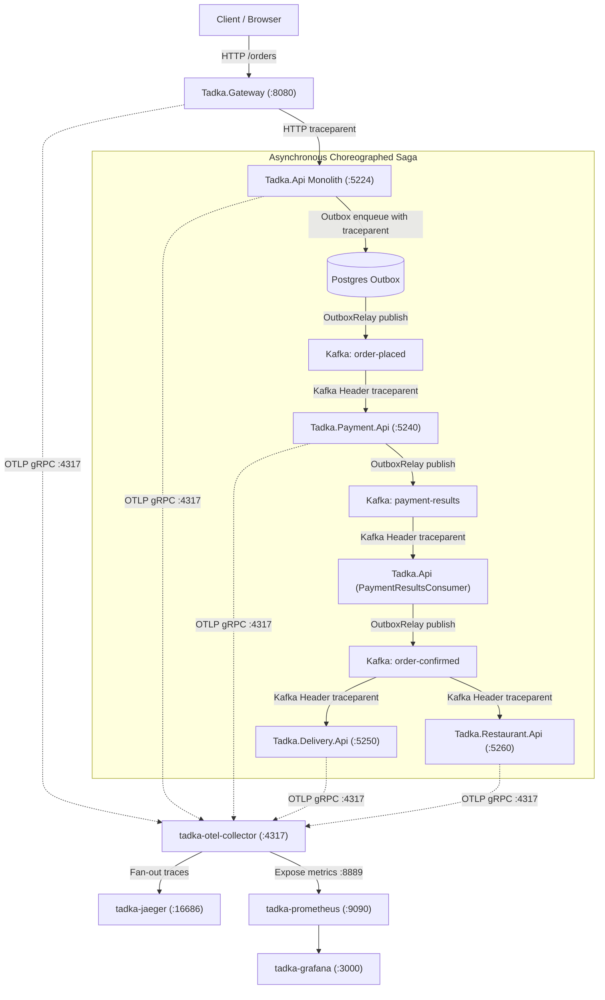

# Day 13: Runbook: Observability for the 4-service system (OpenTelemetry, Jaeger, Prometheus, Grafana)

**Branch:** `day-13`  ·  **What changed since Day 12:** [`docs/changelog.md`](../changelog.md).

Tadka's choreographed Kafka saga (Ordering → Payment → Delivery → Restaurant) across **4 services + an API gateway** is now **visible**. Three pillars of observability are instrumented once with the vendor-neutral **OpenTelemetry (OTel)** standard ([ADR-040](../adrs/040-observability-opentelemetry-otlp.md)), exported over OTLP to a lean OSS stack: **OpenTelemetry Collector → Jaeger (distributed traces) + Prometheus (RED metrics) + Grafana (dashboards & alerting)**. Structured logs are emitted as machine-readable JSON to the console, enriched with `trace_id` and `span_id`. Trace context crosses **both Kafka and the Transactional Outbox** via W3C `traceparent` headers ([ADR-041](../adrs/041-trace-context-propagation-http-kafka-outbox.md)), and metrics are strictly bounded to **low-cardinality** dimensions ([ADR-042](../adrs/042-metrics-cardinality-limits.md)).

> **Demo password:** `Password123!` for customer Priya (`priya@tadka.test`) and Admin (`admin@tadka.test`).  
> **Grafana credentials:** `admin` / `admin`.

Every command below is given twice, bash first and PowerShell second, wherever the two shells differ. They are not the same commands with `curl` swapped for `curl.exe`: bash's `VAR=$(...)`, `sed -E`, and inline `VAR=value command` syntax do not run in plain PowerShell at all. Windows PowerShell 5.1 also cannot read an HTTP status code off a 4xx/5xx response without the call throwing, so the small `Get-StatusCode` helper defined in section 1 is reused throughout. Every bash and PowerShell block here was run live against this branch (the five services, Postgres, Kafka, Redis, PgBouncer, OTel Collector, Jaeger, Prometheus, and Grafana all up) before being written down.

> **Using Git Bash on Windows?** Git Bash rewrites any argument that looks like a Unix path, so `docker exec tadka-kafka /opt/kafka/bin/kafka-topics.sh ...` fails with `C:/Program Files/Git/opt/kafka/...: no such file`. Run `export MSYS_NO_PATHCONV=1` once per terminal first (WSL, macOS and Linux do not need it). Git Bash's `curl` may also exit with code 23 after printing the right answer when you use `-o /dev/null`; the printed status is still correct.

---

## 1. Start the stack

### Demo Day Fresh Reset (Clean Slate)
To start from a clean slate (wiping every volume, lingering test containers, and Prometheus TSDB series). **Do this if you want a guaranteed clean baseline**:

**Bash:**
```bash
docker compose --profile observability down -v --remove-orphans && docker compose --profile observability up -d
until docker inspect tadka-kafka --format "{{.State.Health.Status}}" | grep -q healthy; do sleep 3; done
until docker inspect tadka-restaurant-db --format "{{.State.Health.Status}}" | grep -q healthy; do sleep 3; done
docker compose ps
```

**PowerShell:**
```powershell
docker compose --profile observability down -v --remove-orphans; docker compose --profile observability up -d
do { Start-Sleep -Seconds 3 } until ((docker inspect tadka-kafka --format "{{.State.Health.Status}}") -eq "healthy")
do { Start-Sleep -Seconds 3 } until ((docker inspect tadka-restaurant-db --format "{{.State.Health.Status}}") -eq "healthy")
docker compose ps
```

*(This wipes volume directories `pgdata`, `pgdata_replica`, `pgdata_payment`, `pgdata_delivery`, `pgdata_restaurant`, and brings up the 13 containers fresh from scratch).*

---

### Standard Launch
If starting existing containers without wiping data:

**What this does.** [`docker-compose.yml`](../../docker-compose.yml) with `--profile observability` starts the 9 core infrastructure containers (monolith Postgres 5432 + replica 5433, `payment-db` 5434, `delivery-db` 5435, `restaurant-db` 5436, Redis 6379, Kafka 9092, Kafka UI 8090, PgBouncer 6432) plus the **4 observability containers**:
- **`tadka-otel-collector`** (`:4317` gRPC / `:4318` HTTP / `:8889` Prometheus exporter): Receives OTLP telemetry from apps, batches it, and fans out traces to Jaeger and metrics to Prometheus.
- **`tadka-jaeger`** (`:16686` UI): Distributed trace storage and waterfall visualization.
- **`tadka-prometheus`** (`:9090` UI): Time-series database scraping the Collector every 15s.
- **`tadka-grafana`** (`:3000` UI): Pre-provisioned datasources, RED dashboard, and alert rules.

```bash
git checkout day-13
docker compose --profile observability up -d
until docker inspect tadka-kafka --format "{{.State.Health.Status}}" | grep -q healthy; do sleep 3; done
until docker inspect tadka-restaurant-db --format "{{.State.Health.Status}}" | grep -q healthy; do sleep 3; done
docker compose ps
```
```powershell
git checkout day-13
docker compose --profile observability up -d
do { Start-Sleep -Seconds 3 } until ((docker inspect tadka-kafka --format "{{.State.Health.Status}}") -eq "healthy")
do { Start-Sleep -Seconds 3 } until ((docker inspect tadka-restaurant-db --format "{{.State.Health.Status}}") -eq "healthy")
docker compose ps
```

**Build once before starting the apps.** All services reference the new `Tadka.Telemetry` library. Running one `dotnet build` first prevents file contention errors on `Tadka.Telemetry.dll`:
```bash
dotnet build Tadka.slnx
```
```powershell
dotnet build Tadka.slnx
```

**Pre-create the eight Kafka topics this branch uses.**  
Kafka requires SASL credentials on Day 13 (`--command-config /etc/kafka/docker/client.properties`). Running this topic pre-creation loop prevents `Subscribed topic not available` warnings when consumers launch:
```bash
for t in order-placed payment-results order-confirmed delivery-assigned refund-requested payment-refunded menu-updated restaurant-response; do
  docker exec tadka-kafka /opt/kafka/bin/kafka-topics.sh --bootstrap-server localhost:9092 --command-config /etc/kafka/docker/client.properties --create --if-not-exists --topic $t --partitions 1 --replication-factor 1
done
```
```powershell
foreach ($t in "order-placed","payment-results","order-confirmed","delivery-assigned","refund-requested","payment-refunded","menu-updated","restaurant-response") {
  docker exec tadka-kafka /opt/kafka/bin/kafka-topics.sh --bootstrap-server localhost:9092 --command-config /etc/kafka/docker/client.properties --create --if-not-exists --topic $t --partitions 1 --replication-factor 1
}
```

### Launch the Five Services
Telemetry export is **gated** on the environment variable `OTEL_EXPORTER_OTLP_ENDPOINT`. When this variable is unset, apps run in standalone/test mode without attempting network export to the Collector. **Set it in every terminal before running each service**:

Five processes, five terminals:
```bash
# Terminal 1: Restaurant Service (:5260)
export OTEL_EXPORTER_OTLP_ENDPOINT="http://localhost:4317"
dotnet run --project src/Tadka.Restaurant.Api

# Terminal 2: Payment Service (:5240)
export OTEL_EXPORTER_OTLP_ENDPOINT="http://localhost:4317"
dotnet run --project src/Tadka.Payment.Api

# Terminal 3: Delivery Service (:5250)
export OTEL_EXPORTER_OTLP_ENDPOINT="http://localhost:4317"
dotnet run --project src/Tadka.Delivery.Api

# Terminal 4: Ordering Monolith (:5224)
export OTEL_EXPORTER_OTLP_ENDPOINT="http://localhost:4317"
dotnet run --project src/Tadka.Api

# Terminal 5: API Gateway (:8080)
export OTEL_EXPORTER_OTLP_ENDPOINT="http://localhost:4317"
dotnet run --project src/Tadka.Gateway
```

```powershell
# Terminal 1: Restaurant Service (:5260)
$env:OTEL_EXPORTER_OTLP_ENDPOINT = "http://localhost:4317"
dotnet run --project src/Tadka.Restaurant.Api

# Terminal 2: Payment Service (:5240)
$env:OTEL_EXPORTER_OTLP_ENDPOINT = "http://localhost:4317"
dotnet run --project src/Tadka.Payment.Api

# Terminal 3: Delivery Service (:5250)
$env:OTEL_EXPORTER_OTLP_ENDPOINT = "http://localhost:4317"
dotnet run --project src/Tadka.Delivery.Api

# Terminal 4: Ordering Monolith (:5224)
$env:OTEL_EXPORTER_OTLP_ENDPOINT = "http://localhost:4317"
dotnet run --project src/Tadka.Api

# Terminal 5: API Gateway (:8080)
$env:OTEL_EXPORTER_OTLP_ENDPOINT = "http://localhost:4317"
dotnet run --project src/Tadka.Gateway
```

Observability web portals:
- **Jaeger UI:** [http://localhost:16686](http://localhost:16686)
- **Prometheus UI:** [http://localhost:9090](http://localhost:9090)
- **Grafana UI:** [http://localhost:3000](http://localhost:3000) (User: `admin`, Password: `admin`)
- **Kafka UI:** [http://localhost:8090](http://localhost:8090)

---

### PowerShell helper: reading a status code without the call throwing
Define this once in the terminal where you execute test commands:
```powershell
function Get-StatusCode {
    param($Uri, $Method = "GET", $Headers = @{}, $Body = $null, $ContentType = "application/json")
    try {
        $params = @{ Uri = $Uri; Method = $Method; Headers = $Headers; UseBasicParsing = $true }
        if ($Body) { $params.Body = $Body; $params.ContentType = $ContentType }
        $r = Invoke-WebRequest @params
        return [int]$r.StatusCode
    } catch {
        if ($_.Exception.Response) { return [int]$_.Exception.Response.StatusCode }
        else { throw }
    }
}
```

### Shared setup: Customer Priya Token & Order Payload
```bash
TOKEN=$(curl -s -X POST http://localhost:8080/api/v1/auth/login -H "Content-Type: application/json" -d '{"email":"priya@tadka.test","password":"Password123!"}' | sed -E 's/.*"accessToken":"([^"]+)".*/\1/')
BODY='{"customerId":"c1b2c3d4-0001-4000-8000-000000000001","restaurantId":"a1b2c3d4-0001-4000-8000-000000000001","items":[{"menuItemId":"b1b2c3d4-0001-4000-8000-000000000001","quantity":2}],"deliveryAddress":{"line1":"x","line2":"y","city":"Bangalore","pincode":"560066","latitude":12.93,"longitude":77.61}}'
```
```powershell
$TOKEN = (Invoke-RestMethod -Uri http://localhost:8080/api/v1/auth/login -Method Post -ContentType "application/json" -Body '{"email":"priya@tadka.test","password":"Password123!"}').accessToken
$H = @{ Authorization = "Bearer $TOKEN" }
$BODY = '{"customerId":"c1b2c3d4-0001-4000-8000-000000000001","restaurantId":"a1b2c3d4-0001-4000-8000-000000000001","items":[{"menuItemId":"b1b2c3d4-0001-4000-8000-000000000001","quantity":2}],"deliveryAddress":{"line1":"x","line2":"y","city":"Bangalore","pincode":"560066","latitude":12.93,"longitude":77.61}}'
```

---

## 2. Architecture & Wiring: The 3 Pillars through OTLP

Prior to Day 13, the choreographed saga was functionally working but completely blind. When an order was stuck, operators had to open five separate terminal windows and manually match log messages.

Day 13 introduces the three pillars of observability using the OpenTelemetry standard ([ADR-040](../adrs/040-observability-opentelemetry-otlp.md)):
1. **Traces:** *Where did the request go across boundaries?* Shows the unified waterfall of the distributed transaction.
2. **Metrics:** *How fast and how healthy is the fleet?* Aggregated rates, error percentages, and latency percentiles.
3. **Logs:** *What exactly happened?* Low-level details emitted as structured JSON to stdout, enriched with `trace_id` and `span_id`.



### Context Propagation across the Transactional Outbox (ADR-041)
In synchronous HTTP calls, `HttpClient` automatically propagates the W3C `traceparent` header. However, in our event-driven architecture, services write to a **Transactional Outbox** table inside the local database transaction. 

By the time the background `OutboxRelay` worker polls the database and publishes to Kafka:
1. The original HTTP request has completed and returned HTTP `201 Created` to the client.
2. The ambient thread's `Activity.Current` is gone.

**The Fix (ADR-041):**
- When enqueuing an outbox message, we capture `Activity.Current?.Id` and write it to the `TraceParent` column on `ordering.outbox_messages` and `restaurant.outbox_messages`.
- When `OutboxRelay` picks up the row (`SKIP LOCKED`), it creates a new child activity (`outbox publish <topic>`) parented to that captured `TraceParent`.
- The relay injects the `traceparent` as a binary byte array header into the Confluent Kafka message: `message.Headers.Add("traceparent", Encoding.UTF8.GetBytes(activity.Id))`.
- When consumers (`OrderPlacedConsumer`, `PaymentResultsConsumer`, `OrderConfirmedConsumer`) read the message, they extract the header using `TadkaTrace.ExtractTraceParent(cr.Message.Headers)` and start their own child span.

---

## 3. Demo 1: The Saga in One Trace (Distributed Tracing in Jaeger)

**What you're proving:** The choreographed Kafka saga—which crossed 5 operating system processes, 2 databases, and 3 Kafka topics—is stitched into a single, continuous waterfall trace. When a step fails, the trace immediately pinpoints the culprit.

### Baseline: Happy Path Saga (9 to 13 spans across 4 services)
Place an order for 2 × Chicken Biryani at Meghana Foods (₹598) through the API Gateway:

**Bash:**
```bash
curl -s -X POST http://localhost:8080/api/v1/orders \
  -H "Authorization: Bearer $TOKEN" \
  -H "Content-Type: application/json" \
  -d "$BODY" | sed -E 's/.*"status":"([^"]+)".*"totalAmount":\{"amount":([0-9.]+).*/status: \1  total: \2/'
```

**PowerShell:**
```powershell
$order = Invoke-RestMethod -Uri http://localhost:8080/api/v1/orders -Method Post -Headers $H -ContentType "application/json" -Body $BODY
"status: " + $order.status + "  total: " + $order.totalAmount.amount
```

**Captured live:** `status: Created  total: 598.00`

Wait 2 seconds for the background saga to complete, then inspect the order status:
```powershell
$status = (Invoke-RestMethod -Uri "http://localhost:8080/api/v1/orders/$($order.id)" -Method Get -Headers $H).status
"Final Order Status: $status"
```
**Captured live:** `Final Order Status: Confirmed`

#### Inspecting the Trace in Jaeger UI
1. Open **[http://localhost:16686](http://localhost:16686)**.
2. In the left navigation, select **Service:** `Tadka.Gateway`.
3. Select **Operation:** `POST` (or leave as all operations).
4. Click **Find Traces**.
5. Click the top trace (duration typically 1.5s – 2.5s).

You will see a unified waterfall with **9 core spans across 4 distinct services**:

| # | Service | Operation / Span Name | Type | Key Tags / Attributes |
|---|---|---|---|---|
| 1 | `Tadka.Gateway` | `POST` | HTTP Entry | `http.route=/api/v1/{**remainder}`, `http.status_code=201` |
| 2 | `Tadka.Api` | `POST api/v1/orders` | HTTP Inbound | `order.id=<guid>`, `http.status_code=201` |
| 3 | `Tadka.Api` | `outbox publish order-placed` | Producer Span | `messaging.system=kafka`, `messaging.destination=order-placed` |
| 4 | `Tadka.Payment.Api` | `consume order-placed` | Consumer Span | `messaging.operation=process`, `messaging.kafka.consumer_group=payment-service` |
| 5 | `Tadka.Payment.Api` | `ProcessPayment` | Internal Work | `payment.amount=598.00`, `payment.status=success` |
| 6 | `Tadka.Payment.Api` | `outbox publish payment-results` | Producer Span | `messaging.destination=payment-results` |
| 7 | `Tadka.Api` | `consume payment-results` | Consumer Span | `messaging.operation=process` |
| 8 | `Tadka.Api` | `outbox publish order-confirmed` | Producer Span | `messaging.destination=order-confirmed` |
| 9 | `Tadka.Delivery.Api` | `consume order-confirmed` | Consumer Span | `rider.name=Imran`, `messaging.destination=order-confirmed` |
| 10 | `Tadka.Restaurant.Api`| `consume order-confirmed` | Consumer Span | `restaurant.status=Accepted` |

---

### The Wound: Simulating Payment Gateway Failure
In Day 8, when a payment gateway failed, the order quietly sat in limbo while operators guessed what happened. With distributed tracing, the exact failure point is highlighted in red.

**Stop the Payment service (Ctrl+C in Terminal 2)** and restart it with the failure simulation flag enabled:

**Bash:**
```bash
export OTEL_EXPORTER_OTLP_ENDPOINT="http://localhost:4317"
export Payment__Gateway__Behavior="Failing"
dotnet run --project src/Tadka.Payment.Api
```

**PowerShell:**
```powershell
$env:OTEL_EXPORTER_OTLP_ENDPOINT = "http://localhost:4317"
$env:Payment__Gateway__Behavior = "Failing"
dotnet run --project src/Tadka.Payment.Api
```

Now, submit a new order through the Gateway:
**Bash:**
```bash
curl -s -X POST http://localhost:8080/api/v1/orders \
  -H "Authorization: Bearer $TOKEN" \
  -H "Content-Type: application/json" \
  -d "$BODY" | sed -E 's/.*"id":"([^"]+)".*"status":"([^"]+)".*/id: \1  status: \2/'
```

**PowerShell:**
```powershell
$failedOrder = Invoke-RestMethod -Uri http://localhost:8080/api/v1/orders -Method Post -Headers $H -ContentType "application/json" -Body $BODY
"id: " + $failedOrder.id + "  status: " + $failedOrder.status
```

**Captured live:** `id: 432961ed-d771-4129-a439-1d69afed52b0  status: Created`

Wait 3 seconds and query the order again:
```powershell
(Invoke-RestMethod -Uri "http://localhost:8080/api/v1/orders/$($failedOrder.id)" -Method Get -Headers $H).status
```
**Captured live:** `Created` (The order never transitions to `Confirmed`).

#### Inspect the Failed Trace in Jaeger
Refresh Jaeger at **[http://localhost:16686](http://localhost:16686)** and open the newest trace:
- **Total Spans:** 8 spans (only Gateway, Ordering, and Payment).
- **Does it reach Delivery?** **NO.** There are 0 spans for `Tadka.Delivery.Api`.
- **The Culprit:** The `ProcessPayment` span in `Tadka.Payment.Api` is highlighted with an **error badge**:
  - `error = True`
  - `otel.status_code = ERROR`
  - `otel.status_description = "PaymentDeclinedException: Gateway declined the payment (simulated)."`
  - `payment.status = "failed"`

**What this proved:** Without touching a single log file, the on-call engineer can see in one second that the saga halted at Payment due to an upstream gateway rejection.

#### The Fix
Stop Payment (Ctrl+C), reset the environment variable, and restart:
```bash
unset Payment__Gateway__Behavior
dotnet run --project src/Tadka.Payment.Api
```
```powershell
$env:Payment__Gateway__Behavior = $null
dotnet run --project src/Tadka.Payment.Api
```

---

### 3.5 Inspecting Context Propagation in Kafka UI
To visually verify that Kafka messages carry the W3C `traceparent` across broker topics:
1. Open Kafka UI at **[http://localhost:8090](http://localhost:8090)**.
2. In the left navigation, click **Topics** → click `order-placed`.
3. Switch to the **Messages** tab.
4. Expand the newest message:
   - Notice the **Headers** table contains:
     - Key: `traceparent`
     - Value: `00-f702b761785651a3b5a7057190bb727a-d4e491a662faeb10-01`
   - Notice the trace ID (`f702b761785651a3b5a7057190bb727a`) exactly matches the trace ID in Jaeger!
5. Now check `payment-results` and `order-confirmed`: each carries the exact same `traceparent` trace ID injected by `OutboxRelay`.

---

### 3.6 Hoisting Spans Across Consumer Exceptions (Fix 6)
In Day 12 and earlier, Kafka consumers declared their span inside a scoped block that did not wrap consumer exceptions. If message processing threw an uncaught exception, the activity was aborted without marking the error state, leaving Jaeger traces marked green or orphaned.

In Day 13 ([Fix 6]), all 9 Kafka consumers hoist `Activity? activity` outside the `try/catch/finally` block:
```csharp
Activity? activity = null;
try
{
    activity = TadkaDiagnostics.ActivitySource.StartActivity(
        $"consume {Topics.OrderPlaced}", ActivityKind.Consumer, TadkaTrace.ParseContext(ReadTraceParent(cr)));

    await HandleAsync(cr.Message.Value, stoppingToken);
    consumer.Commit(cr);
}
catch (ConsumeException ex)
{
    activity?.SetStatus(ActivityStatusCode.Error, ex.Message);
    activity?.AddException(ex);
    logger.LogError(ex, "OrderPlacedConsumer consume error.");
}
catch (Exception ex) when (cr is not null)
{
    // Fix 6: Mark span as Error and record full stack trace before poison routing
    activity?.SetStatus(ActivityStatusCode.Error, ex.Message);
    activity?.AddException(ex);
    await HandlePoisonAsync(consumer, cr, ex, stoppingToken);
}
finally
{
    activity?.Dispose();
}
```
**Why this matters:** When a consumer fails (e.g., transient database error or poison message), the Jaeger span is tagged in bright red with `otel.status_code = ERROR` and includes the exact C# exception type and stack trace as span events.

---

## 4. Demo 2: RED Metrics & The Cardinality Blow-Up (Prometheus & Grafana)

**What you're proving:** Metrics provide aggregated fleet-level health (Rate, Errors, Duration). However, putting high-cardinality values like `order_id` into Prometheus metric labels causes a catastrophic explosion of time-series, leading to memory exhaustion (OOM).

### Baseline: RED Metrics
Open Grafana at **[http://localhost:3000](http://localhost:3000)** (login: `admin` / `admin`).
Navigate to **Dashboards → Tadka → Tadka — System Overview (RED + business)**.

The dashboard displays:
1. **Request Rate (req/s):** PromQL:
   ```promql
   sum by (service_name) (rate(http_server_request_duration_seconds_count[1m]))
   ```
2. **Error Rate (5xx %):** PromQL:
   ```promql
   sum by (service_name) (rate(http_server_request_duration_seconds_count{http_response_status_code=~"5.."}[1m]))
   ```
3. **P95 Latency:** PromQL:
   ```promql
   histogram_quantile(0.95, sum by (le, service_name) (rate(http_server_request_duration_seconds_bucket[1m])))
   ```
4. **Business Throughput:** `tadka_orders_placed_total` and `tadka_payment_result_total{status="success"}`.

> **Note on Metric Cadence:** The OpenTelemetry .NET SDK exports metrics on a **60-second periodic interval**. Unlike traces (which appear in Jaeger immediately), Prometheus will show metric increments after the current 60s scrape cycle completes.

---

### The Wound: Cardinality Explosion Anti-Pattern
Time-series databases like Prometheus store data in memory indexed by the unique combination of labels. A label with millions of distinct values creates millions of active series in the TSDB Head chunk.

Stop the Ordering Monolith (`Tadka.Api`, Ctrl+C in Terminal 4) and relaunch it with the cardinality explosion demo enabled:

**Bash:**
```bash
export OTEL_EXPORTER_OTLP_ENDPOINT="http://localhost:4317"
export OTEL_CARDINALITY_DEMO=true
dotnet run --project src/Tadka.Api
```

**PowerShell:**
```powershell
$env:OTEL_EXPORTER_OTLP_ENDPOINT = "http://localhost:4317"
$env:OTEL_CARDINALITY_DEMO = "true"
dotnet run --project src/Tadka.Api
```

When `OTEL_CARDINALITY_DEMO=true`, [`OrdersController.cs`](../../src/Tadka.Api/Controllers/OrdersController.cs) runs:
```csharp
// CARDINALITY-BLOWUP DEMO (ADR-042): order_id as a metric label
if (Environment.GetEnvironmentVariable("OTEL_CARDINALITY_DEMO") == "true")
    Tadka.Telemetry.TadkaDiagnostics.OrdersPlacedByIdBAD.Add(1,
        new KeyValuePair<string, object?>("order_id", order.Id.ToString()));
```

Now, place 6 orders in rapid succession:
**PowerShell:**
```powershell
# Re-login (monolith keys reset in memory)
$TOKEN = (Invoke-RestMethod -Uri http://localhost:8080/api/v1/auth/login -Method Post -ContentType "application/json" -Body '{"email":"priya@tadka.test","password":"Password123!"}').accessToken
$H = @{ Authorization = "Bearer $TOKEN" }
for ($i = 1; $i -le 6; $i++) {
    $res = Invoke-RestMethod -Uri http://localhost:8080/api/v1/orders -Method Post -Headers $H -ContentType "application/json" -Body $BODY
    "Placed order $i : $($res.id)"
}
```

Wait 60 seconds for the OTel metric push, then query Prometheus directly at [http://localhost:9090](http://localhost:9090):
```promql
count(tadka_orders_placed_by_id_total)
```
**Captured live:** `6` distinct series!

Inspect the TSDB Head series gauge in Prometheus:
```promql
prometheus_tsdb_head_series
```
In Grafana panel 6 ("Active Series in Prometheus"), the graph steps up linearly with every single order placed!

#### The Math (ADR-042)
- At **100,000 orders/day**, this single bad metric creates **100,000 new series every 24 hours**.
- In Prometheus: Each series retains index chunks in RAM, leading to memory bloat and eventual out-of-memory crashes (`OOMKilled`).
- In Datadog or AWS CloudWatch: Custom metrics are billed by active series combinations. 100,000 series can generate surprise monthly bills exceeding thousands of dollars!

#### The Fix
Stop the monolith, clear the flag, and restart:
**PowerShell:**
```powershell
$env:OTEL_CARDINALITY_DEMO = $null
dotnet run --project src/Tadka.Api
```

**The Hard Rule (ADR-042):** High-cardinality values (`order_id`, `user_id`, `email`, `session_token`) belong exclusively on **trace span attributes** and **structured logs**. Allowed Prometheus labels are strictly bounded dimensions: `service_name`, `http_route`, `status_code`, and bounded business enums (`status="success|failed"`).

---

## 5. Demo 3: Correlated Structured Logs by `trace_id`

**What you're proving:** Traces give the macro view; structured logs give the micro details. By enriching Serilog with OpenTelemetry's ambient `Activity.Current`, every log line across all services automatically carries the exact same `trace_id` and `span_id`.

Inspect the console log output of `Tadka.Api` (the monolith) after placing an order:
```json
{
  "@t": "2026-10-06T14:05:02.7798871Z",
  "@mt": "Order {OrderId} auto-confirmed after successful payment.",
  "OrderId": "80bc590f-54e4-4e8d-833c-f9cc4b8a8eae",
  "SourceContext": "Tadka.Api.Domain.Orders.Events.Handlers.ConfirmOrderOnPaymentCompleted",
  "service.name": "Tadka.Api",
  "trace_id": "f702b761785651a3b5a7057190bb727a",
  "span_id": "b72451b1bfa5d37c"
}
```

Now copy that `trace_id` (`f702b761785651a3b5a7057190bb727a`) and grep across the other services' consoles:

**Payment Service (`Tadka.Payment.Api`):**
```json
{
  "@t": "2026-10-06T14:05:02.3188811Z",
  "@mt": "💳 Payment COMPLETED for order {OrderId} (ref {Reference}).",
  "OrderId": "80bc590f-54e4-4e8d-833c-f9cc4b8a8eae",
  "Reference": "FAKEPAY-2DC5D5C59FE1",
  "service.name": "Tadka.Payment.Api",
  "trace_id": "f702b761785651a3b5a7057190bb727a",
  "span_id": "d4e491a662faeb10"
}
```

**Delivery Service (`Tadka.Delivery.Api`):**
```json
{
  "@t": "2026-10-06T14:05:03.4279346Z",
  "@mt": "🛵 Order {OrderId} assigned to rider {Agent} ({AgentId}).",
  "OrderId": "80bc590f-54e4-4e8d-833c-f9cc4b8a8eae",
  "Agent": "Imran",
  "service.name": "Tadka.Delivery.Api",
  "trace_id": "f702b761785651a3b5a7057190bb727a",
  "span_id": "b3f7ad5564144e26"
}
```

**Restaurant Service (`Tadka.Restaurant.Api`):**
```json
{
  "@t": "2026-10-06T14:05:03.3875079Z",
  "@mt": "Restaurant {Status} order {OrderId} (restaurantId={RestaurantId}).",
  "Status": "Accepted",
  "OrderId": "80bc590f-54e4-4e8d-833c-f9cc4b8a8eae",
  "service.name": "Tadka.Restaurant.Api",
  "trace_id": "f702b761785651a3b5a7057190bb727a",
  "span_id": "6fec31698b485cf2"
}
```

**What this proved:** Without requiring a heavyweight centralized log indexing cluster like ELK/Loki in the local demo environment, any developer or automated agent can correlate the entire cross-service lifecycle of a transaction with a simple filter on `trace_id`.

---

## 6. Demo 4: Differentiated SLOs & Actionable Alerting

**What you're proving:** A uniform "four nines (99.99%)" SLO across all services is architectural theatre. SLOs must reflect underlying dependencies (e.g., Payment relies on third-party Razorpay). Furthermore, alerts must trigger on **business failure signals**, not transport HTTP errors (in Tadka, a declined payment returns `200 OK` with an internal failure state).

### Differentiated SLO Targets for Tadka
| Service | Availability SLO | Latency Target | Rationale |
|---|---|---|---|
| **Ordering** | 99.9% | P95 < 200 ms | Fully under internal control (Postgres connection pool + local read model). |
| **Payment** | **99.5%** | P95 < 500 ms | Rides third-party payment gateways (Razorpay/Stripe SLA is ~99.9%). Demanding 99.99% is unrealistic. |
| **Restaurant**| 99.9% | P95 < 100 ms | Read-heavy and heavily cached. |
| **Delivery**  | 99.9% | P95 < 150 ms | Fast in-memory Redis geospatial lookups. |

---

### Tripping the Live Alert
Grafana includes a pre-provisioned alert rule: **"Payment failure rate above SLO (P1)"**.  
It triggers when the 5-minute increase in failed payments exceeds 3:
```promql
sum(increase(tadka_payment_result_total{status="failed"}[5m])) > 3
```

1. Restart Payment with failure enabled:
   ```powershell
   $env:Payment__Gateway__Behavior = "Failing"
   dotnet run --project src/Tadka.Payment.Api
   ```
2. Place a burst of 4 orders through Gateway:
   ```powershell
   for ($i = 1; $i -le 4; $i++) {
       Invoke-RestMethod -Uri http://localhost:8080/api/v1/orders -Method Post -Headers $H -ContentType "application/json" -Body $BODY
   }
   ```
3. Wait 60s for the metric cycle to complete, then inspect Grafana Alerting at **[http://localhost:3000/alerting/list](http://localhost:3000/alerting/list)**:
   - State transitions from **Normal** → **Pending** (during the 30-second dwell window `for: 30s`).
   - After 30 seconds, state transitions to **Firing** (colored red).
4. Restore Payment to normal:
   ```powershell
   $env:Payment__Gateway__Behavior = $null
   dotnet run --project src/Tadka.Payment.Api
   ```
   As the 5-minute rolling window clears, the alert automatically recovers to **Normal**.

---

## 7. Excluded Endpoints ("When NOT to Trace")

Not every HTTP request should generate a trace span. High-frequency infrastructure requests create immense noise and skew latency distributions.

In [`src/Tadka.Telemetry/TelemetryExtensions.cs`](../../src/Tadka.Telemetry/TelemetryExtensions.cs), ASP.NET Core instrumentation is configured with a filter:
```csharp
.AddAspNetCoreInstrumentation(opts =>
{
    opts.Filter = httpContext =>
    {
        var path = httpContext.Request.Path.Value ?? string.Empty;
        // Do NOT trace health checks or metrics scrape endpoints
        return !path.StartsWith("/health", StringComparison.OrdinalIgnoreCase)
            && !path.StartsWith("/metrics", StringComparison.OrdinalIgnoreCase)
            && !path.Equals("/", StringComparison.OrdinalIgnoreCase);
    };
})
```

Why this matters:
- Kubernetes readiness/liveness probes query `/health` every 2–5 seconds. If traced, 95% of Jaeger spans would just be empty `/health` calls.
- Prometheus scrapes `/metrics` on a 15-second loop. Tracing the scraper creates circular telemetry overhead.

---

## 8. Run the tests

Run the complete test suite across all services:
```bash
dotnet test Tadka.slnx
```
```powershell
dotnet test Tadka.slnx
```

**Expected output:**
```
Passed!  - Failed: 0, Passed: 183, Skipped: 0, Total: 183
```
When `OTEL_EXPORTER_OTLP_ENDPOINT` is unset in CI/unit tests, `Tadka.Telemetry` disables remote network export, ensuring tests run offline, fast, and completely deterministic.

### 8.1 Unit Testing Trace Context Round-Trips
[`TraceContextPropagationTests.cs`](../../tests/Tadka.Api.Tests/Telemetry/TraceContextPropagationTests.cs) provides deterministic, zero-infrastructure unit tests for the core W3C contract:
```csharp
[Fact]
public void TraceParent_round_trips_into_a_remote_context_with_matching_ids()
{
    using var source = new ActivitySource("test-source");
    using var listener = new ActivityListener { ShouldListenTo = _ => true, Sample = (ref ActivityCreationOptions<ActivityContext> _) => ActivitySamplingResult.AllDataAndRecorded };
    ActivitySource.AddActivityListener(listener);

    using var activity = source.StartActivity("enqueue", ActivityKind.Internal)!;
    var captured = TadkaTrace.CurrentTraceParent();   // written to outbox row

    var parsed = TadkaTrace.ParseContext(captured);   // consumer reconstructs parent

    Assert.NotNull(captured);
    Assert.Equal(activity.TraceId, parsed.TraceId);
    Assert.Equal(activity.SpanId, parsed.SpanId);
    Assert.True(parsed.IsRemote);                     // marked as remote parent from another process
}
```
A companion theory tests that `null`, empty, or invalid `traceparent` strings safely degrade to `default` (a fresh root span) without throwing exceptions, guaranteeing consumer resiliency even under corrupt or missing headers.

---

## 9. Wiring Reference & Cross-Stack Architecture

How the OpenTelemetry patterns implemented in .NET map to other major enterprise stacks:

| Concept | .NET (Tadka) | Java / Spring Boot | Node.js (Nest/Express) | Go |
|---|---|---|---|---|
| **Core SDK** | `OpenTelemetry.Extensions.Hosting` | OpenTelemetry Java Agent (zero-code) | `@opentelemetry/sdk-node` | `go.opentelemetry.io/otel` |
| **Custom Spans** | `ActivitySource.StartActivity("name")` | `@WithSpan` or `Tracer.spanBuilder()` | `tracer.startActiveSpan()` | `tracer.Start(ctx, "name")` |
| **Custom Metrics**| `Meter.CreateCounter<long>()` | Micrometer `Counter.builder()` | `meter.createCounter()` | `meter.Int64Counter()` |
| **Structured Logs**| Serilog JSON + `ActivityEnricher` | Logback JSON + MDC `traceId` | Pino + `pino-opentelemetry-transport` | Zap / Slog with `trace_id` handler |
| **HTTP Propagation**| Automatic via `HttpClient` | Automatic via `WebClient` / RestClient | `@opentelemetry/instrumentation-http` | `otelhttp.NewTransport()` |
| **Kafka Propagation**| Custom byte header injection + Outbox column | Spring-Kafka `ObservationRegistry` + Outbox JPA column | `kafkajs` custom header inject/extract | Sarama / Kafka-go manual header inject |
| **Trace Backend** | Jaeger (`:16686`) | Jaeger / Tempo | Jaeger / Tempo | Jaeger / Tempo |
| **Metrics Backend**| Prometheus (`:9090`) | Prometheus / Micrometer | Prometheus | Prometheus |

---

## 10. Demo vs Production: Named Gaps

| Dimension | Day 13 Demo Stack | Production Standard | Path to Production |
|---|---|---|---|
| **Trace Storage** | Jaeger all-in-one (in-memory) | **Grafana Tempo** or Jaeger backed by Cassandra/Elasticsearch | Reconfigure OTel Collector `exporters:` to point to Tempo object storage. |
| **Trace Sampling** | 100% head-based | **10% head-based** + Collector tail-based sampling | Configure `tail_sampling` processor in `otel-collector-config.yml` to preserve 100% of errors/slow traces while sampling successful ones. |
| **Log Aggregation**| Structured console JSON | **Grafana Loki** or OpenSearch | Deploy Grafana Loki and configure Promtail/FluentBit to ship container stdout. |
| **Alert Routing** | Grafana local alert state | PagerDuty / OpsGenie / Slack webhooks | Configure Grafana Contact Points with API tokens. |
| **Host Metrics** | Application OTel metrics only | Node Exporter + cAdvisor | Add `node-exporter` and `cadvisor` to `docker-compose.yml`. |

> **Tail Sampling Note:** It is a common misconception that an application SDK sampler can "sample 10% but always keep errors". A head-based sampler makes the sampling decision at the very beginning of the trace, before it is known whether an error will occur. True error preservation under sampling requires **tail sampling at the Collector**, which buffers spans until the trace completes.

---

## 11. Reset

To shut down observability while keeping database volumes intact:
```bash
docker compose --profile observability down
```
```powershell
docker compose --profile observability down
```

To wipe everything completely (databases, volumes, Prometheus TSDB, and Kafka offsets):
```bash
docker compose --profile observability down -v
```
```powershell
docker compose --profile observability down -v
```

To run apps in normal dev mode without telemetry:
```powershell
$env:OTEL_EXPORTER_OTLP_ENDPOINT = $null
```

---

## 12. Ports

| Service / Container | Port | Protocol / Purpose |
|---|---|---|
| `tadka-otel-collector` | `4317` | OTLP gRPC endpoint |
| `tadka-otel-collector` | `4318` | OTLP HTTP endpoint |
| `tadka-otel-collector` | `8889` | Prometheus scrape endpoint |
| `tadka-jaeger` | `16686`| Jaeger UI |
| `tadka-prometheus` | `9090` | Prometheus UI |
| `tadka-grafana` | `3000` | Grafana UI (admin / admin) |
| `tadka-kafka-ui` | `8090` | Kafka UI |
| `Tadka.Gateway` | `8080` | Reverse Proxy entry point |
| `Tadka.Api` (Monolith) | `5224` | Ordering / Auth |
| `Tadka.Payment.Api` | `5240` | Payment Service |
| `Tadka.Delivery.Api` | `5250` | Delivery Service |
| `Tadka.Restaurant.Api`| `5260` | Restaurant Service |
| `tadka-pgbouncer` | `6432` | Postgres Connection Pooler |
| `tadka-postgres` | `5432` | Monolith primary DB |
| `tadka-postgres-replica` | `5433` | Monolith read replica |
| `tadka-payment-db` | `5434` | Payment DB |
| `tadka-delivery-db` | `5435` | Delivery DB |
| `tadka-restaurant-db` | `5436` | Restaurant DB |
| `tadka-redis` | `6379` | Delivery geo-cache |
| `tadka-kafka` | `9092` | Kafka broker (SASL auth) |

---

## 13. Done When Checklist

- [ ] All 13 Docker containers running healthy (`docker compose --profile observability ps`).
- [ ] Kafka topics created with SASL credentials (`--command-config /etc/kafka/docker/client.properties`).
- [ ] Five services running with `$env:OTEL_EXPORTER_OTLP_ENDPOINT="http://localhost:4317"`.
- [ ] Placed an order via Gateway (:8080) and verified the **9-span trace** in Jaeger UI (:16686).
- [ ] Simulated payment gateway failure (`Payment__Gateway__Behavior=Failing`) and observed the failed trace **terminating at Payment** with `error = True`.
- [ ] Viewed RED metrics in Grafana (:3000) on dashboard "Tadka — System Overview (RED + business)".
- [ ] Demonstrated cardinality explosion using `OTEL_CARDINALITY_DEMO=true` and verified its resolution.
- [ ] Extracted a `trace_id` from Jaeger and grepped it across stdout of all 4 backend services.
- [ ] Tripped the P1 SLO alert rule in Grafana Alerting under payment failure.
- [ ] All unit and integration tests passing (`dotnet test Tadka.slnx` → 183 passed).

---

## 14. Troubleshooting

### 1. `docker exec tadka-kafka` hangs or prints nothing
Kafka is configured with SASL/SCRAM authentication. Any command-line tool executed inside the container must provide authentication credentials:
```powershell
docker exec tadka-kafka /opt/kafka/bin/kafka-topics.sh --bootstrap-server localhost:9092 --command-config /etc/kafka/docker/client.properties --list
```

### 2. Consumer logs `Subscribed topic not available`
Harmless warning emitted when a consumer subscribes before the topic has been created. Run the topic pre-creation loop in Section 1.

### 3. Prometheus shows no data for new metrics
The OpenTelemetry .NET SDK exports metrics every **60 seconds**. Wait at least 60 seconds after placing requests before querying Prometheus.

### 4. PowerShell `Invoke-WebRequest` throws on 4xx/5xx responses
Use the `Get-StatusCode` helper defined in Section 1, or use `Invoke-RestMethod` within a `try/catch` block.

### 5. Services fail to build with `Cannot open Tadka.Telemetry.dll for writing`
Occurs when multiple `dotnet run` commands attempt to build the shared dependency simultaneously. Run `dotnet build Tadka.slnx` once before starting services, and add `--no-build` to `dotnet run`.
