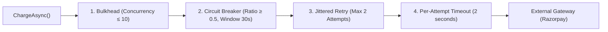

# Day 14: Runbook: Resilience & Chaos Engineering (Circuit Breaker, Buffer Mode, Cache Fall-Through)

**Branch:** `day-14`  ·  **What changed since Day 13:** [`docs/changelog.md`](../changelog.md).

Day 13 made the 4-service system observable; Day 14 makes it **survivable** — and measures every failure on the Day-13 dashboards. The Polly resilience pipeline completes the synchronous **Payment → Gateway** integration ([ADR-043](../adrs/043-circuit-breaker-retry-backoff.md)); dependency classification and graceful degradation establish platform survivability policies ([ADR-044](../adrs/044-graceful-degradation-dependency-classification.md)).

> **The Essential Architectural Reframe:** The Ordering → Payment hop is asynchronous Kafka ([Day 9](../adrs/028-transactional-outbox-pattern.md)) — when the Payment service is offline, Kafka simply buffers messages without data loss. The circuit breaker lives exclusively on the one synchronous network call we do not control: **Payment Service → External Payment Gateway (Razorpay/Stripe)**.

> **Distinguish the Two Failures:** "Payment is down" is ambiguous.
> 1. **Payment Service Down (Process Crash):** The .NET process is dead. Kafka queues `order-placed`. No circuit breaker is involved; this is handled by container restarts and consumer group offset management.
> 2. **Payment Gateway Down (External Outage):** The Payment service is healthy and consuming from Kafka, but its HTTP calls to the external provider time out or return 5xx. The circuit breaker and `Payment:OnGatewayUnavailable` lever decide what happens to the customer's *order*.

Every command below is given twice, bash first and PowerShell second, wherever the two shells differ. Windows PowerShell 5.1 cannot read an HTTP status code off a 4xx/5xx response without throwing, so the `Get-StatusCode` helper defined in section 1 is reused throughout.

---

## 1. Start the stack

### Demo Day Fresh Reset (Clean Slate)
To start from a clean slate (wiping database volumes and Prometheus TSDB metrics):

**Bash:**
```bash
docker compose --profile observability down -v --remove-orphans && docker compose --profile observability up -d
until docker inspect tadka-kafka --format "{{.State.Health.Status}}" | grep -q healthy; do sleep 3; done
until docker inspect tadka-restaurant-db --format "{{.State.Health.Status}}" | grep -q healthy; do sleep 3; done
docker compose ps
```

**PowerShell:**
```powershell
docker compose --profile observability down -v --remove-orphans; docker compose --profile observability up -d
do { Start-Sleep -Seconds 3 } until ((docker inspect tadka-kafka --format "{{.State.Health.Status}}") -eq "healthy")
do { Start-Sleep -Seconds 3 } until ((docker inspect tadka-restaurant-db --format "{{.State.Health.Status}}") -eq "healthy")
docker compose ps
```

---

### Standard Launch
If starting existing containers without wiping data:
```bash
git checkout day-14
docker compose --profile observability up -d
until docker inspect tadka-kafka --format "{{.State.Health.Status}}" | grep -q healthy; do sleep 3; done
until docker inspect tadka-restaurant-db --format "{{.State.Health.Status}}" | grep -q healthy; do sleep 3; done
docker compose ps
```
```powershell
git checkout day-14
docker compose --profile observability up -d
do { Start-Sleep -Seconds 3 } until ((docker inspect tadka-kafka --format "{{.State.Health.Status}}") -eq "healthy")
do { Start-Sleep -Seconds 3 } until ((docker inspect tadka-restaurant-db --format "{{.State.Health.Status}}") -eq "healthy")
docker compose ps
```

**Build once before starting the apps:**
```bash
dotnet build Tadka.slnx
```
```powershell
dotnet build Tadka.slnx
```

**Pre-create the eight Kafka topics this branch uses (SASL):**
```bash
for t in order-placed payment-results order-confirmed delivery-assigned refund-requested payment-refunded menu-updated restaurant-response; do
  docker exec tadka-kafka /opt/kafka/bin/kafka-topics.sh --bootstrap-server localhost:9092 --command-config /etc/kafka/docker/client.properties --create --if-not-exists --topic $t --partitions 1 --replication-factor 1
done
```
```powershell
foreach ($t in "order-placed","payment-results","order-confirmed","delivery-assigned","refund-requested","payment-refunded","menu-updated","restaurant-response") {
  docker exec tadka-kafka /opt/kafka/bin/kafka-topics.sh --bootstrap-server localhost:9092 --command-config /etc/kafka/docker/client.properties --create --if-not-exists --topic $t --partitions 1 --replication-factor 1
}
```

### Launch the Five Services
Telemetry export is enabled via `OTEL_EXPORTER_OTLP_ENDPOINT`:

Five processes, five terminals:
```bash
# Terminal 1: Restaurant Service (:5260)
export OTEL_EXPORTER_OTLP_ENDPOINT="http://localhost:4317"
dotnet run --project src/Tadka.Restaurant.Api

# Terminal 2: Payment Service (:5240)
export OTEL_EXPORTER_OTLP_ENDPOINT="http://localhost:4317"
export Payment__CircuitBreakSeconds=15
dotnet run --project src/Tadka.Payment.Api

# Terminal 3: Delivery Service (:5250)
export OTEL_EXPORTER_OTLP_ENDPOINT="http://localhost:4317"
dotnet run --project src/Tadka.Delivery.Api

# Terminal 4: Ordering Monolith (:5224)
export OTEL_EXPORTER_OTLP_ENDPOINT="http://localhost:4317"
dotnet run --project src/Tadka.Api

# Terminal 5: API Gateway (:8080)
export OTEL_EXPORTER_OTLP_ENDPOINT="http://localhost:4317"
dotnet run --project src/Tadka.Gateway
```

```powershell
# Terminal 1: Restaurant Service (:5260)
$env:OTEL_EXPORTER_OTLP_ENDPOINT = "http://localhost:4317"
dotnet run --project src/Tadka.Restaurant.Api

# Terminal 2: Payment Service (:5240)
$env:OTEL_EXPORTER_OTLP_ENDPOINT = "http://localhost:4317"
$env:Payment__CircuitBreakSeconds = "15"
dotnet run --project src/Tadka.Payment.Api

# Terminal 3: Delivery Service (:5250)
$env:OTEL_EXPORTER_OTLP_ENDPOINT = "http://localhost:4317"
dotnet run --project src/Tadka.Delivery.Api

# Terminal 4: Ordering Monolith (:5224)
$env:OTEL_EXPORTER_OTLP_ENDPOINT = "http://localhost:4317"
dotnet run --project src/Tadka.Api

# Terminal 5: API Gateway (:8080)
$env:OTEL_EXPORTER_OTLP_ENDPOINT = "http://localhost:4317"
dotnet run --project src/Tadka.Gateway
```

### PowerShell Status Code Helper & Shared Setup
```powershell
function Get-StatusCode {
    param($Uri, $Method = "GET", $Headers = @{}, $Body = $null, $ContentType = "application/json")
    try {
        $params = @{ Uri = $Uri; Method = $Method; Headers = $Headers; UseBasicParsing = $true }
        if ($Body) { $params.Body = $Body; $params.ContentType = $ContentType }
        return [int](Invoke-WebRequest @params).StatusCode
    } catch {
        if ($_.Exception.Response) { return [int]$_.Exception.Response.StatusCode }
        else { throw }
    }
}
```

```bash
TOKEN=$(curl -s -X POST http://localhost:8080/api/v1/auth/login -H "Content-Type: application/json" -d '{"email":"priya@tadka.test","password":"Password123!"}' | sed -E 's/.*"accessToken":"([^"]+)".*/\1/')
BODY='{"customerId":"c1b2c3d4-0001-4000-8000-000000000001","restaurantId":"a1b2c3d4-0001-4000-8000-000000000001","items":[{"menuItemId":"b1b2c3d4-0001-4000-8000-000000000001","quantity":2}],"deliveryAddress":{"line1":"x","line2":"y","city":"Bangalore","pincode":"560066","latitude":12.93,"longitude":77.61}}'
```
```powershell
$TOKEN = (Invoke-RestMethod -Uri http://localhost:8080/api/v1/auth/login -Method Post -ContentType "application/json" -Body '{"email":"priya@tadka.test","password":"Password123!"}').accessToken
$H = @{ Authorization = "Bearer $TOKEN" }
$BODY = '{"customerId":"c1b2c3d4-0001-4000-8000-000000000001","restaurantId":"a1b2c3d4-0001-4000-8000-000000000001","items":[{"menuItemId":"b1b2c3d4-0001-4000-8000-000000000001","quantity":2}],"deliveryAddress":{"line1":"x","line2":"y","city":"Bangalore","pincode":"560066","latitude":12.93,"longitude":77.61}}'
```

---

## 2. Architecture: The 4-Layer Polly Resilience Pipeline

In [`src/Tadka.Payment.Api/Resilience/PaymentResiliencePipeline.cs`](../../src/Tadka.Payment.Api/Resilience/PaymentResiliencePipeline.cs), every charge operation passes through four concentric layers:



### Ordering of Layers (Why this order is mandatory):
1. **Bulkhead (Outermost):** Caps concurrent calls (`MaxConcurrentCharges = 10`). Rejects excess load immediately with `RateLimiterRejectedException` to prevent threadpool starvation.
2. **Circuit Breaker (Middle):** Sits *outside* the retry loop. When tripped, it fails requests immediately in <1 ms without executing retry loops or allocating HTTP sockets.
3. **Retry (Inner):** Retries only transient transport failures (`PaymentGatewayUnavailableException`, timeouts). **Never retries business declines** (`PaymentDeclinedException`).
4. **Timeout (Innermost):** Hard 2-second deadline per HTTP attempt. Prevents a single hanging socket from exhausting the connection pool.

---

## 3. Demo 1: Circuit Breaker Lifecycle (Open → Half-Open → Recover)

**What you're proving:** When an external payment gateway suffers an outage, the system automatically stops hammering the failing vendor, fails fast in milliseconds to protect system threads, tests for recovery via a canary probe, and auto-heals when the gateway recovers.

### Step 1: Simulate Gateway Outage
Relaunch Payment with the `Outage` behavior and a 15-second break duration for interactive demonstration:

**Bash:**
```bash
export Payment__Gateway__Behavior="Outage"
export Payment__CircuitBreakSeconds=15
dotnet run --project src/Tadka.Payment.Api
```

**PowerShell:**
```powershell
$env:Payment__Gateway__Behavior = "Outage"
$env:Payment__CircuitBreakSeconds = "15"
dotnet run --project src/Tadka.Payment.Api
```

### Step 2: Trip the Breaker with a Burst of Orders
Submit 6 orders through the API Gateway:

**PowerShell:**
```powershell
for ($i = 1; $i -le 6; $i++) {
    $res = Invoke-RestMethod -Uri http://localhost:8080/api/v1/orders -Method Post -Headers $H -ContentType "application/json" -Body $BODY
    "Placed order ${i} - id: " + $res.id
}
```

### Step 3: Observe Circuit Breaker Opening in Logs
Inspect Payment Service output (`Tadka.Payment.Api`):

```json
{"@t":"...","@mt":"❌ Payment FAILED for order {OrderId}: {Reason}","Reason":"PaymentGatewayUnavailableException: Gateway unavailable / 5xx (simulated outage)."}
{"@t":"...","@mt":"⚡ Payment circuit OPENED for ~{Break}s — gateway looks down; failing fast.","@l":"Error","Break":15}
{"@t":"...","@mt":"❌ Payment FAILED for order {OrderId}: {Reason}","Reason":"BrokenCircuitException: The circuit is now open and is not allowing calls."}
{"@t":"...","@mt":"❌ Payment FAILED for order {OrderId}: {Reason}","Reason":"BrokenCircuitException: The circuit is now open and is not allowing calls."}
```

**Captured live:**
- Order 1 retried with jitter, then failed after gateway outage.
- Breaker calculated failure ratio $\ge 0.5$ and **OPENED**.
- Orders 2 through 6 failed **instantly in under 1 millisecond** with `BrokenCircuitException`, without making any network calls to the external provider!

### Step 4: Canary Probing in Half-Open State
After 15 seconds have elapsed without calls, Polly transitions the breaker to **Half-Open**:
```json
{"@t":"...","@mt":"🔁 Payment circuit HALF-OPEN — probing the gateway with one request."}
```
If that canary probe fails, the circuit re-arms itself into the `Open` state for another 15 seconds.

### Step 5: Gateway Recovers
Clear the outage behavior:
```powershell
$env:Payment__Gateway__Behavior = $null
dotnet run --project src/Tadka.Payment.Api
```
Place a new order:
```powershell
$res = Invoke-RestMethod -Uri http://localhost:8080/api/v1/orders -Method Post -Headers $H -ContentType "application/json" -Body $BODY
Start-Sleep -Seconds 2
(Invoke-RestMethod -Uri "http://localhost:8080/api/v1/orders/$($res.id)" -Method Get -Headers $H).status
```
**Captured live:** `Confirmed` (Breaker closed, charge succeeded).

### Prometheus Metric Verification
In Prometheus ([http://localhost:9090](http://localhost:9090)):
```promql
tadka_payment_circuit_transitions_total
```
Displays counter increments for `state="open"` and `state="half_open"`.

> **Critical Teaching Contrast: Decline vs. Outage:**
> If you test with `Payment__Gateway__Behavior="Failing"` (insufficient funds / card declined), the circuit breaker **does not trip**. A business rejection is an expected domain outcome, not an infrastructure failure. Conflating declines with outages is an anti-pattern.

---

## 4. Demo 1b: Compensate vs. Buffer Mode (Fix 2 / ADR-043)

When a payment gateway is temporarily unreachable, how should the platform handle in-flight orders?

| Mode | Behavior during Gateway Outage | Customer Experience | Kafka Queue |
|---|---|---|---|
| **`Compensate`** (Default) | Records `payment.status = failed`; triggers saga compensating rollback. | Order is cancelled immediately. Customer must re-order. | Consumer offsets committed. Queue stays flat. |
| **`Buffer`** (ADR-043) | Deletes pending row; seeks back Kafka offset; pauses consumer. | Order remains `Created`. Automatically confirms when gateway recovers. | Consumer group lag increases during outage. |

### Step 1: Run in Compensate Mode (Default)
1. Relaunch Payment with `Payment__OnGatewayUnavailable=Compensate` and `Payment__Gateway__Behavior=Outage`.
2. Place an order:
   ```powershell
   $res = Invoke-RestMethod -Uri http://localhost:8080/api/v1/orders -Method Post -Headers $H -ContentType "application/json" -Body $BODY
   ```
3. Order immediately cancels:
   ```powershell
   (Invoke-RestMethod -Uri "http://localhost:8080/api/v1/orders/$($res.id)" -Method Get -Headers $H).cancelledAt
   ```
   **Captured live:** Timestamp populated; order is permanently cancelled.

---

### Step 2: Run in Buffer Mode
1. Relaunch Payment with `Payment__OnGatewayUnavailable=Buffer` and `Payment__Gateway__Behavior=Outage`:
   ```powershell
   $env:Payment__OnGatewayUnavailable = "Buffer"
   $env:Payment__Gateway__Behavior = "Outage"
   dotnet run --project src/Tadka.Payment.Api
   ```
2. Place an order:
   ```powershell
   $bufOrder = Invoke-RestMethod -Uri http://localhost:8080/api/v1/orders -Method Post -Headers $H -ContentType "application/json" -Body $BODY
   ```
3. Inspect Payment log output:
   ```json
   {"@mt":"⏳ Payment BUFFERED for order {OrderId} — gateway unavailable, will retry later (Buffer mode).","OrderId":"5ab9f58a-..."}
   {"@mt":"order-placed at {Offset} buffered — gateway unavailable, seeking back and pausing ~{Seconds}s.","Offset":"order-placed [[0]] @25","Seconds":10}
   ```
4. Check the order status:
   ```powershell
   $check = Invoke-RestMethod -Uri "http://localhost:8080/api/v1/orders/$($bufOrder.id)" -Method Get -Headers $H
   "Status: " + $check.status + " | Cancelled: " + $check.cancelledAt
   ```
   **Captured live:** `Status: Created | Cancelled: ` (Order is NOT cancelled).

5. **Ghost-Row Protection:**  
   In `PaymentService.cs`, the Buffer branch explicitly removes the temporary `Pending` row from `payment.payments`:
   ```csharp
   if (IsBufferMode())
   {
       _db.Payments.Remove(payment);
       await _db.SaveChangesAsync(cancellationToken);
       throw new GatewayUnavailableRetryLaterException(orderId, ex);
   }
   ```
   Without this explicit deletion, a subsequent charge attempt would read the existing `Pending` row and falsely assume an in-progress transaction.

---

## 5. Demo 2: Redis Outage → Graceful Cache Fall-Through (ADR-018/044)

**What you're proving:** Redis is classified as a **Performance Dependency**, not a Core Dependency. The entire checkout and restaurant browsing experience must survive a total Redis crash without returning 500 errors to customers.

### Baseline (Redis Up)
Query the menu for Meghana Foods:
```powershell
$menu = Invoke-RestMethod -Uri "http://localhost:8080/api/v1/restaurants/a1b2c3d4-0001-4000-8000-000000000001/menu" -Method Get
"Menu items count: " + $menu.Count
```
**Captured live:** `Menu items count: 6` (served from Redis in ~1,020 ms cold / ~8 ms warm).

---

### Induce Chaos: Stop Redis
Stop the Redis Docker container:
```bash
docker compose stop redis
```
```powershell
docker compose stop redis
```

Query the menu again:
```powershell
$menuAfterDown = Invoke-RestMethod -Uri "http://localhost:8080/api/v1/restaurants/a1b2c3d4-0001-4000-8000-000000000001/menu" -Method Get
"Menu items count (with Redis DOWN): " + $menuAfterDown.Count
```
**Captured live:** `Menu items count (with Redis DOWN): 6` (HTTP status: `200 OK`).

#### How this is Implemented:
In [`RedisCacheService.cs`](../../src/Tadka.Api/Infrastructure/Caching/RedisCacheService.cs):
```csharp
try
{
    var cached = await _database.StringGetAsync(key);
    if (cached.HasValue) return Deserialize<T>(cached!);
}
catch (RedisException ex)
{
    _logger.LogWarning(ex, "Redis cache unavailable. Falling through to database.");
}
return await dbFallbackFactory();
```
**Architectural Takeaway:** Correctness is preserved; latency increases from ~8ms to ~6,300ms (database query + connection retry backoff). Sizing rule: the primary database must be capacity-planned to absorb full cache fall-through during peak load.

Restart Redis to restore performance:
```bash
docker compose start redis
```
```powershell
docker compose start redis
```

---

## 6. Demo 3: Hot-Key Stampede & Single-Flight Locking (ADR-019)

**What you're proving:** When a high-traffic cache key expires, thousands of concurrent requests can simultaneously miss the cache and overwhelm PostgreSQL (Cache Stampede / Thundering Herd).

In `RedisCacheService.cs`, concurrent cache refreshes are guarded by a **Single-Flight Lock** using Redis `SET key value NX PX 5000`:
1. First requesting thread detects cache miss and acquires the distributed lock.
2. The winning thread queries PostgreSQL, updates Redis with fresh data, and releases the lock via Lua script.
3. Concurrent threads fail to acquire the lock, wait ~80ms, and read the refreshed key from Redis.

**Result:** PostgreSQL receives **1 query**, rather than thousands of duplicate queries.

---

## 7. Demo 4: Slow-Not-Down (Timeout + Jittered Retry)

**What you're proving:** A slow dependency is far more dangerous than a dead dependency. A dead service fails fast; a slow service holds threads, pool connections, and memory until exhaustion.

Relaunch Payment with simulated 8-second gateway latency:
```powershell
$env:Payment__Gateway__Behavior = "Slow"
dotnet run --project src/Tadka.Payment.Api
```

Submit a single order:
```powershell
Invoke-RestMethod -Uri http://localhost:8080/api/v1/orders -Method Post -Headers $H -ContentType "application/json" -Body $BODY
```

Inspect Payment Service logs:
```text
💤 FakeGateway SLOW: sleeping ~8s...
[Timeout after 2.0s] -> Retry 1 with jittered backoff...
💤 FakeGateway SLOW: sleeping ~8s...
[Timeout after 2.0s] -> Abandoned.
```
**Captured live:** The per-attempt 2-second timeout aborted the call at exactly 2.0s instead of hanging for 8.0s. The circuit breaker remained closed because minimum throughput (5 requests) was not met.

---

## 8. Dependency Classification Matrix (ADR-044)

| Component | Class | Failure Impact | Degradation Policy | Circuit Breaker? |
|---|---|---|---|:---:|
| **PostgreSQL** | **Core** | Complete outage. Cannot process transactions. | **Fail Fast.** Never serve stale financial data. | ❌ NO |
| **Kafka Broker** | **Core** | Asynchronous decoupling. | Buffer writes to local outbox table (`SKIP LOCKED`). | ❌ NO |
| **Redis Cache** | **Performance**| Higher DB load; increased latency. | **Fall through to DB** without raising errors. | ❌ NO |
| **External Gateway** | **Auxiliary** | Cannot capture live card charges. | **Circuit Breaker** (Polly pipeline: Bulkhead + Retry + Breaker + Timeout). | ✅ **YES** |
| **Restaurant Replica** | **Auxiliary** | Menus cannot be edited. | Orders priced from local read replica (`ordering.menu_replica`). | ❌ NO |

---

## 9. Where a Circuit Breaker Must NOT Go

1. **In front of PostgreSQL:** If PostgreSQL is down, nothing can proceed correctly. Placing a breaker in front of the database creates phantom fallbacks and corrupts ACID integrity.
2. **In front of Local Read Replicas:** Local database reads take <1ms. Network circuit breakers are irrelevant.
3. **In front of Financial Ledgers:** Never serve "stale money" or invent placeholder approval codes when a payment processor is down.

---

## 10. Run the tests

Run the complete test suite across all services:
```bash
dotnet test Tadka.slnx
```
```powershell
dotnet test Tadka.slnx
```

**Expected output:**
```
Passed!  - Failed: 0, Passed: 187, Skipped: 0, Total: 187
```
Includes the 4 dedicated unit tests in [`PaymentServiceGatewayUnavailableTests.cs`](../../tests/Tadka.Payment.Api.Tests/PaymentServiceGatewayUnavailableTests.cs):
1. `Compensate_mode_records_failed_payment_and_returns_failure`
2. `Buffer_mode_rolls_back_pending_row_and_throws_retry_later`
3. `Business_decline_is_never_buffered_even_in_buffer_mode`
4. `Buffer_mode_allows_subsequent_charge_to_proceed_cleanly`

---

## 11. Cross-Stack Equivalence

| Concept | .NET (Tadka) | Java / Spring Boot | Node.js | Go |
|---|---|---|---|---|
| **Resilience Engine** | Polly (`ResiliencePipeline`) | Resilience4j | Opossum / Brouteur | `sony/gobreaker` / `failsafe-go` |
| **Bulkhead** | `AddConcurrencyLimiter()` | `@Bulkhead` | Bottleneck / generic-pool | `golang.org/x/sync/semaphore` |
| **Circuit Breaker** | `AddCircuitBreaker()` | `@CircuitBreaker` | Opossum circuit | `gobreaker.NewCircuitBreaker()` |
| **Retry with Jitter**| `AddRetry()` + BackoffType.Exponential | `@Retry` (exponential backoff) | `async-retry` | `cenkalti/backoff` |
| **Timeout** | `AddTimeout(TimeSpan)` | `@TimeLimiter` | `AbortController.timeout()` | `context.WithTimeout()` |

---

## 12. Ports Reference Table

| Service / Container | Port | Protocol / Purpose |
|---|---|---|
| `Tadka.Gateway` | `8080` | Reverse Proxy entry point |
| `Tadka.Api` (Monolith) | `5224` | Ordering / Auth |
| `Tadka.Payment.Api` | `5240` | Payment Service |
| `Tadka.Delivery.Api` | `5250` | Delivery Service |
| `Tadka.Restaurant.Api`| `5260` | Restaurant Service |
| `tadka-jaeger` | `16686`| Jaeger Tracing UI |
| `tadka-prometheus` | `9090` | Prometheus Metrics UI |
| `tadka-grafana` | `3000` | Grafana Dashboards (`admin`/`admin`) |
| `tadka-kafka-ui` | `8090` | Kafka UI |
| `tadka-redis` | `6379` | Cache & Geospatial |
| `tadka-pgbouncer` | `6432` | Postgres Connection Pooler |
| `tadka-postgres` | `5432` | Monolith primary database |

---

## 13. Done When Checklist

- [ ] All 13 Docker containers running healthy (`docker compose --profile observability ps`).
- [ ] Five services running with `$env:OTEL_EXPORTER_OTLP_ENDPOINT="http://localhost:4317"`.
- [ ] Tripped circuit breaker under `Payment__Gateway__Behavior=Outage` and verified fail-fast log output in milliseconds.
- [ ] Verified circuit breaker half-open probe and recovery under `Payment__Gateway__Behavior=Fast`.
- [ ] Demonstrated Buffer mode (`Payment:OnGatewayUnavailable=Buffer`): verified pending row deletion and consumer seek-back.
- [ ] Simulated Redis outage (`docker compose stop redis`) and verified 200 OK cache fall-through.
- [ ] All 187 unit and integration tests passing (`dotnet test Tadka.slnx`).

---

## 14. Troubleshooting

### 1. Circuit breaker does not trip when testing failures
Verify that you are using `Payment__Gateway__Behavior=Outage`, not `Failing`. `Failing` simulates a card decline, which is a business response and intentionally does not increment the failure ratio. Also ensure at least 5 calls are placed within the 30-second sampling window.

### 2. Orders stay stuck in Buffer mode indefinitely
Buffer mode pauses consumer processing during gateway outages. To resume, clear the outage behavior (`$env:Payment__Gateway__Behavior = $null`) and restart the Payment service.

### 3. Redis stopped but calls return timeout errors instead of fallback
Verify that `ConnectionStrings:Redis` in `appsettings.Development.json` specifies `abortConnect=false` and a connect timeout of 1–2 seconds.
