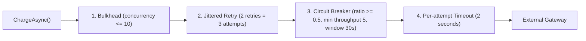

# Day 14: Runbook: Resilience & Chaos Engineering (Circuit Breaker, Buffer Mode, Cache Fall-Through)

**Branch:** `day-14`  ·  **What changed since Day 13:** [`docs/changelog.md`](../changelog.md).

Day 13 made the 4-service system observable; Day 14 makes it **survivable** — and measures every failure on the Day-13 dashboards. The Polly resilience pipeline completes the synchronous **Payment → Gateway** integration ([ADR-043](../adrs/043-circuit-breaker-retry-backoff.md)); dependency classification and graceful degradation establish platform survivability policies ([ADR-044](../adrs/044-graceful-degradation-dependency-classification.md)).

> **The Essential Architectural Reframe:** The Ordering → Payment hop is asynchronous Kafka ([Day 9](../adrs/028-transactional-outbox-pattern.md)) — when the Payment service is offline, Kafka simply buffers messages without data loss. The circuit breaker lives exclusively on the one synchronous network call we do not control: **Payment Service → External Payment Gateway (Razorpay/Stripe)**.

> **Distinguish the Two Failures:** "Payment is down" is ambiguous.
> 1. **Payment Service Down (Process Crash):** The .NET process is dead. Kafka queues `order-placed`. No circuit breaker is involved; this is handled by container restarts and consumer group offset management.
> 2. **Payment Gateway Down (External Outage):** The Payment service is healthy and consuming from Kafka, but its HTTP calls to the external provider time out or return 5xx. The circuit breaker and `Payment:OnGatewayUnavailable` lever decide what happens to the customer's *order*.

Every command below is given twice, bash first and PowerShell second, wherever the two shells differ. Windows PowerShell 5.1 cannot read an HTTP status code off a 4xx/5xx response without throwing, so the `Get-StatusCode` helper defined in section 1 is reused throughout.

---

## 1. Start the stack

### Demo Day Fresh Reset (Clean Slate)
To start from a clean slate (wiping database volumes and Prometheus TSDB metrics):

**Bash:**
```bash
docker compose --profile observability down -v --remove-orphans && docker compose --profile observability up -d
until docker inspect tadka-kafka --format "{{.State.Health.Status}}" | grep -q healthy; do sleep 3; done
until docker inspect tadka-restaurant-db --format "{{.State.Health.Status}}" | grep -q healthy; do sleep 3; done
docker compose ps
```

**PowerShell:**
```powershell
docker compose --profile observability down -v --remove-orphans; docker compose --profile observability up -d
do { Start-Sleep -Seconds 3 } until ((docker inspect tadka-kafka --format "{{.State.Health.Status}}") -eq "healthy")
do { Start-Sleep -Seconds 3 } until ((docker inspect tadka-restaurant-db --format "{{.State.Health.Status}}") -eq "healthy")
docker compose ps
```

---

### Standard Launch
If starting existing containers without wiping data:
```bash
git checkout day-14
docker compose --profile observability up -d
until docker inspect tadka-kafka --format "{{.State.Health.Status}}" | grep -q healthy; do sleep 3; done
until docker inspect tadka-restaurant-db --format "{{.State.Health.Status}}" | grep -q healthy; do sleep 3; done
docker compose ps
```
```powershell
git checkout day-14
docker compose --profile observability up -d
do { Start-Sleep -Seconds 3 } until ((docker inspect tadka-kafka --format "{{.State.Health.Status}}") -eq "healthy")
do { Start-Sleep -Seconds 3 } until ((docker inspect tadka-restaurant-db --format "{{.State.Health.Status}}") -eq "healthy")
docker compose ps
```

**Build once before starting the apps:**
```bash
dotnet build Tadka.slnx
```
```powershell
dotnet build Tadka.slnx
```

**Pre-create the eight Kafka topics this branch uses (SASL):**
```bash
for t in order-placed payment-results order-confirmed delivery-assigned refund-requested payment-refunded menu-updated restaurant-response; do
  docker exec tadka-kafka /opt/kafka/bin/kafka-topics.sh --bootstrap-server localhost:9092 --command-config /etc/kafka/docker/client.properties --create --if-not-exists --topic $t --partitions 1 --replication-factor 1
done
```
```powershell
foreach ($t in "order-placed","payment-results","order-confirmed","delivery-assigned","refund-requested","payment-refunded","menu-updated","restaurant-response") {
  docker exec tadka-kafka /opt/kafka/bin/kafka-topics.sh --bootstrap-server localhost:9092 --command-config /etc/kafka/docker/client.properties --create --if-not-exists --topic $t --partitions 1 --replication-factor 1
}
```

### Launch the Five Services
Telemetry export is enabled via `OTEL_EXPORTER_OTLP_ENDPOINT`:

Five processes, five terminals:
```bash
# Terminal 1: Restaurant Service (:5260)
export OTEL_EXPORTER_OTLP_ENDPOINT="http://localhost:4317"
dotnet run --project src/Tadka.Restaurant.Api

# Terminal 2: Payment Service (:5240)
export OTEL_EXPORTER_OTLP_ENDPOINT="http://localhost:4317"
export Payment__CircuitBreakSeconds=15
dotnet run --project src/Tadka.Payment.Api

# Terminal 3: Delivery Service (:5250)
export OTEL_EXPORTER_OTLP_ENDPOINT="http://localhost:4317"
dotnet run --project src/Tadka.Delivery.Api

# Terminal 4: Ordering Monolith (:5224)
export OTEL_EXPORTER_OTLP_ENDPOINT="http://localhost:4317"
dotnet run --project src/Tadka.Api

# Terminal 5: API Gateway (:8080)
export OTEL_EXPORTER_OTLP_ENDPOINT="http://localhost:4317"
dotnet run --project src/Tadka.Gateway
```

```powershell
# Terminal 1: Restaurant Service (:5260)
$env:OTEL_EXPORTER_OTLP_ENDPOINT = "http://localhost:4317"
dotnet run --project src/Tadka.Restaurant.Api

# Terminal 2: Payment Service (:5240)
$env:OTEL_EXPORTER_OTLP_ENDPOINT = "http://localhost:4317"
$env:Payment__CircuitBreakSeconds = "15"
dotnet run --project src/Tadka.Payment.Api

# Terminal 3: Delivery Service (:5250)
$env:OTEL_EXPORTER_OTLP_ENDPOINT = "http://localhost:4317"
dotnet run --project src/Tadka.Delivery.Api

# Terminal 4: Ordering Monolith (:5224)
$env:OTEL_EXPORTER_OTLP_ENDPOINT = "http://localhost:4317"
dotnet run --project src/Tadka.Api

# Terminal 5: API Gateway (:8080)
$env:OTEL_EXPORTER_OTLP_ENDPOINT = "http://localhost:4317"
dotnet run --project src/Tadka.Gateway
```

### PowerShell Status Code Helper & Shared Setup
```powershell
function Get-StatusCode {
    param($Uri, $Method = "GET", $Headers = @{}, $Body = $null, $ContentType = "application/json")
    try {
        $params = @{ Uri = $Uri; Method = $Method; Headers = $Headers; UseBasicParsing = $true }
        if ($Body) { $params.Body = $Body; $params.ContentType = $ContentType }
        return [int](Invoke-WebRequest @params).StatusCode
    } catch {
        if ($_.Exception.Response) { return [int]$_.Exception.Response.StatusCode }
        else { throw }
    }
}
```

```bash
TOKEN=$(curl -s -X POST http://localhost:8080/api/v1/auth/login -H "Content-Type: application/json" -d '{"email":"priya@tadka.test","password":"Password123!"}' | sed -E 's/.*"accessToken":"([^"]+)".*/\1/')
BODY='{"customerId":"c1b2c3d4-0001-4000-8000-000000000001","restaurantId":"a1b2c3d4-0001-4000-8000-000000000001","items":[{"menuItemId":"b1b2c3d4-0001-4000-8000-000000000001","quantity":2}],"deliveryAddress":{"line1":"x","line2":"y","city":"Bangalore","pincode":"560066","latitude":12.93,"longitude":77.61}}'
```
```powershell
$TOKEN = (Invoke-RestMethod -Uri http://localhost:8080/api/v1/auth/login -Method Post -ContentType "application/json" -Body '{"email":"priya@tadka.test","password":"Password123!"}').accessToken
$H = @{ Authorization = "Bearer $TOKEN" }
$BODY = '{"customerId":"c1b2c3d4-0001-4000-8000-000000000001","restaurantId":"a1b2c3d4-0001-4000-8000-000000000001","items":[{"menuItemId":"b1b2c3d4-0001-4000-8000-000000000001","quantity":2}],"deliveryAddress":{"line1":"x","line2":"y","city":"Bangalore","pincode":"560066","latitude":12.93,"longitude":77.61}}'
```

---

## 2. Architecture: The 4-Layer Polly Resilience Pipeline

In [`src/Tadka.Payment.Api/Resilience/PaymentResiliencePipeline.cs`](../../src/Tadka.Payment.Api/Resilience/PaymentResiliencePipeline.cs), every charge operation passes through four concentric layers:



### Ordering of the layers, outer to inner (as built in the code)
1. **Bulkhead (outermost):** caps concurrent charges (`MaxConcurrentCharges = 10`, no queue). The 11th concurrent call is refused at once with `RateLimiterRejectedException` instead of piling up behind a sick gateway.
2. **Retry:** a failed attempt is tried again with a jittered exponential delay (200 ms base), at most `MaxRetryAttempts = 2` **retries**, so up to **3 attempts**. It handles **transport failures only** (`TimeoutRejectedException`, `PaymentGatewayUnavailableException`). It does **not** handle `BrokenCircuitException`, so an open circuit is never retried (the call fails immediately), and it never handles `PaymentDeclinedException` (a business answer).
3. **Circuit breaker (inside the retry):** it sees **every attempt**, not every order. Three failed attempts of order 1 plus two of order 2 make five calls at 100% failure, which meets `MinimumThroughput = 5` and `FailureRatio = 0.5`, so it opens in the middle of order 2. Only transport failures count; declines do not.
4. **Timeout (innermost):** a hard 2 second deadline for each attempt, so one hanging socket cannot hold a thread for the gateway's full 8 seconds.

The other defensible order puts the breaker **outside** the retry loop. Then the breaker counts whole operations (it would need five failed *orders* to open) and an open breaker skips the retry loop altogether. Tadka counts attempts, which reacts faster, and keeps open-circuit rejections out of the retry policy so the result is the same fail-fast behaviour. The code comment in [`PaymentResiliencePipeline.cs`](../../src/Tadka.Payment.Api/Resilience/PaymentResiliencePipeline.cs) and [ADR-043](../adrs/043-circuit-breaker-retry-backoff.md) record this order.

**Worst-case latency of one charge** (all attempts time out): 3 x 2 s plus two jittered back-offs, about **6.6 seconds** (captured in Demo 4). That number belongs in your latency budget.

---

## 3. Demo 1: Circuit Breaker Lifecycle (Open → Half-Open → Recover)

**What you're proving:** When an external payment gateway suffers an outage, the system automatically stops hammering the failing vendor, fails fast in milliseconds to protect system threads, tests for recovery via a canary probe, and auto-heals when the gateway recovers.

### The lever: flip the gateway while Payment keeps running
`FakePaymentGateway` reads `IOptionsMonitor<PaymentOptions>`, so a saved change to `Payment:Gateway:Behavior` in [`appsettings.Development.json`](../../src/Tadka.Payment.Api/appsettings.Development.json) applies to the **next charge, with no restart**. That matters: restarting Payment resets the circuit breaker to closed, which would hide the recovery path we want to watch. (An environment variable `Payment__Gateway__Behavior` would win over the file and cannot be changed while the process runs, so do **not** set it for this demo.)

Start Payment once, **without** a Behavior variable, with the 15 second break, then wait about 45 seconds (the consumer-group handover from Day 13):

**Bash:**
```bash
export OTEL_EXPORTER_OTLP_ENDPOINT="http://localhost:4317"
export Payment__CircuitBreakSeconds=15
dotnet run --project src/Tadka.Payment.Api
```

**PowerShell:**
```powershell
$env:OTEL_EXPORTER_OTLP_ENDPOINT = "http://localhost:4317"
$env:Payment__CircuitBreakSeconds = "15"
dotnet run --project src/Tadka.Payment.Api
```

In another terminal at the repository root, flip the gateway to `Outage` (the one-liners change whatever value is there to the new one):

**Bash:**
```bash
sed -i 's/"Behavior": "[A-Za-z]*"/"Behavior": "Outage"/' src/Tadka.Payment.Api/appsettings.Development.json
```

**PowerShell:**
```powershell
$f = "src\Tadka.Payment.Api\appsettings.Development.json"
(Get-Content $f -Raw) -replace '"Behavior": "[A-Za-z]*"','"Behavior": "Outage"' | Set-Content $f -NoNewline
```
When you are completely finished, undo the edit with `git checkout -- src/Tadka.Payment.Api/appsettings.Development.json`.

### Step 1: Trip the breaker with a burst of orders
**Bash:**
```bash
for i in 1 2 3 4 5 6; do curl -s -X POST http://localhost:8080/api/v1/orders -H "Authorization: Bearer $TOKEN" -H "Content-Type: application/json" -d "$BODY" > /dev/null; done
```

**PowerShell:**
```powershell
1..6 | ForEach-Object { Invoke-RestMethod -Uri http://localhost:8080/api/v1/orders -Method Post -Headers $H -ContentType "application/json" -Body $BODY | Out-Null }
```

### Step 2: Read the Payment log
```json
{"@mt":"Payment FAILED for order {OrderId}: {Reason}","Reason":"PaymentGatewayUnavailableException: Gateway unavailable / 5xx (simulated outage)."}
{"@mt":"Payment circuit OPENED for ~{Break}s: gateway looks down; failing fast.","@l":"Error","Break":15}
{"@mt":"Payment FAILED for order {OrderId}: {Reason}","Reason":"BrokenCircuitException: The circuit is now open and is not allowing calls."}
```
**Captured live (ProcessPayment span of each order in Jaeger, service `Tadka.Payment.Api`):**

| Order | Took | Why it failed |
|---|---|---|
| 1 | **1,483 ms** | three attempts with jittered back-off; the gateway was `Unavailable` every time |
| 2 | **882 ms** | two attempts; the 5th failed attempt of the burst opened the circuit; the 3rd attempt got `BrokenCircuitException` and was not retried |
| 3 to 6 | **8 to 11 ms** each | `BrokenCircuitException`: no network call, no retry loop |

That is the whole point of the breaker: order 1 cost 1.5 seconds of resources, orders 3 to 6 cost 10 milliseconds each.

### Step 3: Half-open, the probe, and the second trip
After the 15 second break the next call is let through as a probe. While the gateway is still `Outage`, the probe fails and the circuit re-opens for another 15 seconds. **Captured live:**
```
16:36:17.159  Payment circuit OPENED for ~15s
16:36:53.533  Payment circuit HALF-OPEN: probing the gateway with one request
16:36:53.749  Payment circuit OPENED for ~15s        <- the probe failed (216 ms later)
16:36:53.951  Payment FAILED ... BrokenCircuitException   <- the order behind it fails fast
```

### Step 4: Recovery without a restart
Flip the gateway back (`"Behavior": "Fast"`, same one-liners with `Fast`), wait for the break to elapse, and place an order. **Captured live:**
```
16:37:15.905  Payment circuit HALF-OPEN: probing the gateway with one request
16:37:16.116  Payment circuit CLOSED: gateway healthy again.
16:37:16.119  Payment COMPLETED for order ...
```
The probe was the real customer order. It succeeded, the breaker closed, and the next order was `Confirmed` as normal.

### Prometheus metric verification
In Prometheus ([http://localhost:9090](http://localhost:9090)) (the series appear after the 60 second metric export):
```promql
sum by (state) (tadka_payment_circuit_transitions_total)
```
**Captured:** `open` 3, `half_open` 2, `closed` 1 (the counts include an earlier Payment instance's first trip).

> **Critical Teaching Contrast: Decline vs. Outage:**
> If you flip the gateway to `Failing` (insufficient funds / card declined), the circuit breaker **does not trip**. A business rejection is an expected domain outcome, not an infrastructure failure. Conflating declines with outages is an anti-pattern.
> **Captured live:** six orders with the gateway declining each took 209 to 223 ms (a single attempt: no retry), and the Payment log had **zero** circuit lines.

---

## 4. Demo 1b: Compensate vs. Buffer Mode (Fix 2 / ADR-043)

When a payment gateway is temporarily unreachable, how should the platform handle in-flight orders?

| Mode | Behavior during Gateway Outage | Customer Experience | Kafka Queue |
|---|---|---|---|
| **`Compensate`** (Default) | Records `payment.status = failed`; triggers saga compensating rollback. | Order is cancelled immediately. Customer must re-order. | Consumer offsets committed. Queue stays flat. |
| **`Buffer`** (ADR-043) | Deletes pending row; seeks back Kafka offset; pauses consumer. | Order remains `Created`. Automatically confirms when gateway recovers. | Consumer group lag increases during outage. |

### Step 1: Compensate mode (default)
Payment as started in Demo 1 (`Payment__OnGatewayUnavailable` unset means `Compensate`), gateway flipped to `Outage`. Place an order. It is `Cancelled` within a second or two, with `cancelledAt` filled, and the customer has to order again. **Captured live (Demo 1):** orders 1 to 6 all ended `failed`, the saga cancelled them.

### Step 2: Buffer mode
Restart Payment with the lever, keeping Behavior out of the environment, wait about 45 seconds, then flip the gateway to `Outage`:

**Bash:**
```bash
export Payment__CircuitBreakSeconds=15
export Payment__OnGatewayUnavailable=Buffer
dotnet run --project src/Tadka.Payment.Api
```

**PowerShell:**
```powershell
$env:Payment__CircuitBreakSeconds = "15"
$env:Payment__OnGatewayUnavailable = "Buffer"
dotnet run --project src/Tadka.Payment.Api
```

Place one order, then look at it, at the payment rows, and at the Kafka consumer lag a few times:

**Bash:**
```bash
curl -s http://localhost:8080/api/v1/orders/<order-id> -H "Authorization: Bearer $TOKEN" | grep -o '"status":"[^"]*"\|"cancelledAt":[^,]*'
docker exec tadka-payment-db psql -U tadka -d tadka_payment -t -c "select count(*) from payment.payments where \"OrderId\"='<order-id>';"
docker exec tadka-kafka /opt/kafka/bin/kafka-consumer-groups.sh --bootstrap-server localhost:9092 --command-config /etc/kafka/docker/client.properties --describe --group tadka-payment
```

**PowerShell:**
```powershell
$o = Invoke-RestMethod -Uri "http://localhost:8080/api/v1/orders/<order-id>" -Headers $H
"status: " + $o.status + "  cancelledAt: " + $o.cancelledAt
docker exec tadka-payment-db psql -U tadka -d tadka_payment -t -c "select count(*) from payment.payments where \`"OrderId\`"='<order-id>';"
docker exec tadka-kafka /opt/kafka/bin/kafka-consumer-groups.sh --bootstrap-server localhost:9092 --command-config /etc/kafka/docker/client.properties --describe --group tadka-payment
```

**Captured live (outage lasted about 45 seconds):** `status: Created`, `cancelledAt` empty, **0** payment rows for the order, consumer lag **1** on `order-placed`. The Payment log:
```
Payment BUFFERED for order ...: gateway unavailable, will retry later (Buffer mode).
order-placed at ... buffered: gateway unavailable, seeking back and pausing ~15s.      (repeated every 15 s)
Payment circuit HALF-OPEN: probing ...  ->  Payment circuit OPENED ...                 (while still down)
```
Now flip the gateway back to `Fast`. **Captured live:** the next retry came 3 seconds later, the circuit went HALF-OPEN then CLOSED, `Payment COMPLETED`, and the order read `Confirmed` 6 seconds after the flip. Lag went 1 to 0. The customer never had to re-order.

### Why there is no "ghost row"
[`PaymentService.ChargeAsync`](../../src/Tadka.Payment.Api/PaymentService.cs) saves a `Pending` row before it calls the gateway. In Buffer mode, when the failure is "gateway unavailable" it deletes that row before throwing, so the redelivered message is not mistaken for a payment already in progress:
```csharp
if (options.CurrentValue.OnGatewayUnavailable == GatewayUnavailableMode.Buffer && IsGatewayUnavailable(ex))
{
    db.Payments.Remove(payment);
    await db.SaveChangesAsync(CancellationToken.None);
    ...
    throw new GatewayUnavailableRetryLaterException(..., ex);
}
```
`IsGatewayUnavailable` is `BrokenCircuitException`, `PaymentGatewayUnavailableException` or `TimeoutRejectedException`. A **decline** is never buffered, even in Buffer mode (`Business_decline_is_never_buffered_even_in_buffer_mode`), and a bulkhead rejection is compensated, not buffered. In [`OrderPlacedConsumer`](../../src/Tadka.Payment.Api/Messaging/OrderPlacedConsumer.cs) the exception seeks the offset back and pauses for the circuit's break duration; it deliberately does **not** count toward the poison-message (DLQ) budget.

---

## 5. Demo 2: Redis Outage → Graceful Cache Fall-Through (ADR-018/044)

**What you're proving:** Redis is classified as a **Performance Dependency**, not a Core Dependency. The entire checkout and restaurant browsing experience must survive a total Redis crash without returning 500 errors to customers.

### Baseline (Redis up)
Read the menu through the gateway, three times, and time each call:

**Bash:**
```bash
for i in 1 2 3; do curl -s -o /dev/null -w "http=%{http_code} time=%{time_total}s\n" http://localhost:8080/api/v1/restaurants/a1b2c3d4-0001-4000-8000-000000000001/menu; done
```

**PowerShell:**
```powershell
1..3 | ForEach-Object { $t = Measure-Command { $m = Invoke-RestMethod -Uri "http://localhost:8080/api/v1/restaurants/a1b2c3d4-0001-4000-8000-000000000001/menu" }; "items=" + $m.Count + "  time=" + [int]$t.TotalMilliseconds + " ms" }
```
**Captured live:** 6 items; the first (cache cold) 185 to 347 ms, then **5 to 8 ms** from Redis.

### Induce chaos: stop Redis
```bash
docker compose stop redis
```
```powershell
docker compose stop redis
```
Run the same three calls again. **Captured live:** every call still returns **200 OK with 6 items**, in **0.56 to 0.86 seconds** each (fall-through to Postgres plus one 500 ms Redis timeout). Start Redis again (`docker compose start redis`) and the calls drop back to 4 to 20 ms.

#### How this is implemented
The menu cache lives with the Restaurant service ([`Tadka.Restaurant.Api/Caching/CacheService.cs`](../../src/Tadka.Restaurant.Api/Caching/CacheService.cs)):
```csharp
catch (RedisException ex)
{
    logger.LogWarning(ex, "Redis unavailable for key {Key}; falling back to the database.", key);
    return await factory();
}
```
**The timeout is part of the design.** [`appsettings.Development.json`](../../src/Tadka.Restaurant.Api/appsettings.Development.json) sets `abortConnect=false,connectTimeout=500,syncTimeout=500,asyncTimeout=500`. With the client library's default (5 seconds) the same experiment returned `200 OK` but every call took **5.6 seconds**: correct, and far too slow. A performance dependency must fail faster than the thing it protects.
**Architectural takeaway:** correctness is preserved; latency rises from about 8 ms to under a second. Size the primary database so it can absorb the full cache fall-through at peak.

---

## 6. Demo 3: Hot-Key Stampede & Single-Flight Locking (ADR-019)

**What you're proving:** when a hot cache key is missing, thousands of concurrent requests can miss together and overwhelm PostgreSQL (cache stampede). In [`CacheService.cs`](../../src/Tadka.Restaurant.Api/Caching/CacheService.cs) the first caller takes a Redis lock (`SET lock:<key> <token> NX PX 5000`), reads the database and fills the cache; the others wait about 80 ms at a time and read the refreshed key.

Delete the key, reset the table's statistics, fire 30 simultaneous requests, then count how often the table was read:

**Bash:**
```bash
export MSYS_NO_PATHCONV=1
docker exec tadka-restaurant-db psql -U tadka -d tadka_restaurant -q -c "select pg_stat_reset();"
docker exec tadka-redis redis-cli unlink restaurant:a1b2c3d4-0001-4000-8000-000000000001:menu
for i in $(seq 1 30); do curl -s -o /dev/null http://localhost:8080/api/v1/restaurants/a1b2c3d4-0001-4000-8000-000000000001/menu & done; wait
sleep 3
docker exec tadka-restaurant-db psql -U tadka -d tadka_restaurant -t -A -c "select coalesce(seq_scan,0)+coalesce(idx_scan,0) from pg_stat_user_tables where relname='menu_items';"
```

**PowerShell:**
```powershell
docker exec tadka-restaurant-db psql -U tadka -d tadka_restaurant -q -c "select pg_stat_reset();"
docker exec tadka-redis redis-cli unlink restaurant:a1b2c3d4-0001-4000-8000-000000000001:menu
$jobs = 1..30 | ForEach-Object { Start-Job { (Invoke-WebRequest -UseBasicParsing "http://localhost:8080/api/v1/restaurants/a1b2c3d4-0001-4000-8000-000000000001/menu").StatusCode } }
($jobs | Wait-Job | Receive-Job | Group-Object | ForEach-Object { $_.Name + " x " + $_.Count })
Start-Sleep -Seconds 3
docker exec tadka-restaurant-db psql -U tadka -d tadka_restaurant -t -A -c "select coalesce(seq_scan,0)+coalesce(idx_scan,0) from pg_stat_user_tables where relname='menu_items';"
```
**Captured live:** all 30 requests returned `200`, and `menu_items` was read **exactly 1 time** with the bash loop (1 or 2 with the PowerShell jobs, which start a little staggered). Without the lock it would be up to 30.

---

## 7. Demo 4: Slow-Not-Down (Timeout + Jittered Retry)

**What you're proving:** a slow dependency is far more dangerous than a dead one. A dead gateway fails in milliseconds; a slow one holds threads, pool connections and memory for as long as you let it.

With Payment running (no Behavior variable) and the circuit break at 15 seconds, flip the gateway to `Slow` (8 seconds per call) with the same one-liners as Demo 1 (`"Behavior": "Slow"`). Place one order, wait for it to finish, then place a second one.

**Captured live:**
```
FakeGateway SLOW: charging order ... will take ~8s   16:41:32.299   attempt 1  -> timeout after 2 s
FakeGateway SLOW: ...                                16:41:34.579   attempt 2  (2.3 s later: 2 s + jittered back-off)
FakeGateway SLOW: ...                                16:41:36.678   attempt 3
Payment FAILED ... TimeoutRejectedException          16:41:38.688   total 6,632 ms for ONE order
```
The second order made two attempts (4.5 s), the **fifth** failed attempt of the series opened the circuit, and its third attempt failed instantly with `BrokenCircuitException`. So a slow gateway trips the breaker too, but only after enough attempts have been wasted, which is why `Slow` costs far more than `Outage` (Demo 1: 1.5 s for the first order).

Compare the three failure shapes for one order, all measured:

| Gateway | One order costs | Retries | Breaker |
|---|---|---|---|
| Declining (`Failing`) | about 0.2 s | none (a decline is final) | never opens |
| Down (`Outage`) | about 1.5 s the first time, then 10 ms | up to 3 attempts | opens after 5 failed attempts |
| Slow (`Slow`, 8 s) | **6.6 s** | up to 3 attempts of 2 s each | opens after 5 failed attempts |

Put the worst case (6.6 s) into the latency budget, not just the per-attempt timeout.

---

## 7b. Demo 5: Backpressure (admission control, ADR-059)

**What you're proving:** past a concurrency limit it is better to answer "busy, retry shortly" at once than to queue every request until everything is slow.

Restart the monolith with a limit of 2 concurrent requests:

**Bash:**
```bash
export Backpressure__MaxConcurrent=2
export OTEL_EXPORTER_OTLP_ENDPOINT="http://localhost:4317"
dotnet run --project src/Tadka.Api
```

**PowerShell:**
```powershell
$env:Backpressure__MaxConcurrent = "2"
$env:OTEL_EXPORTER_OTLP_ENDPOINT = "http://localhost:4317"
dotnet run --project src/Tadka.Api
```
Log in again (the monolith's keys reset on restart), place an order, and hold **two** live-tracking streams open on it (a stream is a long request, so it keeps its slot), then make a third request:

**Bash:**
```bash
for i in 1 2; do (curl -sN --max-time 12 http://localhost:8080/api/v1/orders/$ID/events -H "Authorization: Bearer $TOKEN" > /dev/null) & done
sleep 3
curl -s -D - http://localhost:8080/api/v1/orders/$ID -H "Authorization: Bearer $TOKEN"
```

**PowerShell:**
```powershell
1..2 | ForEach-Object { Start-Job { param($u, $t) curl.exe -sN --max-time 12 $u -H "Authorization: Bearer $t" > $null } -ArgumentList "http://localhost:8080/api/v1/orders/$ID/events", $TOKEN | Out-Null }
Start-Sleep -Seconds 3
Get-StatusCode -Uri "http://localhost:8080/api/v1/orders/$ID" -Headers $H
```
**Captured live:** `429`, header `Retry-After: 1`, body `{"title":"Server Busy","status":429,"detail":"Admission control: max concurrent requests is 2. Retry shortly."}`. The gateway's `/health` stayed `200`, and once the streams closed the same request returned `200`. Code: [`BackpressureMiddleware`](../../src/Tadka.Api/Middleware/BackpressureMiddleware.cs) (`SemaphoreSlim.WaitAsync(0)`: never waits, never queues). Pinned by `OverloadProtectionTests`.

---

## 7c. Demo 6: Load shedding (priority, ADR-060)

**What you're proving:** under pressure, drop the optional work first so ordering and payment keep their capacity.

Restart the monolith with `LoadShed__Enabled=true`, log in, then:

**Bash:**
```bash
for p in /api/v1/orders/history /api/v1/orders/00000000-0000-0000-0000-000000000001/invoice /api/v1/coupons/WELCOME10 /health; do curl -s -o /dev/null -w "GET $p -> %{http_code}\n" http://localhost:8080$p -H "Authorization: Bearer $TOKEN"; done
curl -s -o /dev/null -w "POST /api/v1/orders -> %{http_code}\n" -X POST http://localhost:8080/api/v1/orders -H "Authorization: Bearer $TOKEN" -H "Content-Type: application/json" -d "$BODY"
```

**PowerShell:**
```powershell
foreach ($p in "/api/v1/orders/history","/api/v1/orders/00000000-0000-0000-0000-000000000001/invoice","/api/v1/coupons/WELCOME10","/health") { "GET $p -> " + (Get-StatusCode -Uri "http://localhost:8080$p" -Headers $H) }
"POST /api/v1/orders -> " + (Get-StatusCode -Uri http://localhost:8080/api/v1/orders -Method Post -Headers $H -Body $BODY)
```
**Captured live:** history `503`, invoice `503`, coupons `503` (each with `Retry-After: 5` and the body "Load shedding active: this non-critical path is temporarily unavailable. Ordering and payment still work."), `/health` `200`, `POST /orders` `201`. Code: [`LoadSheddingMiddleware`](../../src/Tadka.Api/Middleware/LoadSheddingMiddleware.cs). The explicit sheddable list (`/history`, `/invoice`, `/demo`) is checked **before** the critical prefixes, because history and invoice live under `/api/v1/orders`, a critical prefix. Everything else under `/api` that is not critical (auth, orders, payments, deliveries) is also shed.

Backpressure vs shedding in one line: backpressure says "I am full, come back" to **everyone**; shedding says "I am choosing to refuse **this** kind of work".

---

## 7d. Demo 7: Kafka down (the Outbox buffers the order)

**What you're proving:** Ordering has no synchronous dependency on Kafka. The order and its event commit together; the relay publishes when Kafka is back.
```bash
docker compose stop kafka
```
```powershell
docker compose stop kafka
```
Place three orders. **Captured live:** each `POST /orders` returned `201` in about **12 ms**, the orders stayed `Created`, and `select count(*) from ordering.outbox_messages where "ProcessedAt" is null` returned **3**.
```bash
docker compose start kafka
```
**Captured live:** once the broker is back the relay drained the backlog (0 unsent rows) within a second. In this lab the broker keeps nothing on disk, so after a broker restart also restart the five services (and re-run the topic loop first if the topics are gone): their consumers then pick the three orders up and all three read `Confirmed` about 25 seconds later.

---

## 8. Dependency Classification Matrix (ADR-044)

| Component | Class | Failure Impact | Degradation Policy | Circuit Breaker? |
|---|---|---|---|:---:|
| **PostgreSQL** | **Core** | Complete outage. Cannot process transactions. | **Fail Fast.** Never serve stale financial data. | ❌ NO |
| **Kafka Broker** | **Core** | Asynchronous decoupling. | Buffer writes to local outbox table (`SKIP LOCKED`). | ❌ NO |
| **Redis Cache** | **Performance**| Higher DB load; increased latency. | **Fall through to DB** without raising errors. | ❌ NO |
| **External Gateway** | **Auxiliary** | Cannot capture live card charges. | **Circuit Breaker** (Polly pipeline: Bulkhead + Retry + Breaker + Timeout). | ✅ **YES** |
| **Restaurant Replica** | **Auxiliary** | Menus cannot be edited. | Orders priced from local read replica (`ordering.menu_replica`). | ❌ NO |

---

## 9. Where a Circuit Breaker Must NOT Go

1. **In front of PostgreSQL:** If PostgreSQL is down, nothing can proceed correctly. Placing a breaker in front of the database creates phantom fallbacks and corrupts ACID integrity.
2. **In front of Local Read Replicas:** Local database reads take <1ms. Network circuit breakers are irrelevant.
3. **In front of Financial Ledgers:** Never serve "stale money" or invent placeholder approval codes when a payment processor is down.

---

## 10. Run the tests

Run the complete test suite across all services:
```bash
dotnet test Tadka.slnx
```
```powershell
dotnet test Tadka.slnx
```

**Expected output:**
```
Passed!  - Failed: 0, Passed: 207, Skipped: 0, Total: 207
```
Monolith 115, Payment 35, Delivery 23, Restaurant 19, Gateway 15. It includes the 4 dedicated unit tests in [`PaymentServiceGatewayUnavailableTests.cs`](../../tests/Tadka.Payment.Api.Tests/PaymentServiceGatewayUnavailableTests.cs) and the 12 in [`OverloadProtectionTests.cs`](../../tests/Tadka.Api.Tests/Middleware/OverloadProtectionTests.cs) (load shedding 503 and Retry-After, critical paths admitted, admission control 429 then admitted again):
1. `Compensate_mode_records_failed_payment_and_returns_failure`
2. `Buffer_mode_rolls_back_pending_row_and_throws_retry_later`
3. `Business_decline_is_never_buffered_even_in_buffer_mode`
4. `Buffer_mode_allows_subsequent_charge_to_proceed_cleanly`

---

## 11. Cross-Stack Equivalence

| Concept | .NET (Tadka) | Java / Spring Boot | Node.js | Go |
|---|---|---|---|---|
| **Resilience Engine** | Polly (`ResiliencePipeline`) | Resilience4j | Opossum / Brouteur | `sony/gobreaker` / `failsafe-go` |
| **Bulkhead** | `AddConcurrencyLimiter()` | `@Bulkhead` | Bottleneck / generic-pool | `golang.org/x/sync/semaphore` |
| **Circuit Breaker** | `AddCircuitBreaker()` | `@CircuitBreaker` | Opossum circuit | `gobreaker.NewCircuitBreaker()` |
| **Retry with Jitter**| `AddRetry()` + BackoffType.Exponential | `@Retry` (exponential backoff) | `async-retry` | `cenkalti/backoff` |
| **Timeout** | `AddTimeout(TimeSpan)` | `@TimeLimiter` | `AbortController.timeout()` | `context.WithTimeout()` |

---

## 12. Ports Reference Table

| Service / Container | Port | Protocol / Purpose |
|---|---|---|
| `Tadka.Gateway` | `8080` | Reverse Proxy entry point |
| `Tadka.Api` (Monolith) | `5224` | Ordering / Auth |
| `Tadka.Payment.Api` | `5240` | Payment Service |
| `Tadka.Delivery.Api` | `5250` | Delivery Service |
| `Tadka.Restaurant.Api`| `5260` | Restaurant Service |
| `tadka-jaeger` | `16686`| Jaeger Tracing UI |
| `tadka-prometheus` | `9090` | Prometheus Metrics UI |
| `tadka-grafana` | `3000` | Grafana Dashboards (`admin`/`admin`) |
| `tadka-kafka-ui` | `8090` | Kafka UI |
| `tadka-redis` | `6379` | Cache & Geospatial |
| `tadka-pgbouncer` | `6432` | Postgres Connection Pooler |
| `tadka-postgres` | `5432` | Monolith primary database |

---

## 13. Done When Checklist

- [ ] All 13 Docker containers running healthy (`docker compose --profile observability ps`).
- [ ] Five services running with `$env:OTEL_EXPORTER_OTLP_ENDPOINT="http://localhost:4317"`.
- [ ] Tripped circuit breaker under `Payment__Gateway__Behavior=Outage` and verified fail-fast log output in milliseconds.
- [ ] Verified the half-open probe (failed once, then succeeded) and recovery by flipping the gateway to `Fast` **without restarting Payment**.
- [ ] Demonstrated Buffer mode (`Payment:OnGatewayUnavailable=Buffer`): verified pending row deletion and consumer seek-back.
- [ ] Simulated Redis outage (`docker compose stop redis`) and verified 200 OK cache fall-through.
- [ ] Slow gateway: one order took about 6.6 s (3 attempts of 2 s), and the breaker opened on the second order (Demo 4).
- [ ] Backpressure returned `429` with `Retry-After: 1`, and load shedding returned `503` for history, invoice and coupons while `POST /orders` stayed `201` (Demos 5 and 6).
- [ ] Kafka stopped: orders still `201`, the outbox backlog drained on return (Demo 7).
- [ ] All 207 unit and integration tests passing (`dotnet test Tadka.slnx`).

---

## 14. Troubleshooting

### 1. Circuit breaker does not trip when testing failures
Verify that you are using `Payment__Gateway__Behavior=Outage`, not `Failing`. `Failing` simulates a card decline, which is a business response and intentionally does not increment the failure ratio. Also ensure at least 5 calls are placed within the 30-second sampling window.

### 2. Orders stay in `Created` in Buffer mode
That is Buffer mode doing its job while the gateway is down. To resume, flip the gateway back to `Fast` in `appsettings.Development.json` (no restart). If you started Payment with a `Payment__Gateway__Behavior` environment variable, the file edit is ignored (the variable wins): unset it and restart Payment once.

### 3. Redis stopped and menu calls take about 5 seconds
The Redis client is using its default 5 second timeout. Check that `ConnectionStrings:Redis` in [`Tadka.Restaurant.Api/appsettings.Development.json`](../../src/Tadka.Restaurant.Api/appsettings.Development.json) contains `abortConnect=false,connectTimeout=500,syncTimeout=500,asyncTimeout=500`, and that no `ConnectionStrings__Redis` environment variable overrides it.

### 4. Flipping the gateway in `appsettings.Development.json` changes nothing
An environment variable `Payment__Gateway__Behavior` is set in that terminal (it overrides the file), or you edited a different checkout's copy of the file. Also remember the consumer-group handover: after a Payment restart wait about 45 seconds before the first order is processed.

### 5. Kafka restarts in a loop after Docker was restarted
`Log directory /tmp/kafka-logs is already formatted`: you are on an older copy of `docker/kafka-scram-entrypoint.sh`. `git pull` this branch, then `docker compose up -d --force-recreate kafka`.
