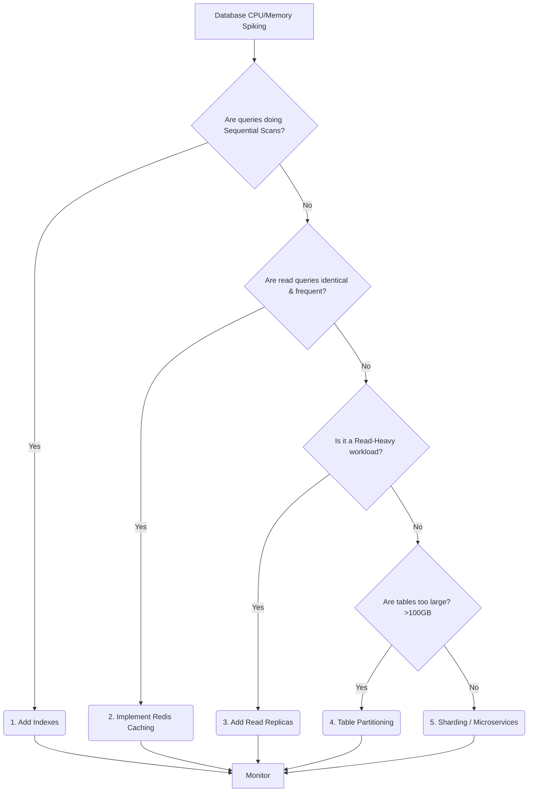

# The "Cheapest-First" Scaling Decision Framework

When the database starts bottlenecking, engineers often reach for the most complex solution first (Microservices or Sharding). As an architect, you must evaluate solutions strictly from **cheapest to most expensive** (in terms of engineering effort and operational complexity).

## The Optimization Tree

## 1. Indexes (Cost: Very Low)
- **What it is:** B-Trees, Hash indexes, Composite indexes.
- **When to use:** Always your first step. Run `EXPLAIN ANALYZE`.
- **Trade-off:** Slightly slower `INSERT/UPDATE`, takes up disk space.

## 2. Caching (Cost: Low)
- **What it is:** Redis Cache-Aside.
- **When to use:** High read-to-write ratio (e.g., Restaurant Menus).
- **Trade-off:** Cache invalidation complexity, potential for stale data (AP vs CP).

## 3. Read Replicas (Cost: Medium)
- **What it is:** Streaming replication to a secondary database instance. Application routes `GET` requests to the Replica.
- **When to use:** When you have optimized queries, cached what you can, but the sheer volume of unique reads is still overwhelming the primary CPU.
- **Trade-off:** Eventual consistency (Replication Lag). You write to Primary, read from Replica, and the data might not be there yet.

## 4. Table Partitioning (Cost: High)
- **What it is:** Splitting one massive logical table (e.g., `Orders`) into smaller physical tables by date (e.g., `Orders_2024_01`, `Orders_2024_02`).
- **When to use:** When indexes no longer fit in RAM, or when bulk-deleting old data is causing transaction log bloat.
- **Trade-off:** Queries that don't include the partition key will fan out and become slower.

## 5. Sharding (Cost: Extreme)
- **What it is:** Splitting data across entirely different database servers (e.g., Server A holds Customers A-M, Server B holds N-Z).
- **When to use:** You have exhausted all vertical scaling (AWS r6g.16xlarge) and all previous steps. 
- **Trade-off:** You lose `JOIN`s across shards, you lose distributed transactions (ACID), and schema migrations become a nightmare.
