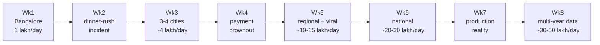

# Tadka Growth Story — The Curriculum Spine

> **This is the source of truth for the cohort.** The 8-week roadmap, the product brief's scale numbers, the per-week ADRs, and the Break Kits all hang off this document. If a number or a decision anywhere else disagrees with this file, this file wins — fix the other doc.

---

## Why this document exists

Most system-design courses teach patterns on a calendar: "Week 4 is microservices week." That teaches the wrong instinct. Real architects don't add Kafka because it's Tuesday — they add it because something broke, they measured it, they weighed the options, and the cost of *not* changing finally exceeded the cost of changing.

So Tadka is run as a **business that keeps outgrowing its architecture**. The scale starts small — genuinely small — and climbs. Each week, growth applies a new kind of pressure, something breaks *in a way you can see and reproduce*, and only then do we earn the next architectural move.

The recurring loop, every single week:

```
Baseline  →  Break it  →  Read the symptoms  →  Enumerate the options
   →  Decide (write the ADR)  →  Fix  →  Re-test  →  Compare
```

By Week 8 you will have built a distributed system. The capstone lesson is that **you didn't need most of it for 1 lakh orders/day** — you built it because the business grew into it, and you can now point at the exact moment each decision became justified. That judgment is the difference between a senior developer and an architect.

---

## The honest baseline: what "1 lakh orders/day" actually means

Before we touch architecture, do the math the brief promises to teach. An architect always converts vague targets into numbers.

**1,00,000 orders/day**

- Average write rate: `100,000 ÷ 86,400s` ≈ **1.2 orders/sec**
- Dinner rush (7–10pm holds ~50% of daily volume): `50,000 ÷ 10,800s` ≈ **4.6 orders/sec average over the rush**, spiking to **~20–25 orders/sec** at the very peak
- Reads dominate (people browse far more than they order). At ~50–100 reads per order, peak reads ≈ **a few hundred to ~1,000 reads/sec**
- Storage: an order row + items ≈ a few KB. 1 lakh/day ≈ **~0.5–1 GB/month** of order data

**The uncomfortable truth:** a single PostgreSQL 16 instance on a modest box (say 4 vCPU / 16 GB) handles ~20 writes/sec and ~1,000 reads/sec **without breaking a sweat**. At 1 lakh/day you do **not** need read replicas, Redis, Kafka, microservices, or sharding.

So why does this course build all of that? Two reasons:
1. **The business grows** (see the trajectory below) until the numbers genuinely demand it.
2. Even at 1 lakh/day, **concurrency** — not total volume — breaks naive code during the dinner rush. That's a real, teachable failure on day one.

We never pretend 1 lakh/day requires microservices. We grow into them honestly.

---

## The growth trajectory

Each week is also a jump forward in the life of the business. The scale numbers are teaching approximations, but the *ratios and breaking points* are realistic.



| Wk | Business milestone | Scale (peak) | What breaks | The architectural move it earns |
|----|----|----|----|----|
| 1 | Bangalore launch | 1 lakh/day · ~25 orders/s | Nothing yet — set NFRs & baseline | Monolith, schema-per-domain |
| 2 | First dinner-rush incident | same volume, concurrency spike | Seq scans → connection-pool exhaustion → p99 blows up | Indexes + connection pooling + Redis cache-aside |
| 3 | Expand to 3–4 cities | ~4 lakh/day · ~3–4k reads/s | Read load saturates the primary CPU | Read replica (+ feel replication lag / CAP) |
| 4 | Payment-gateway brownout | ~6 lakh/day | Synchronous payment stalls the whole monolith | Modular monolith → extract Payment + CQRS |
| 5 | Regional + a viral moment | ~10–15 lakh/day, sharp spikes | Sync call chain cascades; retries double-charge | Kafka + saga + idempotency + outbox |
| 6 | National, multiple teams | ~20–30 lakh/day | One-line change forces full-platform redeploy | Extract Delivery + Restaurant; ECS, Terraform, CI/CD, gateway |
| 7 | Production reality | sustained national load | Cascade failure, and you can't see *why* p99 spiked | OpenTelemetry + Grafana + Tempo + Polly + chaos |
| 8 | Multi-year, multi-city data | ~30–50 lakh/day, billions of rows | Single-DB write ceiling, table too big for RAM | Partitioning → sharding (Instagram case study) |

> **The recurring lens:** every "options" discussion uses [`scaling-decision-tree.md`](scaling-decision-tree.md) — evaluate from cheapest to most expensive (indexes → cache → replica → partition → shard/extract). Never reach for the expensive tool first.

---

## Week-by-week: the failure arc in detail

Each week below follows the same structure: **Milestone → NFR pressure → What breaks → How you see it → Options → Decision → Fix → Re-test.**

### Week 1 — Launch in Bangalore (1 lakh/day)

- **Milestone:** Tadka goes live in one city. 100 restaurants, the dinner-rush crowd.
- **NFR pressure:** Define them from the math above — target p99 < 300ms for menu reads, order placement < 1s, 99.9% availability. Write these down; they become the pass/fail bar for every later week.
- **What breaks:** Nothing — yet. This week is about establishing a **baseline**. You cannot prove something got worse (or better) without a number from before.
- **How you see it:** Run the baseline k6 load test at dinner-rush concurrency. Record p50/p95/p99 and DB CPU. This is your "before" snapshot for the whole course.
- **Options / Decision:** Start as a **monolith with schema-per-domain** (ADR-002, ADR-003). Resist every urge to add caching or services. *"No premature optimization"* is itself an architectural decision, and it's the right one here.
- **Fix / Re-test:** N/A — bank the baseline.

### Week 2 — The first dinner-rush incident

- **Milestone:** Same volume, but the 7–10pm concurrency is now real. Marketing ran a promo; everyone orders at 8pm.
- **NFR pressure:** p99 must hold under *concurrent* load, not just average load.
- **What breaks:** The menu endpoint reads the same rows for everyone, the `orders` table has no useful indexes, and a few seq scans under high concurrency hold connections open long enough to **exhaust the connection pool**. New requests queue, p99 spikes from 200ms to multiple seconds, some orders time out. **Total volume is fine — concurrency is the killer.**
- **How you see it:** k6 dinner-rush profile + `EXPLAIN ANALYZE` showing `Seq Scan` + pool-exhaustion errors / climbing wait counts in logs. This is the Week-2 Break Kit.
- **Options (cheapest-first):** add indexes · cache hot reads · tune the pool · add a replica · scale the box vertically.
- **Decision:** Apply the cheap ones that the evidence supports — **B-tree indexes** for the proven query patterns, **connection-pool tuning**, and **Redis cache-aside** on the menu (a hot, read-heavy, rarely-changing resource). *Do not* add a replica yet — the bottleneck isn't read volume, it's missing indexes and a small pool. (ADRs: indexing, caching.)
- **Fix / Re-test:** Re-run the same load test. p99 should drop back under target. **Measured before/after is the deliverable**, not the code.

### Week 3 — Expansion to 3–4 cities (~4 lakh/day)

- **Milestone:** Hyderabad and Pune launch. Volume ~4×, and the read:write ratio widens — browsing grows faster than ordering.
- **NFR pressure:** Reads now ~3–4k/sec at peak; the primary's CPU is mostly serving reads.
- **What breaks:** Caching absorbs the *repeated* reads, but the long tail of **unique** reads (different restaurants, filters, order-history pages) still lands on the primary and saturates its CPU. Writes start to suffer because reads are stealing CPU.
- **How you see it:** Primary CPU pinned during rush; cache hit-rate good but not enough; write latency climbing alongside read volume.
- **Options:** more/longer caching · **read replica** · table partitioning (premature) · vertical scale (running out of room).
- **Decision:** Add a **read replica** and route GET traffic to it. Then — deliberately — trigger the **replication-lag bug**: place an order (write to primary), immediately fetch it (read from replica), and watch it 404 because the replica hasn't caught up. This is **CAP / eventual consistency you can feel**, not a slide. Decide where read-your-writes matters (read those from the primary) and where stale-by-2s is fine. (ADR: read replica + consistency policy. Fix the boilerplate "Revisit when" — e.g. *revisit if read:write drops below 5:1 or lag exceeds 2s*.)
- **Fix / Re-test:** Primary CPU drops; confirm the consistency policy handles the read-your-write case.

### Week 4 — The payment-gateway brownout

- **Milestone:** ~6 lakh/day. The payment provider has a bad afternoon — not down, just **slow** (latency from 200ms to 8s).
- **NFR pressure:** Payment success rate > 99.5%, and a slow dependency must not take down ordering.
- **What breaks:** Today payment is processed **synchronously inside the order-creation transaction**. When the gateway slows, every order request holds a thread *and* a DB transaction open for 8 seconds. Threads pile up, the pool drains, and **the entire monolith — including restaurant browsing, which has nothing to do with payments — goes unresponsive.** One slow dependency took down everything because there was no isolation.
- **How you see it:** Flip the fake gateway to "slow" mode under load; watch the whole API's p99 collapse, not just payments. The most visceral demo of the course.
- **Options:** timeouts · retries · **bulkhead** (isolate the failure) · make payment **async** · **extract** payment into its own module/service with its own resources.
- **Decision:** Move to a **modular monolith**, **extract Payment** behind a clean boundary with its own failure domain, introduce **CQRS** to separate the write path, and add timeouts so a slow gateway fails fast instead of cascading. **Service extraction is now earned by an outage you witnessed** — not by the calendar. (ADRs: payment extraction, CQRS, timeout/bulkhead.)
- **Fix / Re-test:** Re-run the brownout. Payments degrade in isolation; browsing and order intake stay healthy.

### Week 5 — Regional growth and a viral moment (~10–15 lakh/day)

- **Milestone:** A celebrity tweets about Tadka. Traffic spikes 5× for two hours, then settles at a new, higher baseline.
- **NFR pressure:** Absorb spikes without dropping orders; never double-charge; survive a partial outage of any one service.
- **What breaks:** The synchronous call chain order → payment → delivery means a delivery-service hiccup **rolls back perfectly good orders**, and client/gateway **retries during the spike double-charge customers** because there's no idempotency. Sync coupling turns one service's bad minute into a platform incident.
- **How you see it:** Inject latency/failures into the delivery call mid-spike; show orders failing and a retry producing two payments for one order.
- **Options:** synchronous orchestration vs **asynchronous choreography** · **saga** for multi-step consistency · **idempotency keys** · **transactional outbox** · a queue as a **shock absorber** for spikes.
- **Decision:** Introduce **Kafka** for cross-service events, a **saga** for the order lifecycle, **idempotency keys** on payment, and the **outbox** pattern for reliable publishing. Events decouple the services and buffer the viral spike. **Kafka arrives in Week 5 — never earlier** — because only now does the failure/scale pressure justify it. (ADRs: messaging choice, saga, idempotency.)
- **Fix / Re-test:** Replay the spike + fault injection. Orders survive a delivery outage; retries are safe; the queue absorbs the burst.

### Week 6 — National ambitions, multiple teams (~20–30 lakh/day)

- **Milestone:** Multiple cities, multiple squads. The org is now the constraint as much as the load.
- **NFR pressure:** Independent deployability; a change in one domain must not risk the whole platform; teams must not block each other.
- **What breaks:** A one-line fix in payment requires redeploying the **entire** monolith. Deploy risk is platform-wide, release trains are slow, and squads step on each other's changes. This is **Conway's Law made physical** — an organizational failure that architecture must answer.
- **How you see it:** Show the blast radius of a trivial change; show the merge/deploy contention across squads.
- **Options:** keep a well-modularized monolith · extract the **next** services in the canonical order.
- **Decision:** Extract **Delivery** then **Restaurant** (canonical order: Payment → Delivery → Restaurant), deploy on **ECS Fargate**, manage infra with **Terraform**, automate with **CI/CD**, and front everything with the **YARP API gateway**. End state: **4 services + gateway** (Payment, Delivery, Restaurant, and the Ordering/Identity core) — *not* "5 microservices." (ADRs: extraction order, gateway, deployment.)
- **Fix / Re-test:** Deploy one service independently; show the blast radius shrink.

### Week 7 — Production reality

- **Milestone:** Sustained national load. Real incidents, on real infrastructure, at 2am.
- **NFR pressure:** Mean-time-to-diagnose. When p99 spikes, you must find *which* service and *why* in minutes.
- **What breaks:** A downstream slowdown **cascades** across services with no circuit breaker, and during the incident **you can't see where the time went** — there are no traces spanning service boundaries. You're debugging blind.
- **How you see it:** Inject a downstream slowdown; show the cascade with no breaker; show that logs alone can't locate the culprit.
- **Options:** structured logs · metrics · **distributed tracing** · **circuit breakers** · retries with backoff · bulkheads.
- **Decision:** Add **OpenTelemetry** tracing, **Grafana + Tempo + Loki/Prometheus** dashboards, and **Polly** circuit breakers + retry policies. Then run a **chaos experiment** to *watch the breaker trip and the system recover*. (ADRs: observability stack, resilience policies.)
- **Fix / Re-test:** Re-inject the fault; trace pinpoints the slow span; the breaker contains the blast radius.

### Week 8 — Multi-year data and the scale ceiling (~30–50 lakh/day)

- **Milestone:** Years of multi-city data. The `orders` table is now enormous.
- **NFR pressure:** Sustained high write throughput; queries whose working set no longer fits in RAM.
- **What breaks:** The single primary hits its **write ceiling**, indexes on the giant `orders` table no longer fit in memory, and old data bloats everything. Vertical scaling has run out (you're already on a huge instance).
- **How you see it:** Load to the write ceiling; show index/RAM pressure and degraded writes on a large table.
- **Options:** archive/TTL old data · **table partitioning** by date · **sharding** across servers.
- **Decision:** Partition first (cheaper, keeps one DB). Only then discuss **sharding** — and **this is where the [Instagram sharding case study](database/instagram-sharding-case-study.md) finally belongs**, framed as "the scale you've now actually reached." (ADR: partitioning/sharding.)
- **Capstone:** Run the full load test, do a cost review, and then the judgment exercise: **map everything you built back against the single-Postgres box that would still serve 1 lakh/day.** For each component, answer: *at what number did this become necessary?* Leaving the course able to answer that is the entire point.

---

## How students "see it break" — the Break Kit ritual

Theory doesn't transfer; felt failure does. Each week ships a **Break Kit** (`docs/break-kits/week-NN.md` + scripts) containing:

- **Load generation:** k6 profiles, including a **dinner-rush concurrency** profile (ramp concurrency, not just RPS — concurrency is what breaks naive code at low volume).
- **Fault injection:** a toggleable **fake payment gateway** (fast / slow / failing) and a latency/partition proxy so failures happen on demand, in session.
- **Observability to witness it:** enough logging/metrics from Week 1, full tracing by Week 7, so the failure is *visible*, not inferred.
- **The fixed loop:** `Baseline → Break → Read symptoms → Options → Decide (ADR) → Fix → Re-test → Compare`. Same ritual every week — that repetition is what builds the architect's reflex.

> The deliverable each week is **the before/after measurement and the ADR**, not the code. The code is just the evidence that the decision worked.

---

## Decision discipline (applies every week)

1. **Convert targets to numbers** before deciding anything.
2. **Measure the break** — never optimize on a hunch. `EXPLAIN ANALYZE`, load tests, traces.
3. **Evaluate cheapest-first** via [`scaling-decision-tree.md`](scaling-decision-tree.md).
4. **Write the ADR before the code**, and make "Revisit when" a *specific, measurable trigger* — not boilerplate.
5. **Re-test and compare.** A decision you can't show improved a number is a guess.

---

## Cross-references

- [`tadka-product-brief.md`](tadka-product-brief.md) — the PM brief (gets a Growth Trajectory section that mirrors this file)
- [`scaling-decision-tree.md`](scaling-decision-tree.md) — the cheapest-first lens used in every "options" step
- [`database/indexing-strategy.md`](database/indexing-strategy.md) — Week 2/3 indexing decisions
- [`database/instagram-sharding-case-study.md`](database/instagram-sharding-case-study.md) — Week 8 only
- [`adrs/`](adrs/) — one ADR per earned decision
- `docs/break-kits/` — per-week reproducible failures *(to be created)*
